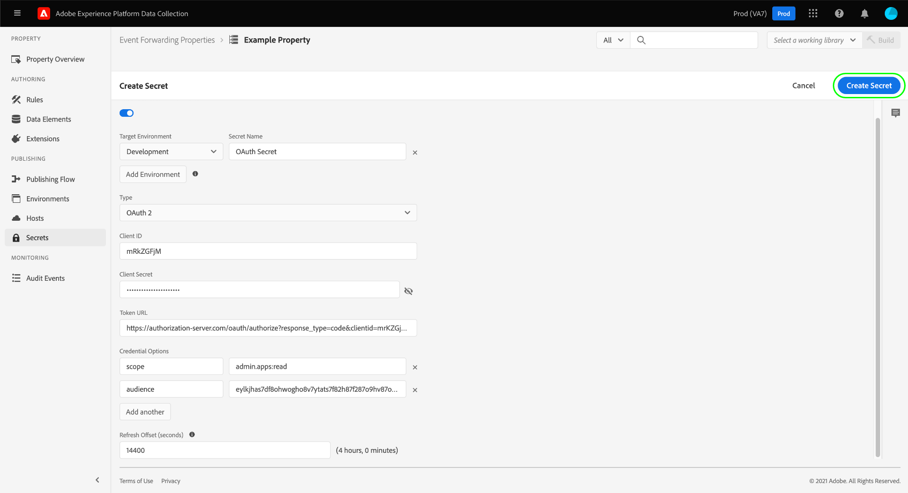

# 이벤트 전달에서 암호 구성

이벤트 전달에서 암호는 다른 시스템에 대한 인증 자격 증명을 나타내는 리소스로, 데이터를 안전하게 교환할 수 있습니다. 암호는 이벤트 전달 속성 내에서만 만들 수 있습니다.

현재 지원되는 암호 유형은 다음과 같습니다.

| 암호 유형 | 설명 |
| --- | --- |
| [!UICONTROL 토큰] | 두 시스템에서 모두 알고 이해할 수 있는 인증 토큰 값을 나타내는 단일 문자열입니다. |
| [!UICONTROL HTTP] | 사용자 이름과 암호로 각각 두 개의 문자열 속성을 포함합니다. |
| [!UICONTROL OAuth 2] | 을(를) 지원하는 여러 특성을 포함합니다 [클라이언트 자격 증명 부여 유형](https://datatracker.ietf.org/doc/html/rfc6749#section-1.3.4) 대상 [OAuth 2.0](https://datatracker.ietf.org/doc/html/rfc6749) 인증 사양입니다. 시스템에서 필요한 정보를 요청한 다음 지정된 간격에 따라 이러한 토큰의 갱신을 처리합니다. |
| [!UICONTROL Google OAuth 2] | 을(를) 지원하는 여러 특성을 포함합니다 [OAuth 2.0](https://datatracker.ietf.org/doc/html/rfc6749) 에서 사용할 인증 사양 [Google 광고 API](https://developers.google.com/google-ads/api/docs/oauth/overview) 및 [Pub/Sub API](https://cloud.google.com/pubsub/docs/reference/service_apis_overview). 시스템에서 필요한 정보를 요청한 다음 지정된 간격에 따라 이러한 토큰의 갱신을 처리합니다. |

{style=&quot;table-layout:auto&quot;}

이 안내서에서는 이벤트 전달을 위한 암호를 구성하는 방법에 대한 개요([!UICONTROL Edge]) 속성(Experience Platform UI 또는 데이터 수집 UI)을 포함합니다.

>[!NOTE]
>
>암호 구조의 JSON 예를 포함하여 Reactor API에서 암호를 관리하는 방법에 대한 자세한 지침은 다음을 참조하십시오. [secret API 안내서](../../api/guides/secrets.md).

## 전제 조건

이 안내서에서는 데이터 요소 및 이벤트 전달 규칙을 만드는 방법 등 UI에서 태그 및 이벤트 전달을 위한 리소스를 관리하는 방법을 이미 알고 있다고 가정합니다. 다음 안내서를 참조하십시오. [리소스 관리](../managing-resources/overview.md) 소개가 필요한 경우

또한 라이브러리에 리소스를 추가하고 테스트를 위해 웹 사이트에 빌드를 설치하는 방법 등 태그 및 이벤트 전달을 위한 게시 플로우에 대한 작업 이해를 해야 합니다. 자세한 내용은 [게시 개요](../publishing/overview.md) 자세한 내용

## 암호 만들기 {#create}

암호를 만들려면 **[!UICONTROL 이벤트 전달]** 왼쪽 탐색에서 암호를 추가할 이벤트 전달 속성을 엽니다. 다음 을 선택합니다. **[!UICONTROL 비밀]** 왼쪽 탐색에서 를 차례로 클릭하거나 **[!UICONTROL 새 암호 만들기]**.

다음 화면에서는 비밀의 세부 사항을 구성할 수 있습니다. 이벤트 전달에서 암호를 사용할 수 있도록 하려면 기존 환경에 할당해야 합니다. 이벤트 전달 속성을 위해 만든 환경이 없는 경우 의 안내서를 참조하십시오 [환경](../publishing/environments.md) 계속하기 전에 구성하는 방법에 대한 지침입니다.

>[!NOTE]
>
>암호를 환경에 추가하기 전에 만들고 저장하려면 **[!UICONTROL 환경에 암호 연결]** 나머지 정보를 입력하기 전에 전환합니다. 암호를 사용하려면 나중에 환경에 할당해야 합니다.
>
>

아래 **[!UICONTROL Target 환경]**&#x200B;를 누르고 드롭다운 메뉴를 사용하여 암호를 지정할 환경을 선택합니다. 아래 **[!UICONTROL 비밀 이름]**&#x200B;를 채울 때는 환경 컨텍스트에서 암호 이름을 제공합니다. 이 이름은 이벤트 전달 속성 아래의 모든 비밀에서 고유해야 합니다.

암호는 한 번에 한 환경에만 할당할 수 있지만, 원할 경우 다른 환경의 여러 비밀에 동일한 자격 증명을 할당할 수 있습니다. 선택 **[!UICONTROL 환경 추가]** 를 클릭하여 목록에 다른 행을 추가합니다.

추가하는 각 환경에 대해 연결된 비밀에 다른 고유한 이름을 제공해야 합니다. 사용 가능한 모든 환경을 배기하는 경우 **[!UICONTROL 환경 추가]** 단추를 사용할 수 없습니다.

여기에서 암호를 만드는 단계는 만드는 비밀의 유형에 따라 다릅니다. 자세한 내용은 아래 하위 섹션을 참조하십시오.

* [[!UICONTROL 토큰]](#token)
* [[!UICONTROL HTTP]](#http)
* [[!UICONTROL OAuth 2]](#oauth2)
* [[!UICONTROL Google OAuth 2]](#google-oauth2)

### [!UICONTROL 토큰] {#token}

토큰 암호를 만들려면 **[!UICONTROL 토큰]** 에서 **[!UICONTROL 유형]** 드롭다운. 에서 **[!UICONTROL 토큰]** 표시되는 필드에 인증 중인 시스템에서 인식하는 자격 증명 문자열을 제공합니다. 선택 **[!UICONTROL 암호 만들기]** 비밀을 지키기 위해

### [!UICONTROL HTTP] {#http}

HTTP 암호를 만들려면 **[!UICONTROL 단순 HTTP]** 에서 **[!UICONTROL 유형]** 드롭다운. 아래 표시되는 필드에서 선택하기 전에 자격 증명을 위한 사용자 이름과 암호를 입력합니다 **[!UICONTROL 암호 만들기]** 비밀을 지키기 위해

>[!NOTE]
>
>저장되면 자격 증명은 [&quot;기본&quot; HTTP 인증 체계](https://www.rfc-editor.org/rfc/rfc7617.html).

### [!UICONTROL OAuth 2] {#oauth2}

OAuth 2 암호를 만들려면 을(를) 선택합니다. **[!UICONTROL OAuth 2]** 에서 **[!UICONTROL 유형]** 드롭다운. 아래 표시되는 필드에서 [[!UICONTROL 클라이언트 ID] 및 [!UICONTROL 클라이언트 암호]](https://www.oauth.com/oauth2-servers/client-registration/client-id-secret/)뿐만 아니라 [[!UICONTROL 토큰 URL]](https://www.oauth.com/oauth2-servers/access-tokens/client-credentials/) 를 사용하십시오. 다음 [!UICONTROL 토큰 URL] UI의 필드는 인증 서버 호스트와 토큰 경로 간의 연결입니다.

아래 **[!UICONTROL 자격 증명 옵션]**&#x200B;과 같은 다른 자격 증명 옵션을 제공할 수 있습니다 `scope` 및 `audience` 키-값 쌍 형태로 표시됩니다. 키-값 쌍을 더 추가하려면 을 선택합니다 **[!UICONTROL 다른 추가]**.

마지막으로 다음을 구성할 수 있습니다 **[!UICONTROL 오프셋 새로 고침]** 비밀의 값입니다. 이는 시스템이 자동 새로 고침을 수행할 토큰 만료 전 시간(초)을 나타냅니다. 같은 시간(분)이 필드 오른쪽에 표시되고 입력할 때 자동으로 업데이트됩니다.

예를 들어 새로 고침 오프셋이 기본값인 `14400` (4시간)이고 액세스 토큰에 `expires_in` 값 `86400` (24시간)이면 시스템에서 20시간 후에 자동으로 암호를 새로 고칩니다.

>[!IMPORTANT]
>
>OAuth 암호는 새로 고침 사이에 최소 4시간이 필요하며 최소 8시간 동안 유효해야 합니다. 이 제한 사항을 사용하면 생성된 토큰에 문제가 발생할 경우 최소 4시간을 개입할 수 있습니다.
>
>예를 들어, 오프셋이 `28800` (8시간) 및 액세스 토큰에 `expires_in` 의 `36000` (10시간) 차이가 4시간 미만이어서 교환이 실패합니다.

완료되면 을 선택합니다 **[!UICONTROL 암호 만들기]** 비밀을 지키기 위해

### [!UICONTROL Google OAuth 2] {#google-oauth2}

Google OAuth 2 암호를 만들려면 을(를) 선택합니다 **[!UICONTROL Google OAuth 2]** 에서 **[!UICONTROL 유형]** 드롭다운. 아래 **[!UICONTROL 범위]**&#x200B;에서 이 암호를 사용하여 액세스 권한을 부여할 Google API를 선택합니다. 현재 지원되는 제품은 다음과 같습니다.

* [Google 광고 API](https://developers.google.com/google-ads/api/docs/oauth/overview)
* [Pub/Sub API](https://cloud.google.com/pubsub/docs/reference/service_apis_overview)

완료되면 을 선택합니다 **[!UICONTROL 암호 만들기]**.

Google을 통해 암호를 수동으로 승인해야 함을 알려주는 팝오버가 나타납니다. 선택 **[!UICONTROL 만들기 및 승인]** 계속하십시오.

Google 계정에 대한 자격 증명을 입력할 수 있는 대화 상자가 나타납니다. 프롬프트에 따라 선택한 범위의 데이터에 이벤트 전달 액세스 권한을 부여합니다. 인증 프로세스가 완료되면 비밀이 만들어집니다.

>[!IMPORTANT]
>
>조직에 Google Cloud 응용 프로그램에 대한 재인증 정책이 설정된 경우 인증이 만료된 후(정책 구성에 따라 1시간에서 24시간 사이) 생성된 암호가 성공적으로 새로 고쳐지지 않습니다.
>
>이 문제를 해결하려면 Google Admin Console에 로그인하여 **[!DNL App access control]** 페이지로 표시되므로 이벤트 전달 앱(Adobe Real-Time CDP 이벤트 전달)을 [!DNL Trusted]. 의 Google 설명서를 참조하십시오. [Google 클라우드 서비스에 대한 세션 길이 설정](https://support.google.com/a/answer/9368756) 추가 정보.

## 암호 편집

속성에 대한 암호를 만든 후 **[!UICONTROL 비밀]** 작업 공간. 기존 비밀의 세부 정보를 편집하려면 목록에서 해당 이름을 선택합니다.

다음 화면에서는 비밀의 이름과 자격 증명을 변경할 수 있습니다.

>[!NOTE]
>
>암호가 기존 환경과 연결된 경우에는 다른 환경에 암호를 재할당할 수 없습니다. 다른 환경에서 동일한 자격 증명을 사용하려면 [새 암호 만들기](#create) 을 가리키도록 업데이트하는 것이 좋습니다. 이 화면에서 환경을 재할당하는 유일한 방법은 사전에 암호를 환경에 할당하지 않았거나 비밀번호가 첨부된 환경을 삭제한 경우에만 입니다.

### 암호 교환 다시 시도

편집 화면에서 암호 교환을 다시 시도하거나 새로 고칠 수 있습니다. 이 프로세스는 편집 중인 비밀의 유형에 따라 다릅니다.

| 암호 유형 | 다시 시도 프로토콜 |
| --- | --- |
| [!UICONTROL 토큰] | 선택 **[!UICONTROL Exchange 암호]** 암호 교환을 다시 시도합니다. 이 컨트롤은 비밀에 연결된 환경이 있는 경우에만 사용할 수 있습니다. |
| [!UICONTROL HTTP] | 비밀에 첨부된 환경이 없는 경우 을 선택합니다 **[!UICONTROL Exchange 암호]** 자격 증명을 base64로 교환하려면 환경이 연결된 경우 [선택]을 선택합니다 **[!UICONTROL 암호 교환 및 배포]** base64로 교환하고 암호를 배포합니다. |
| [!UICONTROL OAuth 2] | 선택 **[!UICONTROL 토큰 생성]** 자격 증명을 교환하고 인증 공급자로부터 액세스 토큰을 반환하려면 다음을 수행하십시오. |

## 암호 삭제

에서 기존 암호를 삭제하려면  **[!UICONTROL 비밀]** 작업 영역에서 해당 이름 옆의 확인란을 선택한 다음 **[!UICONTROL 삭제]**.

## 이벤트 전달에서 암호 사용

이벤트 전달에서 암호를 사용하려면 먼저 [데이터 요소](../managing-resources/data-elements.md) 그것은 그 비밀 자체를 참조합니다. 데이터 요소를 저장한 후 이벤트 전달에 포함할 수 있습니다 [규칙](../managing-resources/rules.md) 그리고 이러한 규칙을 [라이브러리](../publishing/libraries.md)- Adobe 서버에 다음 방법으로 배포할 수 있습니다. [빌드](../publishing/builds.md).

데이터 요소를 만들 때 **[!UICONTROL 코어]** 확장을 선택한 다음 **[!UICONTROL 비밀]** 를 반환합니다. 올바른 패널을 업데이트하고 데이터 요소에 최대 3개의 암호를 할당하는 드롭다운 컨트롤을 제공합니다. 하나 [!UICONTROL 개발], [!UICONTROL 스테이징], 및 [!UICONTROL 프로덕션] 각각 사용할 수 있습니다.

>[!NOTE]
>
>개발, 스테이징 및 프로덕션 환경에 첨부된 암호만 해당 드롭다운에 표시됩니다.

여러 암호를 단일 데이터 요소에 할당하고 규칙에 포함함으로써, 포함된 라이브러리가 있는 위치에 따라 데이터 요소 변경 값을 가질 수 있습니다 [게시 흐름](../publishing/publishing-flow.md).

>[!NOTE]
>
>데이터 요소를 만들 때 개발 환경을 할당해야 합니다. 스테이징 및 프로덕션 환경에 대한 암호는 필요하지 않지만, 비밀 유형 데이터 요소에 해당 환경에 대해 선택한 암호가 없으면 해당 환경으로 전환하려고 하는 빌드가 실패합니다.

## 다음 단계

이 안내서에서는 UI에서 암호를 관리하는 방법을 다룹니다. Reactor API를 사용하여 비밀과 상호 작용하는 방법에 대한 자세한 내용은 [비밀 끝점 안내서](../../api/endpoints/secrets.md).
