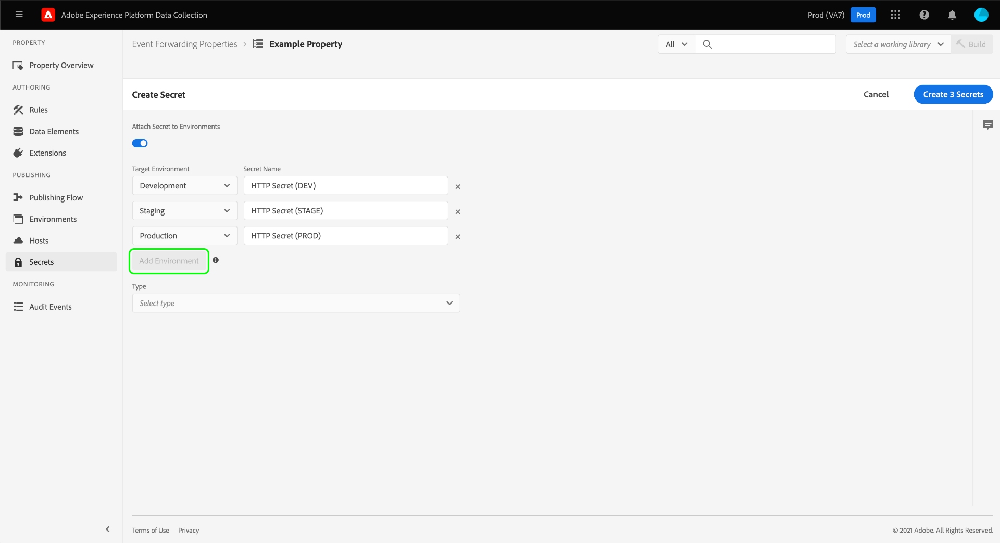

# 이벤트 전달에서 암호 구성

이벤트 전달에서 암호는 다른 시스템에 대한 인증 자격 증명을 나타내는 리소스로, 데이터를 안전하게 교환할 수 있습니다. 암호는 이벤트 전달 속성 내에서만 만들 수 있습니다.

현재 지원되는 암호 유형은 다음과 같습니다.

| 암호 유형 | 설명 |
| --- | --- |
| [!UICONTROL 토큰] | 두 시스템에서 모두 알고 이해할 수 있는 인증 토큰 값을 나타내는 단일 문자열입니다. |
| [!UICONTROL HTTP] | Contains two string attributes for a username and password, respectively. |
| [!UICONTROL OAuth2] | 을(를) 지원하는 여러 특성을 포함합니다 [OAuth2](https://datatracker.ietf.org/doc/html/rfc6749) 인증 사양입니다. 시스템에서 필요한 정보를 요청한 다음 지정된 간격에 따라 이러한 토큰의 갱신을 처리합니다. 현재 [클라이언트 자격 증명](https://datatracker.ietf.org/doc/html/rfc6749#section-1.3.4) OAuth2 버전이 지원됩니다. |

{style=&quot;table-layout:auto&quot;}

이 안내서에서는 이벤트 전달을 위한 암호를 구성하는 방법에 대한 개요([!UICONTROL Edge]) 내의 아무 곳에나 삽입할 수 있습니다.

>[!NOTE]
>
>암호 구조의 JSON 예를 포함하여 Reactor API에서 암호를 관리하는 방법에 대한 자세한 지침은 다음을 참조하십시오. [secret API 안내서](../../api/guides/secrets.md).

## 전제 조건

이 안내서에서는 데이터 요소 및 이벤트 전달 규칙을 만드는 방법을 비롯하여 데이터 수집 UI의 태그 및 이벤트 전달에 대한 리소스를 관리하는 방법을 이미 알고 있다고 가정합니다. 다음 안내서를 참조하십시오. [리소스 관리](../managing-resources/overview.md) 소개가 필요한 경우

또한 라이브러리에 리소스를 추가하고 테스트를 위해 웹 사이트에 빌드를 설치하는 방법 등 태그 및 이벤트 전달을 위한 게시 플로우에 대한 작업 이해를 해야 합니다. 자세한 내용은 [게시 개요](../publishing/overview.md) 자세한 내용

## Create a secret {#create}

암호를 만들려면 데이터 수집 UI에 로그인하고 암호를 추가할 이벤트 전달 속성을 엽니다. Next, select **[!UICONTROL Secrets]** in the left navigation, followed by **[!UICONTROL Create New Secret]**.

The next screen allows you to configure the details of the secret. 이벤트 전달에서 암호를 사용할 수 있도록 하려면 기존 환경에 할당해야 합니다. If you do not have any environments created for your event forwarding property, see the guide on [environments](../publishing/environments.md) for guidance on how to configure them before continuing.

>[!NOTE]
>
>암호를 환경에 추가하기 전에 만들고 저장하려면 **[!UICONTROL 환경에 암호 연결]** 나머지 정보를 입력하기 전에 전환합니다. Note that you will have to assign it to an environment later if you want to use the secret.
>
>

아래 **[!UICONTROL Target 환경]**&#x200B;를 누르고 드롭다운 메뉴를 사용하여 암호를 지정할 환경을 선택합니다. Under **[!UICONTROL Secret Name]**, provide a name for the secret in the context of the environment. This name must be unique across all secrets under the event forwarding property.

암호는 한 번에 한 환경에만 할당할 수 있지만, 원할 경우 다른 환경의 여러 비밀에 동일한 자격 증명을 할당할 수 있습니다. 선택 **[!UICONTROL 환경 추가]** 를 클릭하여 목록에 다른 행을 추가합니다.

For each environment you add, you must provide another unique name for the associated secret. If you exhaust all available environments, the **[!UICONTROL Add Environment]** button will be unavailable.

여기에서 암호를 만드는 단계는 만드는 비밀의 유형에 따라 다릅니다. 자세한 내용은 아래 하위 섹션을 참조하십시오.

* [[!UICONTROL 토큰]](#token)
* [[!UICONTROL HTTP]](#http)
* [[!UICONTROL OAuth2]](#oauth2)

### [!UICONTROL 토큰] {#token}

To create a token secret, select **[!UICONTROL Token]** from the **[!UICONTROL Type]** dropdown. 에서 **[!UICONTROL 토큰]** 표시되는 필드에 인증 중인 시스템에서 인식하는 자격 증명 문자열을 제공합니다. Select **[!UICONTROL Create Secret]** to save the secret.

### [!UICONTROL HTTP] {#http}

To create an HTTP secret, select **[!UICONTROL Simple HTTP]** from the **[!UICONTROL Type]** dropdown. In the fields that appear below, provide a username and password for the credential before selecting **[!UICONTROL Create Secret]** to save the secret.

>[!NOTE]
>
>저장되면 자격 증명은 [&quot;기본&quot; HTTP 인증 체계](https://www.rfc-editor.org/rfc/rfc7617.html).

### [!UICONTROL OAuth2] {#oauth2}

OAuth2 암호를 만들려면 **[!UICONTROL OAuth2]** 에서 **[!UICONTROL 유형]** 드롭다운. 아래 표시되는 필드에서 [[!UICONTROL 클라이언트 ID] 및 [!UICONTROL 클라이언트 암호]](https://www.oauth.com/oauth2-servers/client-registration/client-id-secret/)뿐만 아니라 [인증 URL](https://www.oauth.com/oauth2-servers/access-tokens/client-credentials/) 를 사용하십시오. 다음 [!UICONTROL 인증 URL] 데이터 수집 UI의 필드는 인증 서버 호스트와 토큰 경로 간의 연결입니다.

아래 **[!UICONTROL 자격 증명 옵션]**&#x200B;과 같은 다른 자격 증명 옵션을 제공할 수 있습니다 `scope` 및 `audience` 키-값 쌍 형태로 표시됩니다. 키-값 쌍을 더 추가하려면 을 선택합니다 **[!UICONTROL 다른 추가]**.

마지막으로 다음을 구성할 수 있습니다 **[!UICONTROL 오프셋 새로 고침]** 비밀의 값입니다. 이는 시스템이 자동 새로 고침을 수행할 토큰 만료 전 시간(초)을 나타냅니다. 같은 시간(분)이 필드 오른쪽에 표시되고 입력할 때 자동으로 업데이트됩니다.

예를 들어 새로 고침 오프셋이 기본값인 `14400` (4시간)이고 액세스 토큰에 `expires_in` 값 `86400` (24시간)이면 시스템에서 20시간 후에 자동으로 암호를 새로 고칩니다.

>[!IMPORTANT]
>
>An OAuth secret requires at least four hours between refreshes and must also be valid for a minimum of eight hours. 이 제한 사항을 사용하면 생성된 토큰에 문제가 발생할 경우 최소 4시간을 개입할 수 있습니다.
>
>예를 들어, 오프셋이 `28800` (8시간) 및 액세스 토큰에 `expires_in` 의 `36000` (10시간) 차이가 4시간 미만이어서 교환이 실패합니다.

When finished, select **[!UICONTROL Create Secret]** to save the secret.

## 암호 편집

속성에 대한 암호를 만든 후 **[!UICONTROL 비밀]** 작업 공간. 기존 비밀의 세부 정보를 편집하려면 목록에서 해당 이름을 선택합니다.

다음 화면에서는 비밀의 이름과 자격 증명을 변경할 수 있습니다.

>[!NOTE]
>
>If the secret is associated with an existing environment, you cannot reassign the secret to another environment. 다른 환경에서 동일한 자격 증명을 사용하려면 [새 암호 만들기](#create) 을 가리키도록 업데이트하는 것이 좋습니다. 이 화면에서 환경을 재할당하는 유일한 방법은 사전에 암호를 환경에 할당하지 않았거나 비밀번호가 첨부된 환경을 삭제한 경우에만 입니다.

### 암호 교환 다시 시도

편집 화면에서 암호 교환을 다시 시도하거나 새로 고칠 수 있습니다. This process varies depending on the type of secret being edited:

| 암호 유형 | Retry protocol |
| --- | --- |
| [!UICONTROL 토큰] | 선택 **[!UICONTROL Exchange 암호]** 암호 교환을 다시 시도합니다. This control is only available when there is an environment attached to the secret. |
| [!UICONTROL HTTP] | 비밀에 첨부된 환경이 없는 경우 을 선택합니다 **[!UICONTROL Exchange 암호]** 자격 증명을 base64로 교환하려면 If an environment is attached, select elect **[!UICONTROL Exchange and Deploy Secret]** to exchange to base64 and deploy the secret to Cloudfare. |
| [!UICONTROL OAuth2] | Select **[!UICONTROL Generate Token]** to exchange the credentials and return an access token from the authentication provider. |

## Delete a secret

To delete an existing secret in the  **[!UICONTROL Secrets]** workspace, select the checkbox next to its name before selecting **[!UICONTROL Delete]**.

## 이벤트 전달에서 암호 사용

이벤트 전달에서 암호를 사용하려면 먼저 [데이터 요소](../managing-resources/data-elements.md) 그것은 그 비밀 자체를 참조합니다. 데이터 요소를 저장한 후 이벤트 전달에 포함할 수 있습니다 [규칙](../managing-resources/rules.md) 그리고 이러한 규칙을 [라이브러리](../publishing/libraries.md)- Adobe 서버에 다음 방법으로 배포할 수 있습니다. [빌드](../publishing/builds.md).

데이터 요소를 만들 때 **[!UICONTROL 코어]** 확장을 선택한 다음 **[!UICONTROL 비밀]** 를 반환합니다. 올바른 패널을 업데이트하고 데이터 요소에 최대 3개의 암호를 할당하는 드롭다운 컨트롤을 제공합니다. 하나 [!UICONTROL 개발], [!UICONTROL 스테이징], 및 [!UICONTROL 프로덕션] 각각 사용할 수 있습니다.

>[!NOTE]
>
>Only secrets attached to the development, staging, and production environments appear for their respective dropdowns.

여러 암호를 단일 데이터 요소에 할당하고 규칙에 포함함으로써, 포함된 라이브러리가 있는 위치에 따라 데이터 요소 변경 값을 가질 수 있습니다 [게시 흐름](../publishing/publishing-flow.md).

>[!NOTE]
>
>When creating the data element, a development environment must be assigned. 스테이징 및 프로덕션 환경에 대한 암호는 필요하지 않지만, 비밀 유형 데이터 요소에 해당 환경에 대해 선택한 암호가 없으면 해당 환경으로 전환하려고 하는 빌드가 실패합니다.

## 다음 단계

이 안내서에서는 데이터 수집 UI에서 암호를 관리하는 방법을 다룹니다. Reactor API를 사용하여 비밀과 상호 작용하는 방법에 대한 자세한 내용은 [비밀 끝점 안내서](../../api/endpoints/secrets.md).
