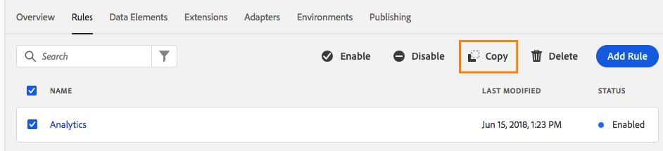

# 리소스 복사

>[!NOTE]
>
>Adobe Experience Platform Launch은 Adobe Experience Platform의 데이터 수집 기술군으로 새롭게 브랜딩되었습니다. 그 결과 제품 설명서에 몇 가지 용어 변경 사항이 적용되었습니다. 용어 변경에 대한 통합 참고 자료는 다음 [문서](../../term-updates.md)를 참조하십시오.

기존 리소스의 설정을 사용하여 새 리소스를 만드는 것이 편리한 경우가 있습니다. 이러한 경우 복사본을 만들 수 있습니다.

속성, 확장, 규칙 및 데이터 요소를 모두 복사할 수 있습니다.

리소스를 복사하면 지정한 대상에 해당 리소스의 복제본이 만들어집니다. 이는 개별적인 일회성 작업이며, 원래 리소스와 수행된 모든 사본의 관계가 계속 유지되지 않습니다.

## 복사 시작

설치된 확장을 보고, **[!UICONTROL 구성]** 단추의 드롭다운 화살표를 선택하고, **[!UICONTROL 복사]**&#x200B;를 선택하여 확장의 복사를 시작할 수 있습니다.

속성, 규칙 및 데이터 요소의 경우 복사할 리소스를 선택한 다음 작업 메뉴에서 **[!UICONTROL 복사]**&#x200B;를 선택하면 됩니다.

규칙 또는 데이터 요소를 복사하는 경우 복사 대화 상자에서 드롭다운 메뉴를 사용하여 복사할 대상 속성을 선택할 수 있습니다(기본 설정은 현재 속성임). 확장을 동일한 속성에 복사할 수 없으므로 확장에서는 해당 옵션을 제공하지 않습니다.

>[!NOTE]
>
>한 속성이 확장 개발에 대해 구성되어 있고 다른 속성은 아닌 경우 리소스를 다른 속성에 복사할 수 없습니다.

원하는 동작을 구성했으면 **[!UICONTROL 복사]**&#x200B;를 선택합니다.

## 속성 복사

전체 속성의 복사본을 만들 때 프로세스에 대해 알고 있어야 하는 몇 가지 사항이 있습니다.

* 속성 설정이 있는 그대로(도메인, 고급 설정 등) 복사됩니다.
* 원본 속성 내의 규칙, 데이터 요소 및 확장은 새 타겟 속성에 복사됩니다. 어댑터, 환경 및 라이브러리는 복사되지 않습니다.
* 필요한 확장(기존 데이터 요소 또는 규칙 구성 요소에 필요한 확장)은 원본 속성에서 제거되었더라도 타겟 속성에 복사됩니다.
* 속성을 복사하는 데 시간이 오래 걸릴 수 있습니다. 이 복사 작업은 배경에서 수행됩니다. 복사 진행 상황을 모니터링하거나 복사가 진행되는 동안 다른 작업을 계속 진행할 수 있습니다.
* 개별 리소스가 이미 타겟 속성에 복사된 후(복사가 완료되기 전) 개별 리소스를 수정하는 경우 새로운 수정 사항은 복사되지 않습니다.

## 확장 복사

확장을 다른 속성에 복사할 때 몇 가지 사항을 알고 있어야 합니다.

* 대상 속성에 확장이 설치되어 있지 않으면 원본 속성과 동일한 설정을 사용하여 설치됩니다.
* 대상 속성에 이미 확장이 설치되어 있으면 설정만 복사됩니다.
* 대상 속성에 더 낮은 버전의 확장이 설치되어 있는 경우 복사를 수행하려면 먼저 대상 속성에서 확장을 업그레이드해야 한다는 메시지가 나타납니다. 확장 개발자는 확장에 설정을 점차적으로 추가할 수 있으므로 새로운 확장의 설정을 이전 버전에 안전하게 적용할 수 없습니다.
* 대상 속성에 더 높은 버전의 확장이 설치되어 있는 경우 설정이 복사되지만 다운그레이드는 수행되지 않습니다. 대상 속성은 여전히 현재 버전 번호를 유지합니다.

## 규칙 및 데이터 요소 복사

모든 규칙 및 데이터 요소는 확장에서 제공하므로, 속성 간에 복사할 때에는 Platform이 이러한 기본 확장을 고려해야 합니다.

복사 대화 상자에서는 복사를 시작하기 전에 수행할 작업에 대한 정확한 설명을 제공합니다. 위의 대화 상자는 규칙에 대한 것이지만 데이터 요소에도 적용됩니다.

1. **이러한 규칙에 필요한 확장이 복사됩니다.** 따라서 필요한 확장이 규칙과 함께 진행될 것임을 알 수 있습니다. 이러한 사본은 위에 요약된 일반 확장 사본과 동일한 규칙을 따릅니다.
1. **확장이 이미 설치되어 있는 경우 확장 설정은 복사되지 않습니다.** 즉, 필요한 확장이 대상 속성에 이미 있으면 확장은 그대로 유지됩니다. 확장 설정도 복사하려는 경우 대상 **Replace extension settings on destination property** 전환을 사용할 수 있으며 설명이 그에 따라 업데이트됩니다.
1. **이러한 규칙에 필요한 데이터 요소는 복사되지 않습니다.** 이 설명은 규칙에만 적용됩니다. 규칙이 올바르게 작동하기 위해 종종 데이터 요소를 사용합니다. 규칙을 새 속성에 복사하는 경우 필요한 데이터 요소를 별도의 작업으로도 복사해야 합니다.
