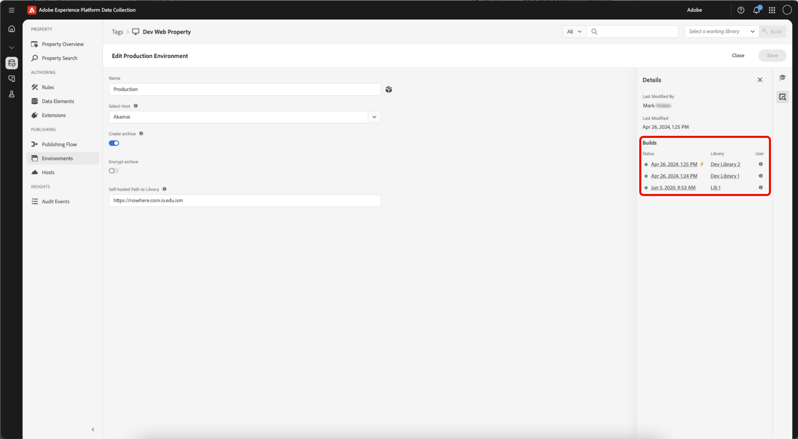

# 빌드

빌드는 클라이언트 장치에서 실행되는 모든 코드가 들어 있는 파일 세트입니다.

라이브러리 내에 지정한 변경 사항과 이전에 제출, 승인 또는 게시된 모든 변경 사항을 합친 것입니다.

빌드는 서로를 참조하는 클라이언트측 코드 파일로 구성됩니다. 이러한 파일은 라이브러리에 대해 선택한 환경과 호스트를 사용하여 호스팅 위치에 전달됩니다. 사이트에서 배포한 코드는 사용자가 사이트 또는 애플리케이션에 액세스할 때 파일이 로드될 수 있도록 이와 동일한 위치를 가리킵니다.

## 파일 내용 {#file-contents}

라이브러리는 라이브러리 내에 포함해야 하는 개별 태그 리소스(확장, 규칙 및 데이터 요소) 세트를 정의합니다.

빌드에는 라이브러리에 포함된 리소스를 지원하는 데 필요한 구성(사용자가 입력)과 모든 모듈 코드(확장 개발자가 제공)가 포함되어 있습니다. 예를 들어, 확장에서 규칙 내에서 사용되지 않는 작업을 제공하는 경우 그러한 작업을 수행하는 코드가 빌드 내에 포함되어 있지 않습니다.

빌드는 기본 라이브러리 파일과 잠재적으로 작은 여러 파일로 나뉩니다. 기본 라이브러리 파일은 임베드 코드에서 참조되고 런타임에 페이지에 로드됩니다. 이 파일에는 다음이 포함되어 있습니다.

* 규칙 엔진
* 모든 확장 구성
* 모든 데이터 요소 코드 및 구성
* 모든 규칙 이벤트 코드 및 구성
* 모든 조건 코드 및 구성
* Library Loaded 또는 Page Bottom 이벤트가 있는 모든 규칙에 대한 이벤트 코드 및 구성(바로 필요할 수 있으므로)

필요에 따라 페이지에 로드되는 개별 작업에 대한 코드와 구성은 여러 작은 파일에 들어 있습니다. 규칙이 트리거되고 해당 조건이 평가되어 작업을 실행해야 하는 경우 해당 특정 작업에 필요한 코드 및 구성은 작은 파일 중 하나에서 검색됩니다. 즉, 필요한 작업을 수행하는 데 필요한 코드만 페이지에 로드되어 기본 라이브러리가 가능한 한 작아집니다.

## 파일 포맷 {#file-format}

빌드의 기본 파일 형식은 확장, 데이터 요소 및 규칙이 사용자가 원하는 방식으로 실행되는 데 필요한 모든 코드를 포함하고 있는 파일 패키지입니다.

하지만 경우에 따라 실행 가능한 클라이언트측 코드 파일이 아니라, .zip 보관 파일을 선호할 수 있습니다. 예를 들어 빌드를 직접 호스팅하고 다른 배포에 이 빌드를 사용하려는 경우 보관 파일을 만들 수 있습니다. 자체 호스팅되는 경로에 있는 모든 항목을 라이브러리 필드에 제공하면 환경을 저장할 수 있습니다. 새 코드와 함께 보관된 다운로드에 대한 링크를 사용할 수 있습니다. 라이브러리가 빌드되면 Akamai에 zip 파일을 배포하고 `assets.adobedtm.com/...`에서 다운로드할 수 있습니다.

>[!NOTE]
>
>작성할 때까지 해당 위치에 아무 것도 없습니다.

파일 형식과 관계없이 빌드는 항상 호스트에 지정한 위치로 전달됩니다.

빌드를 완료하려면 라이브러리를 선택하고 해당 게시 프로세스 수준에서 사용할 수 있는 빌드 옵션을 선택합니다(개발용 빌드, 스테이징용 빌드 등).

## 축소 {#minification}

축소는 파일에서 실행하는 데 필요하지 않은 데이터를 제거하여 대역폭 비용을 줄이고 속도를 향상시킵니다.

성능을 향상시키기 위해 Experience Platform은 다음을 포함한 모든 것을 축소합니다.

* 기본 태그 라이브러리
* 확장의 일부로 확장 개발자가 제공하는 모듈 코드
* Experience Platform 사용자가 제공한 사용자 지정 코드

>[!NOTE]
>
>모듈 코드와 사용자 지정 코드가 이미 축소된 경우 Experience Platform에서는 이를 다시 축소합니다. 이러한 두 번째 축소는 추가 이점이 없지만, 아무런 영향을 주지 않으며 Experience Platform이 덜 복잡해지고 유지 관리가 쉬워집니다.

제공된 모든 클라이언트측 코드는 축소된 코드 버전을 가리킵니다. 이는 축소된 파일에 대한 표준 명명 규칙을 따르는 파일 이름에 표시됩니다.

`launch-%environment_id%.min.js`

축소되지 않은 코드를 보려면 파일 이름에서 .min을 제거합니다.

`launch-%environment_id%.js`

확장 개발자가 해당 확장에 축소된 코드를 제공하는 경우 Experience Platform은 축소 해제된 빌드에 축소 해제된 코드를 제공하지 않습니다. 마찬가지로, Experience Platform 사용자가 축소된 코드를 사용자 지정 코드 상자에 입력하면 해당 코드가 축소 해제된 빌드에서 축소됩니다. Experience Platform은 아무것도 축소 해제하지 않습니다.

축소에 대한 자세한 내용은 [이 스택 경로 문서](https://blog.stackpath.com/glossary/minification/)를 참조하십시오.

빌드를 수행할 때 먼저 축소 해제된 라이브러리를 구성한 다음 전체 라이브러리를 한 번에 축소합니다.

## 빌드 세부 정보 보기 {#build-details}

>[!IMPORTANT]
>
>라이브러리에는 태그 리소스의 수정 버전이 저장되지만 **빌드**&#x200B;는 사이트에 전달되는 파일이 들어 있는 해당 라이브러리의 시점 스냅숏입니다.

**라이브러리** 또는 **환경**&#x200B;에서 빌드 및 빌드 세부 정보에 액세스하여 현재 라이브 빌드를 보고 빌드에 포함된 내용(확장, 데이터 요소 및 규칙)을 검사할 수 있습니다.

### 라이브러리에서 빌드 세부 정보 보기

태그 속성에서 **[!UICONTROL Publishing Flow]**&#x200B;을(를) 열고 라이브러리를 선택합니다.

세부 정보 패널에서 다음을 검토할 수 있습니다.

* **[!UICONTROL Last Build Environment]** — 마지막 빌드를 받은 환경에 대한 링크입니다. 이 라이브러리가 해당 환경의 현재 빌드(**현재** 또는 **현재 빌드가 아님**)인지 나타냅니다.
* **[!UICONTROL Current Builds]** — 현재 해당 환경에 있는 빌드입니다. 게시된 라이브러리의 경우 라이브 프로덕션 빌드는 이 섹션에서 번개 볼트 아이콘으로 표시됩니다.
* 나열된 각 빌드에 대해 다음을 볼 수 있습니다.
   * **[!UICONTROL Status]** - 빌드가 만들어진 때입니다.
   * **[!UICONTROL Environment]** - 빌드가 배포된 환경입니다.
   * **[!UICONTROL User]** - 빌드를 만든 사용자입니다.

### 환경에서 빌드 보기

빌드는 환경 및 해당 환경에 빌드된 라이브러리와 연결됩니다. 빌드는 컴파일된 리소스를 실제로 포함하는 것입니다.

세부 정보 패널에서 **[!UICONTROL Environment]**&#x200B;을(를) 선택합니다. 환경 세부 정보 패널에는 최근 빌드, 현재 라이브 빌드 및 관련 라이브러리 목록이 표시됩니다.

그런 다음 빌드를 선택하여 세부 정보를 엽니다. 빌드 세부 정보에 해당 빌드에 포함된 **확장**, **데이터 요소** 및 **규칙**&#x200B;이 표시됩니다.

>[!NOTE]
>
>빌드는 라이브러리에만 나열된 리소스 이상을 포함할 수 있습니다. 빌드에 패키지된 **확장**, **데이터 요소** 및 **규칙**&#x200B;에는 라이브러리의 콘텐츠와 업스트림 콘텐츠가 포함됩니다. 사이트 또는 앱에 게시되는 전체 스냅샷입니다.

세부 정보 패널을 사용하여 **[!UICONTROL Environment]** 또는 **[!UICONTROL Library]**(으)로 다시 이동합니다.
