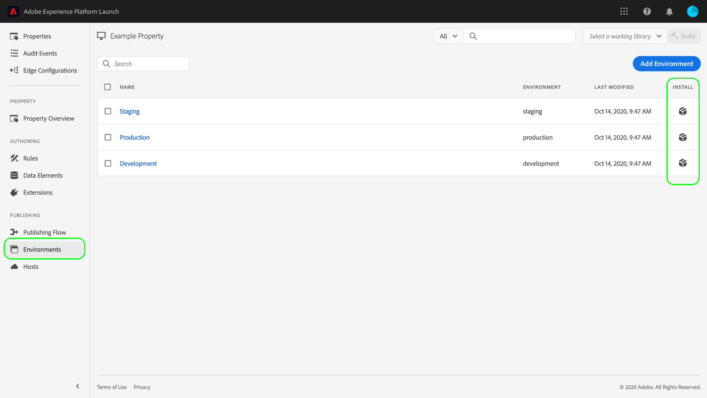

# 환경

>[!NOTE]
>
>Adobe Experience Platform Launch은 Adobe Experience Platform에서 데이터 수집 기술 세트로 브랜딩되었습니다. 그 결과로 제품 설명서 전반에서 몇 가지 용어 변경이 있었습니다. 용어 변경에 대한 통합 참고 자료는 다음 [문서](../../term-updates.md)를 참조하십시오.

태그 환경은 웹 사이트 또는 앱에서 배포하는 라이브러리 빌드의 몇 가지 주요 측면을 정의합니다.

* 빌드의 파일 이름입니다.
* 환경에 지정된 호스트에 따른 빌드의 도메인 및 경로입니다.
* 선택한 아카이브 옵션에 따른 빌드의 파일 형식입니다.

라이브러리 빌드를 만들 때 환경에 할당해야 합니다. 그런 다음 빌드의 확장, 규칙 및 데이터 요소를 컴파일하여 지정된 환경에 배치합니다. 각 환경에서는 지정된 빌드를 사이트에 통합할 수 있는 고유한 포함 코드를 제공합니다.

 가공물마다 다른 환경에 있을 수 있습니다. 이렇게 하면 라이브러리가 작업 과정을 진행할 때 각기 다른 환경에서 서로 다른 라이브러리를 테스트할 수 있습니다.

이 문서에서는 데이터 수집 사용자 인터페이스에서 서로 다른 환경을 설치, 구성 및 만드는 방법에 대해 설명합니다.

## 환경 유형

태그는 의 서로 다른 상태에 해당하는 세 가지 서로 다른 환경 유형을 지원합니다 [게시 워크플로우](./publishing-flow.md):

| 환경 유형 | 설명 |
| --- | --- |
| 개발 | 이 환경은 게시 작업 과정의 **개발** 열에 해당합니다. |
| 스테이징 | 이 환경은 게시 작업 과정의 **제출됨** 및 **승인됨** 열에 해당합니다. |
| 프로덕션 | 이 환경은 게시 작업 과정의 **게시됨** 열에 해당합니다. |

서로 다른  가공물마다 다른 환경에 있을 수 있습니다. 이렇게 하면 라이브러리의 게시 작업 과정을 진행할 때 각기 다른 환경에서 서로 다른 라이브러리를 테스트할 수 있습니다.

>[!NOTE]
>
>각 환경에 한 번에 하나의 라이브러리 빌드만 지정할 수 있습니다. 그러나 시간이 지나면서 게시 작업 과정을 통해 이동하는 동안 단일 환경에 여러 가지 빌드가 포함될 것으로 예상되며 필요에 따라 환경 간에 빌드를 재지정할 수 있습니다.

## 설치 {#installation}

각 환경에는 애플리케이션에 연결하는 데 사용되는 일련의 지침이 있습니다. 웹 속성의 경우 이 지침은 포함 코드를 제공합니다. 모바일 속성의 경우 이러한 지침은 사용 중인 라이브러리를 인스턴스화하고 런타임 시 구성을 검색하는 데 필요한 코드를 제공합니다.

>[!IMPORTANT]
>
>각 환경 유형에 해당하는 고유한 설치 지침이 있습니다. 사용 중인 환경에 따라 올바른 포함 코드 및/또는 종속성을 사용하고 있는지 확인해야 합니다.
>
>예를 들어, 웹 속성에 대한 프로덕션 포함 코드는 브라우저 캐싱을 지원하는 반면 개발 및 스테이징 포함 코드는 지원하지 않습니다. 따라서 트래픽이 많거나 프로덕션 컨텍스트에서는 개발 또는 스테이징 포함 코드를 사용할 수 없습니다.

환경에 대한 설치 지침에 액세스하려면 다음 위치로 이동합니다. **[!UICONTROL 환경]** 속성에 대한 탭을 선택한 다음 **[!UICONTROL 설치]** 아이콘 을 클릭하여 제품에서 사용할 수 있습니다.

웹 속성을 사용하는 경우 문서의 `<head>` 태그에 사용할 포함 코드가 제공됩니다. 또한 런타임 시 동기적으로 또는 비동기적으로 라이브러리 파일을 배포할 수 있는 옵션이 제공됩니다. 선택한 설정에 따라 표시되는 설치 지침이 달라집니다. 포함 코드는 이 문서의 후반부에 자세히 설명되어 있습니다.

모바일 속성을 사용하는 경우, Android([Gradle](https://gradle.org/)을 통해) 및 iOS([CocoaPods](https://cocoapods.org/)를 통해)에 대한 종속성을 설치하는 별도의 지침이 제공됩니다.

## 모바일 구성

모바일 속성의 경우 목록에서 해당 구성 옵션을 선택하여 환경에 대한 구성 옵션을 볼 수 있습니다. 여기서 환경의 이름을 변경할 수 있습니다. 현재 모바일 환경에서는 Adobe 관리 호스트만 사용할 수 있습니다.

자세한 내용은 [호스트](./hosts/hosts-overview.md) 개요를 참조하십시오.

## 웹 구성

지정된 환경의 설정에 따라 웹 속성에 대해 다음 사항이 결정됩니다.

* **호스트**: 빌드를 배포할 서버 위치입니다.
* **아카이브 설정**: 시스템에서 배포 가능한 파일 세트를 출력할지 또는 아카이브 형식으로 압축할지 여부.
* **포함 코드**: 런타임 시 라이브러리 빌드를 배포하는 데 사용되는 웹 사이트 페이지의 HTML 내에 임베드할 `<script>` 코드입니다.

에서 [!UICONTROL 환경] 탭에서 나열된 환경을 선택하여 해당 구성 컨트롤을 표시합니다.

### Host {#host}

선택 **[!UICONTROL 호스트]** 드롭다운 메뉴에서 환경에 대해 사전 구성된 호스트를 선택합니다.

빌드가 만들어지면 해당 빌드가 지정된 호스트에 지정한 위치로 전달됩니다. 태그 호스트를 만들고 구성하는 방법에 대한 자세한 내용은 [호스트 개요](./hosts/hosts-overview.md).

### 아카이브 설정 {#archive}

대부분의 빌드는 여러 파일로 구성됩니다. 다중 파일 빌드에는 필요에 따라 가져올 수 있고 다른 파일에 대한 내부 참조를 포함하는 기본 라이브러리 파일(포함 코드에 연결됨)이 있습니다.

다음 **[!UICONTROL 아카이브 만들기]** 단추를 사용하면 환경의 아카이브 설정을 전환할 수 있습니다. 기본적으로 아카이브 옵션은 꺼져 있으며 빌드는 실행되는 형식 그대로(웹 속성의 경우 JavaScript, 모바일 속성의 경우 JSON) 전달됩니다.

아카이브 설정을 켜기로 선택하면 UI에 추가 구성 설정이 나타나므로 자체 호스팅을 사용하는 경우 선택적으로 아카이브 파일을 암호화하고 라이브러리의 경로를 정의할 수 있습니다.

경로는 전체 URL이거나 여러 도메인에서 사용할 수 있는 상대 경로일 수 있습니다. 대부분의 빌드에는 서로에 대한 내부 참조가 포함된 파일이 여러 개 있으므로 경로가 매우 중요합니다.

아카이브 옵션을 사용하는 경우 모든 빌드 파일은 ZIP 파일로 대신 전달됩니다. 이 기능은 다음과 같은 경우 유용할 수 있습니다.

1. 라이브러리를 자체 호스팅하고 있지만 전달할 SFTP 호스트를 설정하지 않으려고 합니다.
1. 배포 전에 빌드에 대한 코드 분석을 실행해야 합니다.
1. 빌드 콘텐츠만 보고 포함된 내용을 확인하려고 합니다.

### 포함 코드 {#embed-code}

포함 코드는 `<script>` 태그에 배치해야 하는 `<head>` 빌드하는 코드를 로드 및 실행하기 위한 웹 사이트 페이지의 섹션. 각 환경 구성은 자체 포함 코드를 자동으로 생성하므로 태그를 실행할 페이지의 사이트에 복사하여 붙여넣으면 됩니다.

설치 지침을 볼 때 스크립트를 통해 라이브러리 파일을 동기식으로 또는 비동기식으로 로드하도록 선택할 수 있습니다. 이 설정은 영구적이지 않으며, 사이트에 태그를 실제로 구현한 방법을 반영하지 않습니다. 대신, 환경을 설치하는 적절한 방법을 보여주는 데 사용합니다.

>[!WARNING]
>
>태그 라이브러리의 내용에 따라 규칙 및 기타 요소의 동작이 동기식 배포와 비동기식 배포 간에 변경될 수 있습니다. 따라서 변경 사항을 철저히 테스트하는 것이 중요합니다.

#### 비동기 배포

비동기 배포를 사용하면 라이브러리를 검색하는 동안 브라우저에 페이지의 나머지 부분을 계속 로드할 수 있습니다. 이 설정을 사용할 때는 하나의 포함 코드만 있으며 문서 `<head>`에 삽입해야 합니다.

이 설정에 대한 자세한 내용은 [비동기식 배포](../client-side/asynchronous-deployment.md)에 대한 안내서를 참조하십시오.

#### 동기식 배포

브라우저에서 동기식 배포를 사용하여 포함 코드를 읽으면 태그 라이브러리를 검색하여 실행한 후 페이지 로드를 계속합니다.

동기 포함 코드는 웹 사이트의 HTML 내에 배치해야 하는 두 개의 `<script>` 태그로 구성됩니다. 한 개의 `<script>` 태그는 문서 `<head>`에 배치해야 하지만 다른 태그는 닫는 `</body>` 태그 바로 앞에 넣어야 합니다.

#### 포함 코드 업데이트

포함 코드는 환경 구성을 기반으로 생성되므로 일부 구성 변경 사항은 해당 환경의 포함 코드를 자동으로 업데이트합니다. 이러한 변경 사항은 다음과 같습니다.

* Adobe 관리 호스트에서 SFTP 호스트로 전환 또는 그 반대로 전환.
* 아카이브 설정 변경.
* 아카이브 설정이 활성화된 경우 경로 필드 업데이트.

>[!WARNING]
>
>태그 환경의 포함 코드가 변경되면 HTML에서 포함 코드를 수동으로 업데이트해야 합니다. 비용이 많이 드는 유지 관리를 방지하기 위해서는 반드시 필요한 경우에만 포함 코드를 업데이트해야 합니다.

## 환경 만들기

속성을 처음 만들면 개발, 스테이징 및 프로덕션의 세 가지 환경이 속성에 자동으로 할당됩니다. 게시 작업 과정을 실행하는 데는 이것으로 충분합니다. 그러나 여러 개발자가 동시에 서로 다른 프로젝트에서 작업하고 있는 대규모 팀에서는 유용할 수 있으므로 원하는 경우 개발 환경을 추가할 수 있습니다.

설정 [!UICONTROL 환경] 속성에 대한 탭에서 을 선택합니다. **[!UICONTROL 환경 추가]**.

다음 화면에서 **[!UICONTROL 개발]** 선택 사항입니다.

다음 화면에서는 새 환경의 이름을 지정하고, 호스트를 선택하고, 아카이브 설정을 선택할 수 있습니다. 완료되면 을 선택합니다 **[!UICONTROL 저장]** 환경을 만듭니다.

다음 [!UICONTROL 환경] 새 환경에 대한 설치 지침이 표시된 탭이 다시 나타납니다.

## 다음 단계

이 문서를 다 읽으면 UI에서 환경을 구성하고 웹 사이트 또는 앱에 환경을 설치하는 작업을 이해할 수 있어야 합니다. 이제 라이브러리 빌드의 게시를 시작할 준비가 되었습니다.

시간이 지나면서 라이브러리의 게시를 반복하면 문제 해결 및 롤백 목적으로 이전 빌드를 추적하고 아카이브하는 작업이 필요할 수 있습니다. 자세한 내용은 [이전 라이브러리를 다시 게시하는 방법](./republish.md)에 대한 안내서를 참조하십시오.
