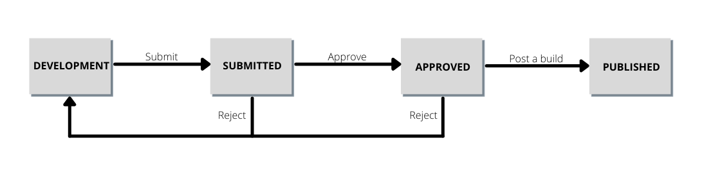

# 게시 플로우

>[!NOTE]
>
>Adobe Experience Platform Launch은 Adobe Experience Platform의 데이터 수집 기술군으로 새롭게 브랜딩되었습니다. 그 결과로 제품 설명서 전반에서 몇 가지 용어 변경이 있었습니다. 용어 변경에 대한 통합 참고 자료는 다음 [문서](../../term-updates.md)를 참조하십시오.

Adobe Experience Platform의 태그 게시 플로우는 라이브러리를 만들고 빌드를 테스트하고 프로덕션용으로 승인하는 프로세스를 의미합니다.

라이브러리에서 수행할 수 있는 작업은 라이브러리의 상태와 사용자의 권한 수준에 따라 다릅니다. 또한 라이브러리의 상태는 게시 플로우의 업스트림에 따라 라이브러리에 포함된 리소스(규칙, 데이터 요소 및 확장)에도 영향을 줍니다.

아래 섹션에서는 게시 플로우와 관련된 권한, 라이브러리 상태 및 업스트림에 대한 세부 정보를 다룹니다.

## 권한 {#permissions}

게시 플로우에 여러 수준의 중요한 사용자 권한이 있습니다. 특히, [!UICONTROL 개발], [!UICONTROL 승인], 및 [!UICONTROL 게시] 속성 권한:

* **[!UICONTROL 개발]**: 라이브러리를 만들고 개발용으로 빌드하고 승인을 위해 제출하는 능력이 포함됩니다.
* **[!UICONTROL 승인]**: 스테이징용으로 빌드하고 스테이징된 빌드를 승인하는 능력이 포함됩니다.
* **[!UICONTROL 게시]**: 승인된 라이브러리를 게시하는 능력이 포함됩니다.

권리는 포함되지 않습니다. 한 사람이 처음부터 끝까지 작업 과정을 수행하려면 주어진 속성 내에 있는 세 개의 권한을 모두 부여 받아야 합니다.

다음을 참조하십시오. [사용자 권한 안내서](../administration/user-permissions.md) 태그에 대한 권한 관리에 대한 자세한 정보입니다.

## 라이브러리 상태 {#state}

게시 플로우와 관련하여 라이브러리는 다음과 같은 네 가지 기본 상태에 있을 수 있습니다.

* [[!UICONTROL 개발]](#development)
* [[!UICONTROL 제출됨]](#submitted)
* [[!UICONTROL 승인됨]](#approved)
* [[!UICONTROL 게시됨]](#published)

이 네 가지 상태는 다음 내에서 열로 표시됩니다. **[!UICONTROL 게시 플로우]** 탭.

이러한 상태 간에 라이브러리를 이동하려면 특정 작업을 수행해야 합니다. 다음 다이어그램은 상태 간에 라이브러리를 이동하는 각 작업을 간략하게 설명합니다.

### [!UICONTROL 개발] {#development}

새 라이브러리가 생성되면에서 시작됩니다. [!UICONTROL 개발] 주. 라이브러리에 대한 모든 변경은 라이브러리가 있는 동안 이루어져야 합니다 [!UICONTROL 개발]. 개발 및 테스트가 완료되면 승인을 위해 라이브러리를 제출할 수 있습니다.

다음 표는에서 라이브러리에 대해 사용 가능한 작업을 간략하게 설명합니다. [!UICONTROL 개발] 상태:

| 작업 | 설명 |
| --- | --- |
| [!UICONTROL 편집] | 사용 [!UICONTROL 라이브러리 편집] 라이브러리에서 구성 요소를 추가하거나 제거하는 화면입니다. |
| [!UICONTROL 개발 빌드] | 라이브러리에 대한 빌드를 만듭니다. 빌드가 컴파일되고 라이브러리가 할당된 환경에 배포됩니다. 라이브러리가 환경에 할당되지 않았거나 업스트림에 이미 정의된 변경 사항이 포함된 경우 이 단계는 실패합니다. |
| [!UICONTROL 승인을 위한 제출] | 개발 환경에서 라이브러리 할당을 해제하고 라이브러리를 [!UICONTROL 제출됨] 작업 승인 권한이 있는 사용자의 열입니다. 이 옵션을 활성화하려면 라이브러리의 최신 빌드가 성공해야 합니다. |
| [!UICONTROL 스테이징에 제출 및 빌드] | 이 작업은 개발 및 승인 권한이 모두 있는 사용자만 수행할 수 있습니다. 이 작업을 수행하면 개발 환경에서 라이브러리 할당이 취소되고 라이브러리가 [!UICONTROL 제출됨] 스테이징 환경에 라이브러리를 빌드합니다. 이 옵션을 활성화하려면 라이브러리의 최신 빌드가 성공해야 합니다. |
| [!UICONTROL Approve for Publishing] | 이 작업은 개발 및 승인 권한이 모두 있는 사용자만 수행할 수 있습니다. 이 작업은 개발 환경에서 라이브러리 할당을 취소하고 로 이동합니다. [!UICONTROL 승인됨] 상태 - 스테이징 환경 및 을 건너뜁니다. [!UICONTROL 제출됨] 완전히 말해. 이 옵션을 활성화하려면 라이브러리의 최신 빌드가 성공해야 합니다. |
| [!UICONTROL 승인 및 프로덕션에 게시] | 이 작업은 개발, 승인 및 게시 권한이 있는 사용자만 수행할 수 있습니다. 이 작업을 수행하면 개발 환경에서 라이브러리 할당이 취소되고 라이브러리로 이동합니다. [!UICONTROL 승인됨] 상태 및 게시를 프로덕션에 추가합니다. 프로덕션 빌드가 완료되면 라이브러리가 로 이동합니다. [!UICONTROL 게시됨] 주. 이 옵션을 활성화하려면 라이브러리의 최신 빌드가 성공해야 합니다. |
| [!UICONTROL 삭제] | 시스템에서 라이브러리를 제거합니다. 환경에서 빌드가 제거되지는 않습니다. |

### [!UICONTROL 제출됨] {#submitted}

라이브러리가 다음에 있을 때 [!UICONTROL 제출됨] 상태, 승인 권한이 있는 사용자는 스테이징 환경에서 라이브러리를 테스트할 수 있습니다. 테스트가 완료되면 라이브러리를 승인하거나 거부할 수 있습니다. 거부된 빌드는 다음으로 돌아가기 [!UICONTROL 개발] 게시 플로우를 다시 시작하기 전에 추가 변경을 수행할 수 있습니다.

다음 표는에서 라이브러리에 대해 사용 가능한 작업을 간략하게 설명합니다. [!UICONTROL 제출됨] 상태:

| 작업 | 설명 |
| --- | --- |
| [!UICONTROL 열기] | 라이브러리의 콘텐츠를 봅니다. 의 외부에 있는 라이브러리는 변경할 수 없습니다. [!UICONTROL 개발] 열. 변경이 필요한 경우 변경할 수 있도록 라이브러리를 거부해야 합니다. [!UICONTROL 개발]. |
| [!UICONTROL Build for Staging] | 배포를 위해 스테이징 환경에서 라이브러리를 빌드합니다. |
| [!UICONTROL Approve for Publishing] | 라이브러리를 다음으로 이동 [!UICONTROL 승인됨] 작업을 수행할 수 있는 게시 권한이 있는 사용자의 열입니다. |
| [!UICONTROL 승인 및 프로덕션에 게시] | 승인 및 게시 권한이 모두 있는 사용자만 수행할 수 있습니다. 이 작업은 스테이징 환경에서 라이브러리 할당을 취소하고 로 이동합니다. [!UICONTROL 승인됨] 상태 및 게시를 프로덕션에 추가합니다. 프로덕션 빌드가 완료되면 라이브러리가 로 이동합니다. [!UICONTROL 게시됨] 주. 이 작업은 스테이징 환경에서 성공적으로 빌드하지 않고도 을 사용하여 수행할 수 있습니다. |
| [!UICONTROL 거부] | 스테이징 환경에서 라이브러리 할당을 해제하고 라이브러리를 다시 로 이동합니다. [!UICONTROL 개발] 추가 변경을 위한 열. |

### [!UICONTROL 승인됨] {#approved}

라이브러리가 승인되면 게시 권한이 있는 사용자가 라이브러리를 게시하거나 거부할 수 있습니다. 거부된 빌드는 다음으로 돌아가기 [!UICONTROL 개발] 게시 플로우가 다시 시작되기 전에 추가 변경을 수행할 수 있도록 합니다.

다음 표는에서 라이브러리에 대해 사용 가능한 작업을 간략하게 설명합니다. [!UICONTROL 승인됨] 상태:

| 작업 | 설명 |
| --- | --- |
| [!UICONTROL 열기] | 라이브러리의 콘텐츠를 봅니다. 의 외부에 있는 라이브러리는 변경할 수 없습니다. [!UICONTROL 개발] 열. 변경이 필요한 경우 변경할 수 있도록 라이브러리를 거부해야 합니다. [!UICONTROL 개발]. |
| [!UICONTROL 빌드 및 프로덕션에 게시] | 스테이징 환경에서 라이브러리 할당을 해제하고 프로덕션 환경에 라이브러리를 할당하고 배포합니다.  **중요**: 이 옵션을 선택하면 라이브러리가 프로덕션 환경에서 활성화됩니다. 이 옵션을 선택하기 전에 라이브러리에 원하는 변경 사항이 포함되어 있는지 확인하십시오. |
| [!UICONTROL 거부] | 스테이징 환경에서 라이브러리 할당을 해제하고 라이브러리를 [!UICONTROL 개발] 추가 변경을 위한 열. |

### [!UICONTROL 게시됨] {#published}

다음 [!UICONTROL 게시됨] 열에는 게시된 라이브러리 및 게시 날짜가 표시됩니다. 현재 게시된 라이브러리 옆에 녹색 점이 표시됩니다. 이전 라이브러리에서 다시 게시를 수행하지 않은 경우 이 라이브러리는 항상 열의 맨 위에 있는 라이브러리입니다.

| 작업 | 설명 |
| --- | --- |
| [!UICONTROL 열기] | 라이브러리의 콘텐츠를 봅니다. 의 외부에 있는 라이브러리는 변경할 수 없습니다. [!UICONTROL 개발] 열. 프로덕션 환경에 있는 내용을 변경하려면 새 라이브러리를 만들고 전체 게시 프로세스를 통과시켜야 합니다. |
| [!UICONTROL 다시 게시] | 이 작업은 가장 최근에 게시된 5개의 라이브러리에서만 수행할 수 있으며, 프로덕션 환경이 (A) 아카이브 옵션을 해제하여 구성하고 (b) 를 사용하는 경우에만 수행할 수 있습니다. [!UICONTROL Adobe에서 관리] 빌드 시 를 호스팅합니다. |
| [!UICONTROL 다운로드] | 이 작업은 가장 최근에 게시된 5개의 라이브러리에서만 사용할 수 있으며, 프로덕션 환경이 (A) 아카이브 옵션이으로 구성되어 있고 (b) 가 를 사용하는 경우에만 가능합니다 [!UICONTROL Adobe에서 관리] 빌드 시 를 호스팅합니다. |

## 업스트림 {#upstream}

첫 번째 라이브러리를 게시한 후에 새 라이브러리가 게시 플로우를 통과하므로 업스트림의 역할을 이해하는 것이 중요해집니다.

라이브러리가 현재 [!UICONTROL 개발], [!UICONTROL 제출됨], 또는 [!UICONTROL 승인됨] 스테이징하면 해당 라이브러리는 업스트림에 있는 라이브러리의 규칙, 데이터 요소 및 확장을 상속합니다. 이러한 상속된 리소스는 게시 플로우를 통과할 때 각 라이브러리에 대한 “기준선”이 됩니다. 기본적으로 각각의 새 라이브러리를 단순하게 업스트림에 의해 설정된 기준선에 대한 일련의 변경 사항으로 여길 수 있습니다. 이로써 새 반복이 게시될 때 이전 라이브러리에서 예기치 않게 덮어쓰여지는 것이 없습니다.

업스트림에 포함되는 내용은 라이브러리의 현재 단계에 따라 다릅니다. 예를 들어 의 라이브러리 [!UICONTROL 승인됨] 열은 다음에서 리소스만 상속합니다. [!UICONTROL 게시됨] 라이브러리, 반면에 라이브러리는 [!UICONTROL 개발] 다른 모든 열에서 리소스를 상속합니다.

UI에서 라이브러리를 편집할 때 업스트림에서 상속된 모든 리소스는 **[!UICONTROL 업스트림 리소스]** 섹션. 이러한 리소스를 보려면 섹션 제목 아래의 확장 탭을 선택합니다.

섹션이 확장되어 업스트림에서 상속된 개별 리소스를 표시합니다. 왼쪽 레일을 사용하여 다음을 필터링할 수 있습니다. [!UICONTROL 규칙], [!UICONTROL 데이터 요소], 및 [!UICONTROL 확장]또는 검색 창을 사용하여 이름으로 특정 리소스를 조회합니다.

## 다음 단계

이 안내서에서는 Adobe Experience Platform의 라이브러리에 대한 게시 플로우에 대한 높은 수준의 개요를 제공했습니다. 라이브러리 게시 방법에 대한 자세한 내용은 [게시 개요](./overview.md)를 참조하십시오.
