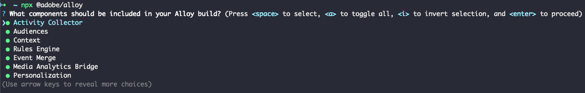
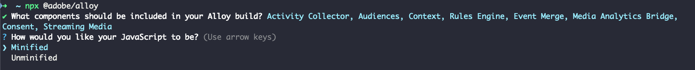

# 사용자 지정 웹 SDK 빌드 만들기

Experience Platform 웹 SDK 라이브러리에는 개인화, ID, 링크 추적 등과 같은 다양한 기능에 대한 여러 모듈이 포함되어 있습니다. 사용 사례에 따라 전체 라이브러리가 아닌 특정 기능만 필요할 수 있습니다. 사용자 지정 웹 SDK 빌드를 만들면 필요한 모듈만 선택할 수 있으므로 라이브러리 크기를 줄이고 성능을 향상시킬 수 있습니다.

## 사용 사례 {#use-case}

사용자 지정 웹 SDK 빌드를 만들면 라이브러리 크기를 줄이고 성능을 높일 수 있습니다. 다음은 몇 가지 예입니다.

### 미디어 분석 제거 {#media-analytics-removal}

웹 사이트에 미디어 컨텐츠가 없는 경우 빌드에서 [!DNL Media Analytics] 및 [!DNL Streaming Media] 모듈을 제외할 수 있습니다. 이렇게 하면 웹 SDK 빌드 크기를 최대 50%까지 줄이고 로드 속도를 향상시킬 수 있습니다.

### Personalization 제거 {#personalization}

사용자 메트릭만 수집해야 하고 개인화에 Adobe Target 또는 Journey Optimizer을 사용할 계획이 없는 경우 [!DNL Personalization] 모듈을 제외할 수 있습니다. 이렇게 하면 라이브러리 크기가 감소하면서도 필요한 지표를 수집할 수 있습니다.

## 전제 조건 {#prerequisites}

사용자 지정 웹 SDK 빌드를 만들려면 Web SDK NPM 패키지가 필요합니다. 컴퓨터에 [Node.js](https://nodejs.org/en/download/package-manager/all)가 설치되어 있는지 확인하십시오. 자세한 내용은 [NPM 패키지를 사용하여 웹 SDK을 설치](npm.md)하는 방법에 대한 설명서를 참조하십시오.

## 구성 요소 및 종속성 {#components-dependencies}

사용자 지정 웹 SDK 빌드를 만들기 전에 사용할 웹 SDK 구성 요소와 명령을 정의합니다. 일부 명령은 빌드에 포함되는 특정 모듈에 따라 다릅니다.

아래 표는 웹 SDK 모듈과 이 모듈에 포함된 명령 간의 관계를 보여 줍니다.

| 모듈 종속성 | 구성 매개 변수 | 명령 | 크기 범주 |
|---------|----------|---------|---------|
| 활동 수집기 | [`clickCollectionEnabled`](../commands/configure/clickcollectionenabled.md) | N/A | 보통 |
| 대상자 | N/A | N/A | 소규모 |
| 컨텍스트 | [`context`](../commands/configure/context.md) | N/A | 소규모 |
| 규칙 엔진 | `personalizationStorageEnabled` | | <ul><li>`evaluateRulesets`</li><li>[`subscribeRulesetItems`](../commands/subscriberulesetitems.md)</li></ul> | 보통 |
| 이벤트 병합 | N/A | `createEventMergeId` | 소규모 |
| 미디어 분석 Bridge | N/A | [`getMediaAnalyticsTracker`](../commands/getmediaanalyticstracker.md) | 대규모 |
| 개인화 | <ul><li>[`prehidingStyle`](../commands/configure/prehidingstyle.md)</li><li>[`targetMigrationEnabled`](../commands/configure/targetmigrationenabled.md)</li><li>[`autoCollectPropositionInteractions`](../commands/configure/autocollectpropositioninteractions.md)</li></ul> | N/A | 대규모 |
| 동의 | [`defaultConsent`](../commands/configure/defaultconsent.md) | [`setConsent`](../commands/setconsent.md) | 소규모 |
| 스트리밍 미디어 | [`streamingMedia`](../commands/configure/streamingmedia.md) | <ul><li>[`createMediaSession`](../commands/createmediasession.md)</li><li>[`sendMediaEvent`](../commands/sendmediaevent.md)</li></ul> | 대규모 |

## NPM 패키지를 사용하여 사용자 지정 웹 SDK 빌드 만들기 {#create-custom-build}

1. 터미널을 열고 `npx @adobe/alloy`을(를) 실행합니다. 사용자 지정 빌드에 포함할 웹 SDK 구성 요소를 선택하라는 메시지가 표시됩니다.

   

   화살표 키를 사용하여 모듈 목록에서 위아래로 이동합니다.

   * 선택한 모듈을 활성화하거나 비활성화하려면 **스페이스**&#x200B;를 누르십시오.
   * `A`을(를) 눌러 모든 모듈을 활성화하거나 비활성화합니다.
   * 선택 영역을 반전하려면 `I`을(를) 누르십시오.
   * `Enter`을(를) 눌러 선택 내용을 확인하고 다음 단계로 이동합니다.

1. 사용자 지정 빌드에 포함할 모듈을 선택한 후 사용자 지정 웹 SDK 라이브러리 빌드의 축소되거나 축소되지 않은 버전을 저장할 수 있습니다. 원하는 옵션을 선택하고 `Enter`을(를) 누릅니다.

   

1. 그런 다음 로컬 컴퓨터에서 빌드를 저장할 위치를 묻는 메시지가 표시됩니다. `Enter`을(를) 눌러 미리 선택된 위치를 확인하거나 새 위치를 입력하십시오.

   

1. 위치를 확인하면 사용자 지정 빌드가 생성되고 저장됩니다.

   

