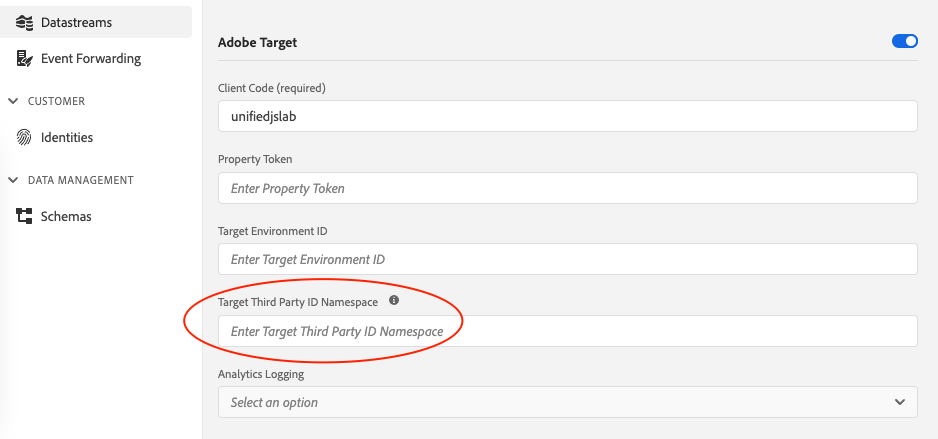

# `mbox3rdPartyId`이란?

Adobe Target의 mbox3rdPartyID는 회사의 충성도 프로그램을 위한 멤버십 ID와 같은 회사의 방문자 ID입니다.

방문자가 회사 사이트에 로그인하면 일반적으로 회사는 방문자 계정, 로열티 카드, 멤버십 번호 또는 해당 회사에 대한 기타 적용 가능한 식별자에 연결되는 ID를 만듭니다. [자세히 알아보기](https://experienceleague.adobe.com/docs/target/using/audiences/visitor-profiles/3rd-party-id.html#)


## 웹 SDK를 사용하여 `mbox3rdPartyId`을(를) 사용하는 방법

### 1단계: `Target Third Party ID Namespace` 구성

mbox 타사 ID로 사용할 ID 네임스페이스를 사용하여 [데이터스트림](../../../datastreams/overview.md)에서 `Target Third Party ID Namespace`을(를) 구성합니다.
[ID 네임스페이스에 대해 자세히 알아보기](https://experienceleague.adobe.com/docs/experience-platform/identity/namespaces.html?lang=ko)



### 2단계: `mbox3rdpartyId`을(를) 대상으로 보내기

1단계에서 구성한 ID 네임스페이스를 사용하여 `sendEvent` 명령의 Target으로 `mbox3rdpartyId`을(를) 보냅니다.
[ID 전송에 대해 자세히 알아보기](../../identity/overview.md#syncing-identities)

```javascript
alloy("sendEvent", {
  xdm: {
    "identityMap": {
      "ID_NAMESPACE": [ // Replace `ID_NAMESPACE` with the namespace you have configured in Step 1.
        {
          "id": "1234",
          "authenticatedState": "authenticated"
        }
      ]
    }
  }
});
```
