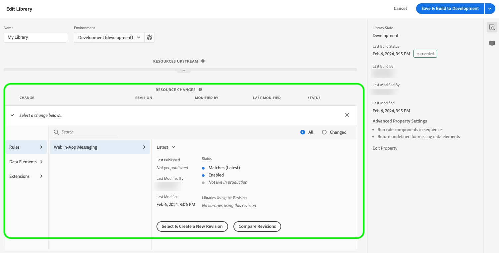

# 웹 SDK에서 웹 인앱 메시지 지원 구성

인앱 메시지는 웹 애플리케이션 내의 사용자에게 보내 특정 관심 영역으로 안내하는 알림입니다.

새 기능 홍보, 특별 오퍼 제공 또는 사용자 온보딩 지원 등 다양한 목적으로 이러한 알림을 사용할 수 있습니다.

인앱 메시지를 사용하면 대상자와 효과적으로 소통하고 대상자의 메시지를 애플리케이션의 중요한 측면으로 유도할 수 있습니다.

>[!IMPORTANT]
>
>Web In-App Messaging은 Web SDK을 사용하여 개인화된 콘텐츠를 제공하는 [Adobe Journey Optimizer](https://experienceleague.adobe.com/docs/journey-optimizer/using/ajo-home.html?lang=ko) 기능입니다.
>
>웹 인앱 메시지 캠페인을 구성하는 방법에 대한 자세한 지침은 [Adobe Journey Optimizer 설명서](https://experienceleague.adobe.com/docs/journey-optimizer/using/in-app/create-in-app-web.html)를 참조하세요.


## 전제 조건 {#prerequisites}

### 웹 SDK 태그 확장 버전 {#extension-version}

웹 인앱 메시지 기능을 사용하려면 최신 버전의 웹 SDK 태그 확장이 필요합니다.

### 웹 인앱 메시지에 대한 CSP 구성 {#csp}

[웹 인앱 메시지](../personalization/web-in-app-messaging.md)를 구성할 때 CSP에 다음 지시문을 포함해야 합니다.

```
default-src  blob:;
```

CSP 구성에 대한 자세한 내용은 [전용 설명서](../use-cases/configuring-a-csp.md)를 참조하십시오.

## 웹 SDK 태그 확장을 사용하여 웹 인앱 메시지 구성 {#tag-extension}

아래 설명된 설정을 찾을 수 있는 위치를 이해하려면 [웹 SDK 태그 확장 구성 페이지](../../tags/extensions/client/web-sdk/web-sdk-extension-configuration.md)를 참조하세요.

웹 SDK 태그 확장을 [설치](../../tags/extensions/client/web-sdk/web-sdk-extension-configuration.md#install-the-web-sdk-tag-extension)한 후 아래 단계에 따라 웹 인앱 메시지에 대한 확장을 구성하십시오.

**[!UICONTROL Personalization]** 섹션에서 **[!UICONTROL 개인화 저장소 사용]** 옵션을 선택합니다. 이 옵션을 사용하면 웹 SDK에서 페이지 로드 중에 사용자가 본 경험을 추적할 수 있습니다.


웹 인앱 메시지는 두 가지 유형의 트리거를 지원합니다.

* [Experience Platform에 데이터 보내기](#send-data-platform)
* [메시지 수동 트리거](#manual-trigger)

사용할 트리거에 따라 웹 SDK 태그 확장을 구성하려면 다음 섹션을 참조하십시오.

### **[!UICONTROL Experience Platform으로 데이터 보내기]** 트리거에 대한 구성 단계 {#send-data-platform}

웹 SDK 확장이 포함된 태그 속성을 선택하고 다음 설정으로 [새 규칙을 만듭니다](../../tags/ui/managing-resources/rules.md##create-a-rule).

1. **[!UICONTROL 확장]**: [!UICONTROL 코어]
2. **[!UICONTROL 이벤트 유형]**: [!UICONTROL 라이브러리가 로드됨(페이지 상단)]

   

3. 이벤트 구성을 저장하려면 **[!UICONTROL 변경 내용 유지]**&#x200B;를 선택하십시오.

그런 다음 만든 규칙에 작업을 추가해야 합니다.

1. [!DNL Actions] 섹션에서 **[!UICONTROL 추가]**&#x200B;를 선택합니다.
   

2. 다음 **[!UICONTROL 작업]** 설정을 사용하십시오.
   * **[!UICONTROL 확장]**: [!UICONTROL Adobe Experience Platform Web SDK]
   * **[!UICONTROL 작업 유형]**: [!UICONTROL 이벤트 보내기]

     

3. 화면 오른쪽의 **[!UICONTROL Personalization]** 섹션에서 **[!UICONTROL 시각적 개인화 결정 렌더링]** 옵션을 활성화합니다.
   

4. 화면 오른쪽의 **[!UICONTROL 결정 컨텍스트]** 섹션에서 캠페인 구성에 사용한 **[!UICONTROL 키]**/**[!UICONTROL 값]** 쌍을 정의하여 인앱 메시지를 사용할 수 있도록 합니다.
   

5. 구성을 저장하려면 **[!UICONTROL 변경 내용 유지]**&#x200B;를 선택하십시오.


그런 다음 새로 만든 규칙을 태그 속성 라이브러리에 추가해야 합니다. 이렇게 하려면 **[!UICONTROL 플로우 게시]**(으)로 이동하여 이전에 만든 규칙을 선택합니다.



라이브러리에 규칙을 추가한 후 **[!UICONTROL 개발에 저장 및 빌드]**&#x200B;를 선택합니다.


이제 구성 프로세스가 완료되었으며 메시지를 사용자에게 표시할 준비가 되었습니다.

### 수동 트리거 사용을 위한 구성 단계 {#manual-trigger}

웹 SDK 확장이 포함된 태그 속성을 선택하고 다음 설정으로 [새 규칙을 만듭니다](../../tags/ui/managing-resources/rules.md##create-a-rule).

1. **[!UICONTROL 확장]**: [!UICONTROL 코어]
2. **[!UICONTROL 이벤트 유형]**: [!UICONTROL 클릭]
3. 선택한 CSS 선택기로 식별되는, 페이지의 특정 요소에 대한 트리거를 설정합니다.

   


그런 다음 만든 규칙에 작업을 추가해야 합니다.

1. [!DNL Actions] 섹션에서 **[!UICONTROL 추가]**&#x200B;를 선택합니다.
   

2. 다음 **[!UICONTROL 작업]** 설정을 사용하십시오.
   * **[!UICONTROL 확장]**: [!UICONTROL Adobe Experience Platform Web SDK]
   * **[!UICONTROL 작업 유형]**: [!UICONTROL 규칙 집합 평가]

     

3. 화면 오른쪽에서 **[!UICONTROL 시각적 개인화 결정 렌더링]** 옵션을 활성화합니다.
   


4. 화면 오른쪽의 **[!UICONTROL 결정 컨텍스트]** 섹션에서 캠페인 구성에 사용한 **[!UICONTROL 키]**/**[!UICONTROL 값]** 쌍을 정의하여 인앱 메시지를 사용할 수 있도록 합니다.
   

5. 구성을 저장하려면 **[!UICONTROL 변경 내용 유지]**&#x200B;를 선택하십시오.

그런 다음 새로 만든 규칙을 태그 속성 라이브러리에 추가해야 합니다. 이렇게 하려면 **[!UICONTROL 플로우 게시]**(으)로 이동하여 이전에 만든 규칙을 선택합니다.


라이브러리에 규칙을 추가한 후 **[!UICONTROL 개발에 저장 및 빌드]**&#x200B;를 선택합니다.


이제 구성 프로세스가 완료되었으며 메시지를 사용자에게 표시할 준비가 되었습니다.

## 웹 SDK JavaScript 라이브러리를 사용하여 웹 인앱 메시지 구성 {#js-library}

웹 SDK 태그 확장을 사용하는 대신 웹 SDK JavaScript 라이브러리에서 직접 웹 인앱 메시지 를 구성할 수도 있습니다.


Adobe Journey Optimizer에서 보내는 웹 인앱 메시지를 두 가지 방법으로 표시할 수 있습니다.

### 방법 1: 개인화 콘텐츠를 자동으로 가져오기 {#automatic}

웹 SDK에서 페이지를 로드할 때 자동으로 개인화 콘텐츠를 가져오려면 아래 예와 같이 `sendEvent` 명령을 사용하십시오.

```js
  alloy("sendEvent", {
      renderDecisions: true,
      personalization: {
          surfaces: ['#welcome']
      }
  });
```

### 방법 2: 사용자 작업에 따라 개인화 콘텐츠를 수동으로 가져오기 {#manual}

사용자가 특정 작업을 수행한 후에만 개인화 콘텐츠를 표시하려면 아래 예와 같이 `evaluateRulesets` 명령을 사용합니다.

이 예제에서는 사용자가 웹 사이트에서 **[!UICONTROL 지금 구입]** 단추를 클릭하면 개인화 콘텐츠가 표시됩니다.

```js
 alloy("evaluateRulesets", {
     renderDecisions: true,
     personalization: {
         decisionContext: {
             "userAction": "buy_now"
         }
     }
 });
```

### 개인화 스토리지 구성 {#personalization-storage}

`personalizationStorageEnabled` 구성 옵션을 통해 설정된 횟수 동안 또는 사용자가 페이지를 방문할 때마다 인앱 메시지를 표시하도록 선택할 수 있습니다.

[웹 SDK 구성](../commands/configure/overview.md)에서 필요에 따라 `personalizationStorageEnabled` 옵션을 설정합니다.

* `personalizationStorageEnabled: true`은(는) [Adobe Journey Optimizer 캠페인](https://experienceleague.adobe.com/docs/journey-optimizer/using/in-app/create-in-app-web.html#configure-inapp)에서 정의한 빈도로 인앱 메시지를 트리거합니다.
* `personalizationStorageEnabled: false`은(는) 페이지를 로드할 때마다 인앱 메시지를 트리거합니다.
