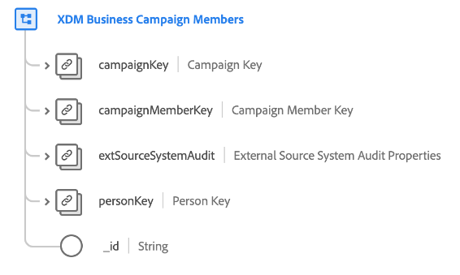

# [!UICONTROL XDM 비즈니스 캠페인 ] 멤버클래스

>[!NOTE]
>
>이 클래스는 실시간 고객 데이터 플랫폼의 B2B 버전에 액세스할 수 있는 조직에서만 사용할 수 있습니다.

[!UICONTROL XDM 비즈니스 캠페인 ] 멤버십은 비즈니스 캠페인과 연관된 담당자 또는 리드를 설명하는 표준 XDM(Experience Data Model) 클래스를 제공합니다.

| 속성 | 데이터 유형 | 설명 |
| --- | --- | --- |
| `campaignKey` | [[!UICONTROL B2B 소스]](../../data-types/b2b-source.md) | 연결된 캠페인에 대한 복합 식별자입니다. |
| `campaignMemberKey` | [[!UICONTROL B2B 소스]](../../data-types/b2b-source.md) | 캠페인 멤버십 엔티티에 대한 복합 식별자입니다. |
| `extSourceSystemAudit` | [[!UICONTROL 외부 소스 시스템 감사 속성]](../../data-types/external-source-system-audit-attributes.md) | 캠페인 멤버십이 외부 소스 시스템에서 가져오는 경우 이 개체는 해당 시스템의 감사 특성을 캡처합니다. |
| `personKey` | [[!UICONTROL B2B 소스]](../../data-types/b2b-source.md) | 연결된 캠페인의 멤버인 사람에 대한 복합 식별자입니다. |
| `_id` | 문자열 | 레코드의 고유 식별자입니다. 이 값은 `campaignMemberID`과 별도의 시스템에서 생성한 값입니다. |
| `campaignID` | 문자열 | 연결된 캠페인에 대한 고유 ID입니다. |
| `campaignMemberID` | 문자열 | 캠페인 멤버십 엔티티에 대한 고유 ID입니다. |
| `personId` | 문자열 | 연결된 캠페인의 멤버인 사람의 고유 ID입니다. |
