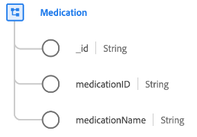

# [!UICONTROL 약물] 클래스

XDM(Experience Data Model)에서 [!UICONTROL 약물] class는 의약품, 의약품 등 의료용으로 사용되는 물질을 정의하는 최소한의 물성을 캡처한다.

| 속성 | 데이터 유형 | 설명 |
| --- | --- | --- |
| `_id` | [!UICONTROL 문자열] | 레코드에 대한 고유한 시스템 생성 문자열 식별자입니다. 이 필드는 개별 레코드의 고유성을 추적하고, 데이터의 중복을 방지하고, 다운스트림 서비스에서 해당 레코드를 조회하는 데 사용됩니다.  이 필드는 시스템이 생성되므로 데이터를 수집하는 동안 명시적 값을 제공하지 않습니다. 그러나 원할 경우 여전히 고유한 ID 값을 제공하도록 선택할 수 있습니다. |
| `medicationId` | [!UICONTROL 문자열] | 약물의 고유 식별자입니다. |
| `medicationName` | [!UICONTROL 문자열] | 약물의 이름. |

{style=&quot;table-layout:auto&quot;}

클래스는 [[!UICONTROL 의료용 약물] 필드 그룹](../field-groups/medication/healthcare-medication.md) 그 약이나 약물에 관한 더 자세한 내용을 설명하다.
