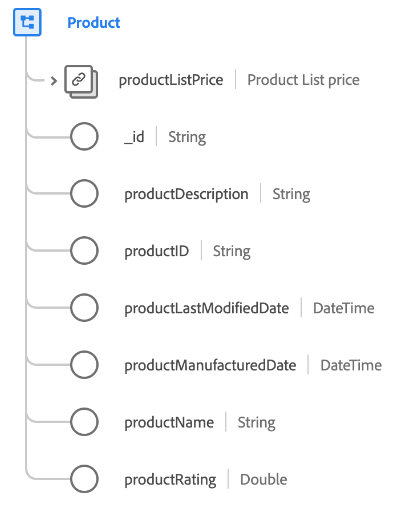

# [!UICONTROL 제품] 클래스

XDM(Experience Data Model)에서 [!UICONTROL 제품] 클래스는 제품을 정의하는 최소 속성 집합을 캡처합니다.

| 속성 | 데이터 유형 | 설명 |
| --- | --- | --- |
| `productListPrice` | [통화](../data-types/currency.md) | 판매 및 할인 전 제품의 기본 가격을 설명합니다. |
| `_id` | 문자열 | 레코드에 대한 고유한 시스템 생성 문자열 식별자입니다. 이 필드는 개별 레코드의 고유성을 추적하고, 데이터의 중복을 방지하고, 다운스트림 서비스에서 해당 레코드를 조회하는 데 사용됩니다.  이 필드는 시스템이 생성되므로 데이터를 수집하는 동안 명시적 값을 제공하지 않습니다. 그러나 원할 경우 여전히 고유한 ID 값을 제공하도록 선택할 수 있습니다. |
| `productDescription` | 문자열 | 제품에 대한 설명입니다. |
| `productID` | 문자열 | 제품에 대한 고유 식별자입니다. |
| `productLastModifiedDate` | DateTime | An [RFC3339](https://datatracker.ietf.org/doc/html/rfc3339) 업데이트에 대해 이 제품이 마지막으로 수정된 시간의 타임스탬프입니다. |
| `productManufacturedDate` | DateTime | An [RFC3339](https://datatracker.ietf.org/doc/html/rfc3339) 이 제품을 만든 시간의 타임스탬프입니다. |
| `productName` | 문자열 | 제품의 이름입니다. |
| `productRating` | 문자열 | 제품의 고객 검토 등급입니다. |

{style=&quot;table-layout:auto&quot;}

## 호환 가능한 필드 그룹 {#field-groups}

Adobe은 와 함께 사용할 여러 표준 필드 그룹을 제공합니다 [!DNL XDM Individual Profile] 클래스 이름을 지정합니다. 다음은 클래스에 일반적으로 사용되는 몇 가지 필드 그룹 목록입니다.

* [[!UICONTROL 제품 카탈로그]](../field-groups/product/product-catalog.md)
* [[!UICONTROL 제품 카테고리]](../field-groups/product/product-category.md)
