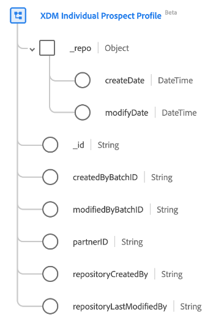

# [!UICONTROL XDM 개별 잠재 고객 프로필] 클래스

>[!IMPORTANT]
>
>다음 [!UICONTROL XDM 개별 잠재 고객 프로필] 클래스는 beta 버전이며 모든 사용자가 사용할 수 없습니다. 설명서 및 기능은 변경될 수 있습니다.

XDM(경험 데이터 모델)에서 [!UICONTROL XDM 개별 잠재 고객 프로필] 클래스는 일반적으로 데이터 파트너로부터 가져온 잠재 고객 프로필을 캡처하여 고객을 주요 고객으로 확보할 수 있습니다.

| 속성 | 데이터 유형 | 설명 |
| --- | --- | --- |
| `_repo` | 오브젝트 | 이 클래스를 사용하면 데이터 공급업체에서 가져온 잠재 프로필을 가져와서 고객 확보 사용 사례를 단계별로 분류할 수 있습니다. |
| `_repo.createDate` | [!UICONTROL DateTime] | 저장소에서 리소스를 만든 서버 날짜 및 시간입니다. 자산 파일을 처음 업로드하거나 서버에서 새 자산의 상위 디렉토리로 디렉토리를 만들 때 생성 시간이 될 수 있습니다. datetime 속성은 ISO 8601 표준을 준수해야 합니다. 이 형식의 예는 &quot;2004-10-23T12&quot;입니다:00:00-06:00&quot;. |
| `_repo.modifyDate` | [!UICONTROL DateTime] | 리소스가 리포지토리에 마지막으로 수정된 서버 날짜와 시간(새 버전의 에셋이 업로드되거나 디렉터리의 하위 리소스가 추가 또는 제거된 날짜와 시간 등) datetime 속성은 ISO 8601 표준을 준수해야 합니다. 예제 양식은 &quot;2004-10-23T12:00:00-06:00&quot; |
| `_id` | [!UICONTROL 문자열] | 레코드에 대한 시스템에서 생성한 고유한 문자열 식별자. 이 필드는 개별 레코드의 고유성을 추적하고, 데이터 중복을 방지하고, 다운스트림 서비스에서 해당 레코드를 조회하는 데 사용됩니다.  이 필드는 시스템에서 생성되므로 데이터 수집 중에 명시적 값을 제공하지 않습니다. 그러나 원하는 경우 고유한 ID 값을 제공하도록 선택할 수 있습니다. |
| `createdByBatchID` | [!UICONTROL 문자열] | 레코드가 생성된 수집된 일괄 처리의 ID입니다. |
| `modifiedByBatchID` | [!UICONTROL 문자열] | 마지막으로 수집된 일괄 처리의 ID로 인해 레코드가 업데이트되었습니다. |
| `partnerID` | [!UICONTROL 문자열] | 일반적으로 개별 잠재 고객을 식별하는 고유한 익명 식별자입니다. 다음에서 설명서를 참조하십시오. [id 유형](../../identity-service/namespaces.md#identity-types) Adobe Experience Platform에서 사용할 수 있는 Partner ID 및 기타 ID 유형에 대해 자세히 알아보려면 |
| `repositoryCreatedBy` | [!UICONTROL 문자열] | 레코드를 만든 사용자의 ID입니다. |
| `repositoryLastModifiedBy` | [!UICONTROL 문자열] | 레코드를 마지막으로 수정한 사용자의 ID입니다. 레코드가 생성되면 `modifiedByUser` 값은 로 설정됩니다. `createdByUser` 값. |

{style="table-layout:auto"}
