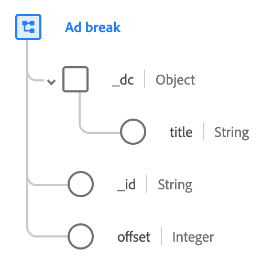

# [!UICONTROL 광고 브레이크] 데이터 유형

[!UICONTROL 광고 브레이크] 는 시간 제한 광고가 시간 미디어에 삽입되는 방법을 설명하는 표준 XDM(Experience Data Model) 데이터 유형입니다.

| 속성 | 데이터 유형 | 설명 |
| --- | --- | --- |
| `_dc.title` | 문자열 | 친숙한 광고 브레이크 이름. |
| `_id` | 문자열 | 광고 브레이크에 대한 고유 식별자입니다. |
| `offset` | 정수 | 기본 컨텐츠의 시작으로부터 광고 브레이크의 오프셋(초)입니다. |

{style=&quot;table-layout:auto&quot;}

데이터 유형에 대한 자세한 내용은 공용 XDM 저장소를 참조하십시오.

* [채워진 예](https://github.com/adobe/xdm/blob/master/components/datatypes/marketing/advertising-break.example.1.json)
* [전체 스키마](https://github.com/adobe/xdm/blob/master/components/datatypes/marketing/advertising-break.schema.json)
