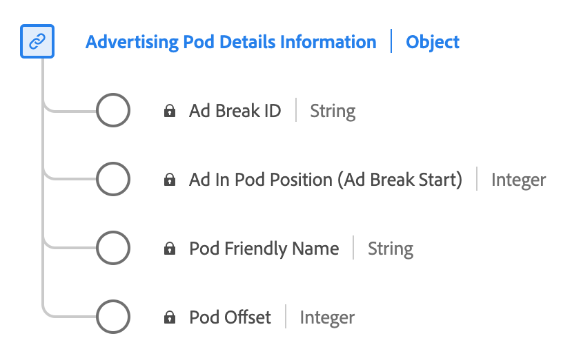

# [!UICONTROL Advertising Pod 세부 정보 보고] 데이터 형식

[!UICONTROL Advertising Pod 세부 정보 보고]은(는) 표준 XDM(Experience Data Model) 데이터 형식입니다. 일반적으로 콘텐츠 브레이크 중에 연속적으로 재생되는 광고 시퀀스 또는 그룹을 정의합니다. [!UICONTROL Advertising Pod Details 보고] 데이터 형식을 사용하여 광고 브레이크 ID, 광고 브레이크에 대한 친숙한 이름, 브레이크 내의 광고 인덱스 및 콘텐츠의 타임라인 내에서 광고 브레이크의 오프셋(초) 등의 세부 정보를 캡처합니다.

| 표시 이름 | 속성 | 데이터 유형 | 설명 |
|----------------------------|------------------------|-----------|-------------------------------------------------------|
| [!UICONTROL 광고 브레이크 ID] | `ID` | 문자열 | 광고 브레이크 ID입니다. |
| [!UICONTROL Pod 알기 쉬운 이름] | `friendlyName` | 문자열 | 쉽게 이해할 수 있는 광고 브레이크 이름입니다. |
| [!UICONTROL Pod의 광고 위치] | `index` | 정수 | 상위 광고 브레이크 시작 내에 있는 광고의 색인입니다. |
| [!UICONTROL Pod 오프셋] | `offset` | 정수 | **필수** 콘텐츠 내부의 광고 브레이크 오프셋(초)입니다. |

{style="table-layout:auto"}

필드 그룹에 대한 자세한 내용은 [공개 XDM 저장소](https://github.com/adobe/xdm/blob/master/components/datatypes/advertisingpoddetails.schema.json)를 참조하세요.
