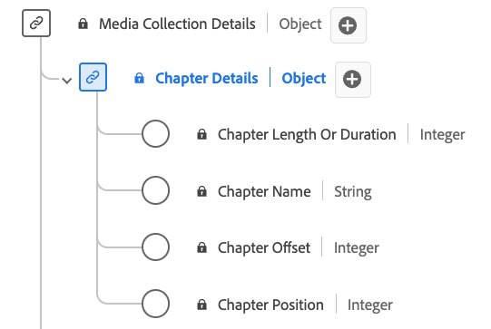

# [!UICONTROL 챕터 세부 정보] 컬렉션 데이터 유형

[!UICONTROL 챕터 세부 정보] 컬렉션은 미디어 콘텐츠 내의 챕터 또는 세그먼트와 관련된 다양한 속성을 설명하는 표준 경험 데이터 모델(XDM) 데이터 유형입니다. 사용 [!UICONTROL 챕터 세부 정보] 챕터 이름, 오프셋, 기간 및 챕터 인덱스와 같은 세부 정보를 캡처하는 컬렉션 데이터 유형입니다. 미디어 수집 필드는 데이터를 캡처하여 추가 처리를 위해 다른 Adobe 서비스로 보냅니다.

>[!NOTE]
>
>각 디스플레이 이름에는 해당 오디오 및 비디오 매개 변수에 대한 추가 정보를 볼 수 있는 링크가 포함되어 있습니다. 연결된 페이지에는 Adobe, 구현 값, 네트워크 매개 변수, 보고 및 중요 고려 사항으로 수집된 비디오 및 데이터에 대한 세부 사항이 포함되어 있습니다.

| 표시 이름 | 속성 | 데이터 유형 | 필수 여부 | 설명 |
|-------------------------------------------------------------------------------------------------------------------------------------------------------------------------|---------------|-----------|----------|---------------------------------------------------|
| [[!UICONTROL 챕터 길이 또는 기간]](https://experienceleague.adobe.com/docs/media-analytics/using/implementation/variables/chapter-parameters.html#chapter-length) | `length` | 정수 | 예 | 챕터의 길이(초)입니다. |
| [[!UICONTROL 챕터 이름]](https://experienceleague.adobe.com/docs/media-analytics/using/implementation/variables/chapter-parameters.html#chapter-name) | `friendlyName` | 문자열 | 아니요 | 챕터 및/또는 세그먼트의 이름입니다. |
| [[!UICONTROL 챕터 오프셋]](https://experienceleague.adobe.com/docs/media-analytics/using/implementation/variables/chapter-parameters.html#chapter-offset) | `offset` | 정수 | 예 | 처음부터 콘텐츠 내에 있는 챕터의 오프셋(초)입니다. |
| [[!UICONTROL 챕터 위치]](https://experienceleague.adobe.com/docs/media-analytics/using/implementation/variables/chapter-parameters.html#chapter-position) | `index` | 정수 | 예 | 콘텐츠 내에서 챕터의 위치(색인, 정수)입니다. |

{style="table-layout:auto"}
