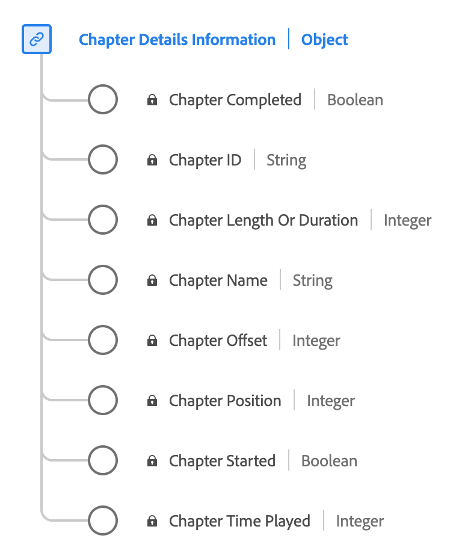

# [!UICONTROL 챕터 세부 정보] 데이터 유형

[!UICONTROL 챕터 세부 정보] 는 미디어 콘텐츠 내의 챕터 또는 세그먼트와 관련된 다양한 속성을 설명하는 표준 경험 데이터 모델(XDM) 데이터 유형입니다. 사용 [!UICONTROL 챕터 세부 정보] 챕터 이름, 기간, 위치, ID, 재생 상태(시작/완료) 및 각 챕터에서 보낸 시간 등의 세부 정보를 캡처할 데이터 유형입니다.

| 표시 이름 | 속성 | 데이터 유형 | 설명 |
|---------------------------|---------------|-----------|---------------------------------------------------|
| [!UICONTROL 챕터 이름] | `friendlyName` | 문자열 | 챕터 및/또는 세그먼트의 이름입니다. |
| [!UICONTROL 챕터 길이 또는 기간] | `length` | 정수 | **필수** 챕터의 길이(초)입니다. |
| [!UICONTROL 챕터 오프셋] | `offset` | 정수 | **필수** 처음부터 콘텐츠 내에 있는 챕터의 오프셋(초)입니다. |
| [!UICONTROL 챕터 위치] | `index` | 정수 | **필수** 콘텐츠 내에서 챕터의 위치(색인, 정수)입니다. |
| [!UICONTROL 챕터 ID] | `ID` | 문자열 | 자동으로 생성된 챕터의 ID입니다. |
| [!UICONTROL 챕터 시작됨] | `isStarted` | 부울 | 챕터가 시작되었는지 여부. |
| [!UICONTROL 챕터 완료됨] | `isCompleted` | 부울 | 챕터가 완료되었는지 여부. |
| [!UICONTROL 챕터 재생 시간] | `timePlayed` | 정수 | 챕터에서 보낸 시간(초)입니다. |

{style="table-layout:auto"}

필드 그룹에 대한 자세한 내용은 [공개 XDM 저장소](https://github.com/adobe/xdm/blob/master/components/datatypes/chapterdetails.schema.json)
