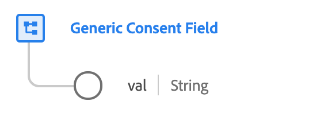

# [!UICONTROL 일반 동의 필드] 데이터 형식

[!UICONTROL 일반 동의 필드]은(는) 특정 동의 환경 설정에 대한 고객의 선택을 설명하는 표준 XDM 데이터 형식입니다.

>[!NOTE]
>
>이 데이터 형식은 [[!UICONTROL 동의 및 환경 설정] 필드 그룹](../field-groups/profile/consents.md)을(를) 기준으로 사용하여 조직의 동의 스키마 구조를 사용자 지정하는 데 사용됩니다.

| 속성 | 데이터 유형 | 설명 |
| --- | --- | --- |
| `val` | 문자열 | 고객이 제공한 이 사용 사례에 대한 동의 선택. 허용되는 값 및 정의에 대해서는 아래 표를 참조하십시오. |

{style="table-layout:auto"}

다음 표에서는 `val`에 대해 허용되는 값을 간략하게 설명합니다.

| 값 | 제목 | 설명 |
| --- | --- | --- |
| `y` | 예(옵트인) | 고객이 동의하기로 선택했다. 즉, 해당 동의에 표시된 대로 데이터 사용에 대해 **do** 동의합니다. |
| `n` | 아니요(옵트아웃) | 고객이 동의를 거부했습니다. 즉, 해당 동의에 명시된 대로 데이터 사용에 대해 **동의하지** 않습니다. |
| `p` | 확인 보류 중 | 시스템이 아직 최종 동의 값을 받지 못했습니다. 이는 2단계 인증이 필요한 동의의 일부로 가장 많이 사용됩니다. 예를 들어 고객이 이메일 수신을 선택하면 이메일의 링크를 선택하여 올바른 이메일 주소를 제공했는지 확인할 때까지 해당 동의는 `p`(으)로 설정되며, 이때 동의는 `y`(으)로 업데이트됩니다.  이 동의에서 2세트 확인 프로세스를 사용하지 않는 경우 `p` 선택 항목을 사용하여 고객이 동의 프롬프트에 아직 응답하지 않았음을 나타낼 수 있습니다. 예를 들어 고객이 동의 프롬프트에 응답하기 전에 웹 사이트의 첫 페이지에서 값을 `p`(으)로 자동 설정할 수 있습니다. 명시적인 동의가 필요하지 않은 관할 구역에서 고객이 명시적으로 옵트아웃하지 않았음을 나타내는 데 사용할 수도 있습니다(즉, 동의가 가정됨). |
| `u` | 알 수 없음 | 고객의 동의 정보를 알 수 없습니다. |
| `dy` | 기본값 예(옵트인) | 고객이 동의 값 자체를 제공하지 않았으며 기본적으로 옵트인(&quot;예&quot;)으로 처리됩니다. 즉, 고객이 달리 표시할 때까지 동의가 가정됩니다.  법률 또는 회사 개인정보 처리방침 변경으로 인해 일부 또는 모든 사용자의 기본값이 변경되면 기본값이 포함된 모든 프로필을 수동으로 업데이트해야 합니다. |
| `dn` | 기본값 No(옵트아웃) | 고객이 동의 값 자체를 제공하지 않았으며 기본적으로 옵트아웃(&quot;No&quot;)으로 처리됩니다. 즉 고객은 달리 표시할 때까지 동의를 거부한 것으로 간주됩니다.  법률 또는 회사 개인정보 처리방침 변경으로 인해 일부 또는 모든 사용자의 기본값이 변경되면 기본값이 포함된 모든 프로필을 수동으로 업데이트해야 합니다. |
| `LI` | 정당한 이익 | 지정된 목적을 위하여 이 자료를 수집·처리할 정당한 영업상의 이익은 그것이 개인에게 끼칠 수 있는 잠재적인 해악을 능가한다. |
| `CT` | 약정 | 지정된 목적의 데이터 수집은 개인과의 계약상 의무를 충족하기 위해 요구된다. |
| `CP` | 법적 의무 준수 | 지정된 목적의 데이터 수집은 해당 사업의 법적 의무를 충족하기 위해 요구된다. |
| `VI` | 개인의 중대한 관심 | 특정된 목적을 위한 데이터의 수집은 개인의 중대한 이익을 보호하기 위해 필요하다. |
| `PI` | 공익 | 특정된 목적의 자료 수집은 공익 또는 공권 행사의 과제를 수행하기 위한 것이다. |

{style="table-layout:auto"}

데이터 유형에 대한 자세한 내용은 공용 XDM 저장소를 참조하십시오.

* [채워진 예](https://github.com/adobe/xdm/blob/master/components/datatypes/consent/consent-field.example.1.json)
* [전체 스키마](https://github.com/adobe/xdm/blob/master/components/datatypes/consent/consent-field.schema.json)
