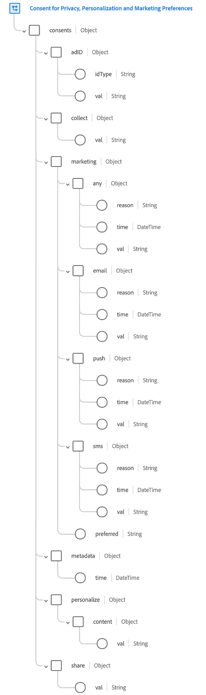

# [!UICONTROL 동의 및 환경 설정] 데이터 유형

다음 [!UICONTROL 개인 정보, 개인화 및 마케팅 환경 설정에 대한 동의] 데이터 유형(이하 &quot;라고 함)[!UICONTROL 동의 및 환경 설정] data type&quot;)은(는) [!DNL Experience Data Model] 데이터 작업에서 CMP(동의 관리 플랫폼) 및 기타 소스에 의해 생성된 고객 권한 및 환경 설정 수집을 지원하기 위한 (XDM) 데이터 유형입니다.

이 문서에서는 가 제공하는 필드의 구조와 용도에 대해 설명합니다. [!UICONTROL 동의 및 환경 설정] 데이터 유형.

## 전제 조건 {#prerequisites}

이 문서에서는 XDM과 의 스키마 사용에 대한 작업 이해가 필요합니다. [!DNL Experience Platform]. 계속하기 전에 다음 설명서를 검토하십시오.

* [XDM 시스템 개요](https://www.adobe.com/go/xdm-home-en)
* [스키마 컴포지션 기본 사항](https://www.adobe.com/go/xdm-schema-best-practices-en)

## 데이터 유형 구조 {#structure}

>[!IMPORTANT]
>
>다음 [!UICONTROL 동의 및 환경 설정] 데이터 유형은 다양한 동의 및 환경 설정 관리 사용 사례를 다루도록 설계되었습니다. 따라서 이 문서에서는 데이터 유형의 필드를 일반적인 용어로 사용하는 방법에 대해 설명하고 이러한 필드의 사용을 해석하는 방법에 대한 제안만 제공합니다. 데이터 유형의 구조를 조직에서 해석하고 고객에게 이러한 동의 및 환경 설정 선택 사항을 제시하는 방법에 맞추려면 개인 정보 보호 법률팀과 상의하십시오.

다음 [!UICONTROL 동의 및 환경 설정] 데이터 유형 은 캡처하는 데 사용되는 여러 필드를 제공합니다. **동의** 및 **환경 설정** 정보.

동의는 고객이 자신의 데이터를 사용할 수 있는 방법을 지정할 수 있는 옵션입니다. 대부분의 동의는 일부 관할권에서 데이터를 특정 방식으로 사용하기 전에 허가를 받아야 하거나, 적극 동의가 필요하지 않은 경우 고객이 해당 사용을 중지(옵트 아웃)할 수 있는 옵션을 보유해야 한다는 점에서 법적 측면이 있습니다.

환경 설정은 고객이 브랜드에 대한 경험의 다양한 측면을 처리하는 방법을 지정할 수 있는 옵션입니다. 이는 다음 두 가지 카테고리에 속합니다.

* **개인화 환경 설정**: 브랜드가 고객에게 제공되는 경험을 개인화하는 방법과 관련된 환경 설정입니다.
* **마케팅 환경 설정**: 브랜드가 다양한 채널을 통해 고객에게 연락하는 것이 허용되는지 여부에 대한 환경 설정.

다음 스크린샷은 데이터 유형의 구조가 Platform UI에 어떻게 표시되는지 보여 줍니다.



>[!TIP]
>
>다음 안내서를 참조하십시오 [xdm 리소스 살펴보기](../ui/explore.md) 에서 모든 XDM 리소스를 조회하고 Platform UI에서 해당 구조를 검사하는 방법에 대한 절차를 확인할 수 있습니다.

다음 JSON은 [!UICONTROL 동의 및 환경 설정] 데이터 유형을 처리할 수 있습니다. 이러한 각 필드의 구체적인 사용 방법에 대한 정보는 다음 섹션에서 확인할 수 있습니다.

```json
{
  "consents": {
    "collect": {
      "val": "VI",
    },
    "adID": {
      "idType": "IDFA",
      "val": "y"
    },
    "share": {
      "val": "y",
    },
    "personalize": {
      "content": {
        "val": "y"
      }
    },
    "marketing": {
      "preferred": "email",
      "any": {
        "val": "u"
      },
      "push": {
        "val": "n",
        "reason": "Too Frequent",
        "time": "2019-01-01T15:52:25+00:00"
      }
    },
    "metadata": {
      "time": "2019-01-01T15:52:25+00:00"
    }
  }
}
```

>[!TIP]
>
>Experience Platform에서 정의하는 모든 XDM 스키마에 대한 샘플 JSON 데이터를 생성하여 고객 동의 및 환경 설정 데이터가 매핑되는 방법을 시각화할 수 있습니다. 자세한 내용은 다음 설명서를 참조하십시오.
>
>* [UI에서 샘플 데이터 생성](../ui/sample.md)
>* [API에서 샘플 데이터 생성](../api/sample-data.md)

## `consents` {#choices}

`consents` 에는 고객의 동의와 환경 설정을 설명하는 몇 가지 필드가 포함되어 있습니다. 이러한 필드는 아래 하위 섹션에 자세히 설명되어 있습니다.

```json
"consents": {
  "collect": {
    "val": "VI",
  },
  "adID": {
    "idType": "IDFA",
    "val": "y"
  },
  "share": {
    "val": "y",
  },
  "personalize": {
    "content": {
      "val": "y"
    }
  },
  "marketing": {
    "preferred": "email",
    "any": {
      "val": "u"
    },
    "email": {
      "val": "n",
      "reason": "Too Frequent",
      "time": "2019-01-01T15:52:25+00:00"
    }
  }
}
```

### `collect`

`collect` 데이터를 수집하기 위한 고객의 동의를 나타냅니다.

```json
"collect": {
  "val": "y"
}
```

| 속성 | 설명 |
| --- | --- |
| `val` | 고객이 제공한 이 사용 사례에 대한 동의 선택. 다음을 참조하십시오. [부록](#choice-values) 허용되는 값 및 정의용. |

{style="table-layout:auto"}

### `adID`

`adID` 광고주 ID를 사용하여 해당 디바이스의 앱 간에 고객을 연결할 수 있는지 여부에 대한 고객의 동의를 나타냅니다.

```json
"adID": {
  "idType": "IDFA",
  "val": "y"
}
```

| 속성 | 설명 |
| --- | --- |
| `idType` | 다음 중 하나의 광고 ID 유형 `IDFA` Apple의 광고주용 ID 또는 `GAID` Google의 광고주 ID(Android 광고주 ID(AAID)라고도 함)용. |
| `val` | 고객이 제공한 이 사용 사례에 대한 동의 선택. 다음을 참조하십시오. [부록](#choice-values) 허용되는 값 및 정의용. |

{style="table-layout:auto"}

### `share`

`share` 데이터를 제2자 또는 제3자와 공유(또는 판매)할 수 있는지 여부에 대한 고객의 동의를 나타냅니다.

```json
"share": {
  "val": "y"
}
```

| 속성 | 설명 |
| --- | --- |
| `val` | 고객이 제공한 이 사용 사례에 대한 동의 선택. 다음을 참조하십시오. [부록](#choice-values) 허용되는 값 및 정의용. |

{style="table-layout:auto"}

### `personalize` {#personalize}

`personalize` 개인화에 데이터를 사용할 수 있는 방법과 관련된 고객 환경 설정을 캡처합니다. 고객은 특정 개인화 사용 사례를 옵트아웃하거나 완전히 개인화를 옵트아웃할 수 있습니다.

>[!IMPORTANT]
>
>`personalize` 마케팅 사용 사례는 다루지 않습니다. 예를 들어 고객이 모든 채널에 대한 개인화를 옵트아웃하는 경우 해당 채널을 통한 커뮤니케이션 수신을 중단해서는 안 됩니다. 대신, 수신하는 메시지는 프로필을 기반으로 하지 않고 일반적이어야 합니다.
>
>동일한 예에서 고객이 모든 채널에 대한 직접 마케팅을 옵트아웃하는 경우 (다음을 통해) `marketing`에 설명되어 있습니다. [다음 섹션](#marketing))을 설정하는 경우 개인화가 허용되더라도 해당 고객은 메시지를 받지 않아야 합니다.

```json
"personalize": {
  "content": {
    "val": "y",
  }
}
```

| 속성 | 설명 |
| --- | --- |
| `content` | 웹 사이트 또는 애플리케이션에서 개인화된 콘텐츠에 대한 고객의 환경 설정을 나타냅니다. |
| `val` | 지정된 사용 사례에 대한 고객 제공 개인화 환경 설정입니다. 고객에게 동의를 제공하라는 메시지가 표시되지 않는 경우 이 필드의 값은 개인화가 발생하는 기준을 나타내야 합니다. 다음을 참조하십시오. [부록](#choice-values) 허용되는 값 및 정의용. |

{style="table-layout:auto"}

### `marketing` {#marketing}

`marketing` 데이터를 사용할 수 있는 마케팅 목적에 대한 고객 환경 설정을 캡처합니다. 고객은 특정 마케팅 사용 사례를 옵트아웃하거나 직접 마케팅을 완전히 옵트아웃할 수 있습니다.

```json
"marketing": {
  "preferred": "email",
  "any": {
    "val": "u"
  },
  "email": {
    "val": "n",
    "reason": "Too Frequent"
  },
  "push": {
    "val": "y"
  },
  "sms": {
    "val": "y"
  }
}
```

| 속성 | 설명 |
| --- | --- |
| `preferred` | 커뮤니케이션 수신을 위한 고객 선호 채널을 나타냅니다. 다음을 참조하십시오. [부록](#preferred-values) (허용된 값). |
| `any` | 다이렉트 마케팅에 대한 고객의 선호도를 전체적으로 나타냅니다. 이 필드에서 제공된 동의 환경 설정은 아래에 제공된 추가 하위 필드에 의해 재정의되지 않는 한 마케팅 채널에 대한 &quot;기본&quot; 환경 설정으로 간주됩니다. `marketing`. 보다 세분화된 동의 옵션을 사용할 계획이라면 이 필드를 제외하는 것이 좋습니다.<br><br>값이 로 설정된 경우 `n`을 활성화하면 더 구체적인 개인화 설정을 모두 무시해야 합니다. 값이 로 설정된 경우 `y`를 활성화하면 보다 세분화된 모든 개인화 옵션이 다음으로 처리되어야 합니다. `y`로 명시적으로 설정되지 않는 경우 `n`. 값이 설정되지 않은 경우 각 개인화 옵션의 값은 지정된 대로 준수되어야 합니다. |
| `email` | 고객이 이메일 메시지 수신에 동의하는지 여부를 나타냅니다. |
| `push` | 고객이 푸시 알림 수신을 허용하는지 여부를 나타냅니다. |
| `sms` | 고객이 문자 메시지 수신에 동의하는지 여부를 나타냅니다. |
| `val` | 지정된 사용 사례에 대한 고객 제공 환경 설정입니다. 고객에게 동의를 제공하라는 메시지가 표시되지 않는 경우 이 필드의 값은 마케팅 사용 사례가 발생해야 하는 기준을 나타내야 합니다. 다음을 참조하십시오. [부록](#choice-values) 허용되는 값 및 정의용. |
| `time` | 마케팅 환경 설정이 변경된 경우의 ISO 8601 타임스탬프(해당하는 경우). 개별 환경 설정에 대한 타임스탬프가 아래에 제공된 타임스탬프와 동일한 경우 `metadata`을 지정하면 이 필드가 해당 기본 설정에 대해 설정되지 않습니다. |
| `reason` | 고객이 마케팅 사용 사례를 옵트아웃하면 이 문자열 필드는 고객이 옵트아웃한 이유를 나타냅니다. |

{style="table-layout:auto"}

### `metadata`

`metadata` 마지막으로 업데이트될 때마다 고객의 동의 및 환경 설정에 대한 일반 메타데이터를 캡처합니다.

```json
"metadata": {
  "time": "2019-01-01T15:52:25+00:00",
}
```

| 속성 | 설명 |
| --- | --- |
| `time` | 고객의 동의 및 환경 설정이 마지막으로 업데이트된 시간의 ISO 8601 타임스탬프. 이 필드는 로드 및 복잡성을 줄이기 위해 개별 환경 설정에 타임스탬프를 적용하는 대신 사용할 수 있습니다. 를 제공하는 중 `time` 개별 환경 설정에 있는 값은 `metadata` 특정 환경 설정에 대한 타임스탬프. |

{style="table-layout:auto"}

## 데이터 유형을 사용하여 데이터 수집 {#ingest}

를 사용하려면 [!UICONTROL 동의 및 환경 설정] 데이터 유형 고객으로부터 동의 데이터를 수집하려면 해당 데이터 유형이 포함된 스키마를 기반으로 데이터 세트를 만들어야 합니다.

다음 튜토리얼 참조: [ui에서 스키마 만들기](https://www.adobe.com/go/xdm-schema-editor-tutorial-en) 필드에 데이터 유형을 할당하는 방법에 대한 단계입니다. 를 사용하는 필드가 포함된 스키마를 만든 경우 [!UICONTROL 동의 및 환경 설정] 데이터 형식은에서 섹션을 참조하십시오. [데이터 세트 만들기](../../catalog/datasets/user-guide.md#create) 데이터 세트 사용 안내서에서 기존 스키마로 데이터 세트를 만드는 단계를 따릅니다.

>[!IMPORTANT]
>
>동의 데이터를 (으)로 전송하려는 경우 [!DNL Real-Time Customer Profile], 다음을 생성해야 합니다. [!DNL Profile]를 기반으로 한 스키마 활성화됨 [!DNL XDM Individual Profile] 을 포함하는 클래스 [!UICONTROL 동의 및 환경 설정] 데이터 유형. 해당 스키마를 기반으로 하여 만드는 데이터 세트도 활성화해야 합니다. [!DNL Profile]. 관련된 특정 단계는 위에 연결된 튜토리얼을 참조하십시오 [!DNL Real-Time Customer Profile] 스키마 및 데이터 세트에 대한 요구 사항입니다.
>
>또한 고객 프로필을 올바르게 업데이트하려면 최신 동의 및 환경 설정 데이터가 포함된 데이터 세트의 우선 순위를 지정할 수 있도록 병합 정책이 구성되어 있는지 확인해야 합니다. 의 개요 보기 [병합 정책](../../rtcdp/profile/merge-policies.md) 추가 정보.

## 동의 및 환경 설정 변경 처리

고객이 웹 사이트에서 동의 또는 환경 설정을 변경할 경우 이러한 변경 사항을 수집하여 를 사용하여 즉시 적용해야 합니다. [Adobe Experience Platform 웹 SDK](../../edge/consent/supporting-consent.md). 고객이 데이터 수집을 옵트아웃하면 모든 데이터 수집을 즉시 중단해야 합니다. 고객이 개인화를 옵트아웃하는 경우 방문하는 다음 페이지에 개인화가 없어야 합니다.

## 부록 {#appendix}

아래 섹션에서는 와 관련된 추가 참조 정보를 제공합니다. [!UICONTROL 동의 및 환경 설정] 데이터 유형.

### 에 대해 허용되는 값 `val` {#choice-values}

다음 표에서 허용되는 값을 간략하게 설명합니다. `val`:

| 값 | 제목 | 설명 |
| --- | --- | --- |
| `y` | 예(옵트인) | 고객이 동의 또는 환경 설정을 선택했습니다. 즉, **할 일** 해당 동의 또는 환경 설정으로 표시된 데이터 사용에 대한 동의. |
| `n` | 아니요(옵트아웃) | 고객이 동의 또는 환경 설정에서 옵트아웃했습니다. 즉, **금지** 해당 동의 또는 환경 설정으로 표시된 데이터 사용에 대한 동의. |
| `p` | 확인 보류 중 | 시스템이 아직 최종 동의 또는 환경 설정 값을 받지 못했습니다. 이는 2단계 인증이 필요한 동의의 일부로 가장 많이 사용됩니다. 예를 들어 고객이 이메일 수신을 선택하면 해당 동의가 로 설정됩니다. `p` 올바른 이메일 주소를 제공했는지 확인하기 위해 이메일에서 링크를 선택할 때까지 해당 동의를 다음으로 업데이트합니다. `y`.<br><br>이 동의 또는 환경 설정이 두 개의 설정 확인 프로세스를 사용하지 않는 경우 `p` 고객이 동의 프롬프트에 아직 응답하지 않았음을 나타내는 데 대신 선택을 사용할 수 있습니다. 예를 들어 값을 자동으로 로 설정할 수 있습니다 `p` 웹 사이트의 첫 페이지에서 고객이 동의 프롬프트에 응답하기 전에. 명시적인 동의가 필요하지 않은 관할 구역에서 고객이 명시적으로 옵트아웃하지 않았음을 나타내는 데 사용할 수도 있습니다(즉, 동의가 가정됨). |
| `u` | 알 수 없음 | 고객의 동의 또는 환경 설정 정보를 알 수 없습니다. |
| `dy` | 기본값 예(옵트인) | 고객이 동의 값 자체를 제공하지 않았으며 기본적으로 옵트인(&quot;예&quot;)으로 처리됩니다. 즉, 고객이 달리 표시할 때까지 동의가 가정됩니다.<br><br>법률 또는 회사 개인정보 처리방침 변경으로 인해 일부 또는 모든 사용자의 기본값이 변경되는 경우 기본값이 포함된 모든 프로필을 수동으로 업데이트해야 합니다. |
| `dn` | 기본값 No(옵트아웃) | 고객이 동의 값 자체를 제공하지 않았으며 기본적으로 옵트아웃(&quot;No&quot;)으로 처리됩니다. 즉 고객은 달리 표시할 때까지 동의를 거부한 것으로 간주됩니다.<br><br>법률 또는 회사 개인정보 처리방침 변경으로 인해 일부 또는 모든 사용자의 기본값이 변경되는 경우 기본값이 포함된 모든 프로필을 수동으로 업데이트해야 합니다. |
| `LI` | 정당한 이익 | 지정된 목적을 위하여 이 자료를 수집·처리할 정당한 영업상의 이익은 그것이 개인에게 끼칠 수 있는 잠재적인 해악을 능가한다. |
| `CT` | 약정 | 지정된 목적의 데이터 수집은 개인과의 계약상 의무를 충족하기 위해 요구된다. |
| `CP` | 법적 의무 준수 | 지정된 목적의 자료 수집은 해당 사업의 법적 의무를 충족하기 위해 요구된다. |
| `VI` | 개인의 중대한 관심 | 특정된 목적을 위한 데이터의 수집은 개인의 중대한 이익을 보호하기 위해 필요하다. |
| `PI` | 공익 | 특정된 목적의 자료 수집은 공익 또는 공권 행사의 과제를 수행하기 위한 것이다. |

{style="table-layout:auto"}

### 에 대해 허용되는 값 `preferred` {#preferred-values}

다음 표에서 허용되는 값을 간략하게 설명합니다. `preferred`:

| 값 | 설명 |
| --- | --- |
| `email` | 이메일 messages. |
| `push` | 푸시 알림. |
| `inApp` | 인앱 메시지. |
| `sms` | SMS 메시지. |
| `phone` | 전화 인터랙션. |
| `phyMail` | 실제 메일. |
| `inVehicle` | 차량 내 메시지. |
| `inHome` | 가정 내 메시지. |
| `iot` | 사물 인터넷(IoT) 메시지. |
| `social` | 소셜 미디어 콘텐츠. |
| `other` | 표준 카테고리에 맞지 않는 채널입니다. |
| `none` | 기본 채널이 없습니다. |
| `unknown` | 기본 채널을 알 수 없습니다. |

{style="table-layout:auto"}

### 전체 [!UICONTROL 동의 및 환경 설정] 스키마 {#full-schema}

에 대한 전체 스키마를 보려면 [!UICONTROL 동의 및 환경 설정] 데이터 형식을 참조하십시오. [공식 XDM 저장소](https://github.com/adobe/xdm/blob/master/components/datatypes/consent/consent-preferences.schema.json).
