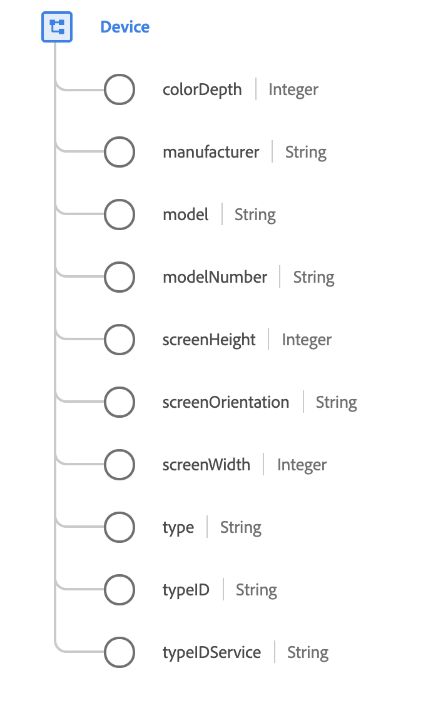

# [!UICONTROL 장치] 데이터 유형

[!UICONTROL 장치] 는 식별된 장치를 설명하는 표준 XDM 데이터 유형입니다. 장치는 세션 간에 일반적으로 쿠키로 추적 가능한 애플리케이션 또는 브라우저 인스턴스입니다.

 

| 속성 | 데이터 유형 | 설명 |
| --- | --- | --- |
| `colorDepth` | 정수 | 디스플레이에서 나타낼 수 있는 색상 수입니다. |
| `manufacturer` | 문자열 | 장치의 디자인 및 만들기를 담당하는 조직의 이름입니다. |
| `model` | 문자열 | 장치의 모델 이름입니다. 장치의 일반적인, 사람이 읽을 수 있는 또는 마케팅 이름입니다. 예를 들어 &quot;iPhone 6S&quot;는 휴대폰의 특정 모델입니다. |
| `modelNumber` | 문자열 | 이 장치의 제조업체에서 지정한 고유 모델 번호 지정 모델 번호는 버전이 아니라 특정 모델 구성을 식별하는 고유 식별자입니다. |
| `screenHeight` | 정수 | 장치 활성 위치의 세로 픽셀 수가 기본 방향으로 표시됩니다. |
| `screenOrientation` | 문자열 | 현재 화면 방향입니다. 허용되는 값은 다음과 같습니다 `portrait` 및 `landscape`. |
| `screenWidth` | 문자열 | 장치 활성 상태의 수평 픽셀 수가 기본 방향으로 표시됩니다. |
| `type` | 문자열 | 추적하는 장치의 유형입니다. 허용되는 값은 다음과 같습니다. <ul><li>`mobile`</li><li>`tablet`</li><li>`desktop`</li><li>`ereader`</li><li>`gaming`</li><li>`television`</li><li>`settop`</li><li>`mediaplayer`</li><li>`computers`</li><li>`tv screens`</li></ul> |
| `typeID` | 문자열 | 장치의 식별자입니다. 사용 중인 하드웨어를 식별하는 DeviceAtlas 또는 다른 서비스의 식별자일 수 있습니다. |
| `typeIDService` | 문자열 | 장치 유형을 식별하는 데 사용되는 서비스의 네임스페이스입니다. 자세한 내용은 [부록](#typeIDService) 참조하십시오. |

{style=&quot;table-layout:auto&quot;}

필드 그룹에 대한 자세한 내용은 공용 XDM 저장소를 참조하십시오.

* [채워진 예](https://github.com/adobe/xdm/blob/master/components/datatypes/device.example.1.json)
* [전체 스키마](https://github.com/adobe/xdm/blob/master/components/datatypes/device.schema.json)

## 부록

다음 섹션에는 [!UICONTROL 장치] 데이터 유형.

## typeIDService에 대해 허용되는 값 {#typeIDService}

다음 표에서는 `typeIDService` 그리고 그들의 연관 의미는 다음과 같습니다.

| 값 | 설명 |
| --- | --- |
| `https://ns.adobe.com/xdm/external/deviceatlas` | 장치가 DeviceAtlas를 사용하여 식별되었습니다. |
| `https://ns.adobe.com/xdm/external/adobecampaign` | Adobe Campaign을 사용하여 장치가 식별되었습니다. |
