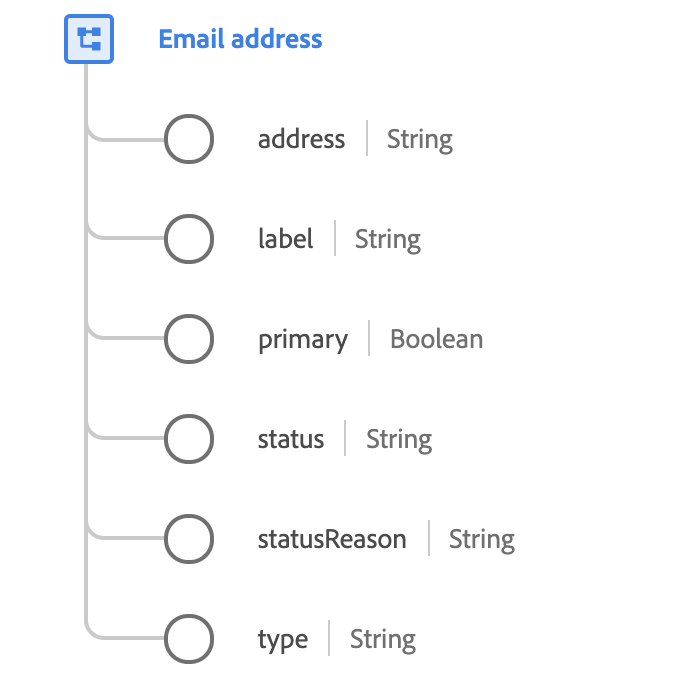

# [!UICONTROL 전자 메일 주소] 데이터 형식

[!UICONTROL 전자 메일 주소]은(는) 전자 메일 주소의 세부 정보를 설명하는 표준 XDM(Experience Data Model) 데이터 형식입니다.

 

| 속성 | 설명 |
| --- | --- |
| `address` | RFC2822 및 후속 표준(예: `name@domain.com`)에 일반적으로 정의된 전자 메일의 기술 주소입니다.  XDM에서 전자 메일 주소에 올바른 최상위 도메인을 포함해야 유효성 검사를 통과할 수 있습니다. IANA(Internet Assigned Numbers Authority)에서 정의한 유효한 최상위 도메인의 전체 목록은 다음 [문서](https://data.iana.org/TLD/tlds-alpha-by-domain.txt)를 참조하십시오. |
| `label` | 사용 가능한 추가 디스플레이 정보. 예를 들어 전자 메일에 `John Smith smithjr@company.uk`의 Microsoft Outlook 리치 주소 표시가 있는 경우 `John Smith`이(가) 이 필드에 배치됩니다. |
| `primary` | 개인의 기본 이메일 주소인지 여부를 나타냅니다. 프로필에는 특정 시점에 하나의 `primary` 전자 메일 주소만 있을 수 있습니다. |
| `status` | 이메일 주소를 현재 사용할 수 있는지 여부를 나타냅니다. |
| `statusReason` | 현재 `status`에 대한 설명입니다. |
| `type` | 계정과 사용자의 연결 방식(예: `work` 또는 `personal`). |

{style="table-layout:auto"}

이메일 주소 데이터 유형에 대한 자세한 내용은 공용 XDM 저장소를 참조하십시오.

* [채워진 예](https://github.com/adobe/xdm/blob/master/components/datatypes/demographic/emailaddress.example.1.json)
* [전체 스키마](https://github.com/adobe/xdm/blob/master/components/datatypes/demographic/emailaddress.schema.json)
