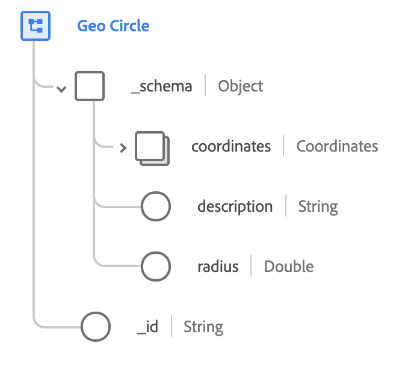

# [!UICONTROL 지역 원] 데이터 유형

[!UICONTROL 지역 원] 는 특정 좌표 집합을 중심으로 하는 특정 반경이 주어질 때 순환 지리적 영역을 설명하는 표준 XDM 데이터 유형입니다. 이 데이터 유형은 [schema.org](https://schema.org/GeoCircle).

 

| 속성 | 데이터 유형 | 설명 |
| --- | --- | --- |
| `_schema.coordinates` | [[!UICONTROL 지역 좌표]](./geo-coordinates.md) | 원의 중심에 대한 지리적 좌표를 설명합니다. |
| `_schema.description` | 문자열 | 원이 포함하는 내용에 대한 설명입니다. |
| `_schema.radius` | 이중 | 원의 반경 길이입니다. 이 값은 [WGS84](https://gisgeography.com/wgs84-world-geodetic-system/) 데이텀 및 는 미터 단위로 측정됩니다. |
| `_id` | 문자열 | 원의 고유한 시스템 생성 ID입니다. |
