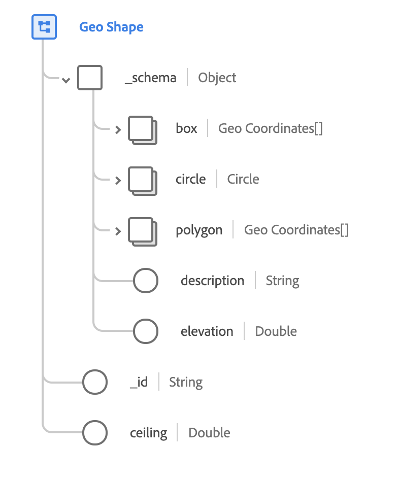

# [!UICONTROL Geo Shape] 데이터 유형

[!UICONTROL Geo Shape] 는 지리적 영역의 모양을 설명하는 표준 XDM 데이터 유형입니다. 이 데이터 유형은 [schema.org](https://schema.org/GeoShape)에 문서화된 공개 사양을 기반으로 합니다.

 

| 속성 | 데이터 유형 | 설명 |
| --- | --- | --- |
| `_schema.box` | [[!UICONTROL Geo Coordinates]](./geo-coordinates.md) 배열 | 두 좌표로 된 사각형으로 둘러싸인 지리적 영역을 설명합니다. 첫 번째 좌표는 사각형의 아래쪽 모퉁이이고 두 번째 좌표는 위쪽 모퉁이입니다. |
| `_schema.circle` | [[!UICONTROL Geo Coordinates]](./geo-coordinates.md) 배열 | 지리적 좌표를 중심으로 한 특정 반경이 있는 원형 영역을 설명합니다. |
| `_schema.polygon` | [[!UICONTROL Geo Circle]](./geo-circle.md) | 첫 번째 및 마지막 좌표가 동일한 일련의 4개 이상의 좌표. |
| `_schema.description` | 문자열 | 모양을 정의하는 사항에 대한 설명입니다. |
| `_schema.elevation` | 이중 | 모양의 특정 또는 최소 높이. 이 값은 [WGS84](http://gisgeography.com/wgs84-world-geodetic-system/) 데이텀을 따르고 미터 단위로 측정됩니다. `ceiling`과 함께 이 속성을 사용하여 위치에 대한 3차원 테두리 상자를 표현할 수 있습니다. |
| `_id` | 문자열 | 모양의 고유한 시스템 생성 식별자입니다. |
| `ceiling` | 이중 | 모양의 최대 높이입니다. 이 속성은 `elevation`과 함께 사용할 때만 유효합니다. 이 값은 [WGS84](http://gisgeography.com/wgs84-world-geodetic-system/) 데이텀을 따르고 미터 단위로 측정됩니다. `elevation`과 함께 이 속성을 사용하여 위치에 대한 3차원 테두리 상자를 표현할 수 있습니다. |
