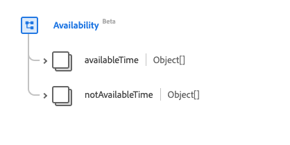

# [!UICONTROL 가용성] 데이터 형식

[!UICONTROL 가용성]은(는) 항목에 대한 가용성 데이터를 설명하는 표준 XDM(경험 데이터 모델) 데이터 형식입니다. 이 데이터 유형은 HL7 FHIR 릴리스 5 사양에 따라 생성됩니다.

| 표시 이름 | 속성 | 데이터 유형 | 설명 |
| --- | --- | --- | --- |
| [!UICONTROL 사용 가능한 시간] | `availableTime` | 오브젝트 배열 | 항목을 사용할 수 있는 시간. 자세한 내용은 아래 [섹션](#available-time)을 참조하세요. |
| [!UICONTROL 사용할 수 없는 시간] | `notAvailableTime` | 문자열 | 제공된 이유로 항목을 사용할 수 없는 시간. 자세한 내용은 아래 [섹션](#not-available-time)을 참조하세요. |

데이터 유형에 대한 자세한 내용은 공용 XDM 저장소를 참조하십시오.

* [채워진 예](https://github.com/adobe/xdm/blob/master/extensions/industry/healthcare/fhir/datatypes/availability.example.1.json)
* [전체 스키마](https://github.com/adobe/xdm/blob/master/extensions/industry/healthcare/fhir/datatypes/availability.schema.json)

## `availableTime` {#available-time}

`availableTime`은(는) 개체 배열로 제공됩니다. 각 객체의 구조는 아래에 설명되어 있습니다.

| 표시 이름 | 속성 | 데이터 유형 | 설명 |
| --- | --- | --- | --- |
| [!UICONTROL 하루 종일] | `allDay` | 부울 | 항목을 항상 사용할 수 있는지 보여 주는 부울. |
| [!UICONTROL 사용 가능한 종료 시간] | `availableEndTime` | 문자열 | 항목을 사용할 수 없게 되는 시간입니다. `allDay`이(가) `true`인 경우 무시됩니다. |
| [!UICONTROL 사용 가능한 시작 시간] | `availableStartTime` | 문자열 | 항목을 사용할 수 있는 시작 시간입니다. `allDay`이(가) `true`인 경우 무시됩니다. |
| [!UICONTROL 요일] | `daysOfWeek` | 문자열 배열 | 사용 가능한 날짜를 자세히 설명하는 문자열 배열입니다. 이 속성의 값은 다음 알려진 열거형 값 중 하나 이상과 같아야 합니다. <li> `mon` </li> <li> `tues` </li> <li> `wed` </li> <li> `thurs`</li>  <li> `fri` </li> <li> `sat`</li> <li> `sun`</li> |

## `notAvailableTime` {#not-available-time}

`notAvailableTime`은(는) 개체 배열로 제공됩니다. 각 객체의 구조는 아래에 설명되어 있습니다.

| 표시 이름 | 속성 | 데이터 유형 | 설명 |
| --- | --- | --- | --- |
| [!UICONTROL 다음 기간 동안] | `during` | [[!UICONTROL 기간]](../healthcare/period.md) | 항목 사용이 중지되는 기간입니다. |
| [!UICONTROL 설명] | `description` | 문자열 | 항목을 사용할 수 없는 이유. |
