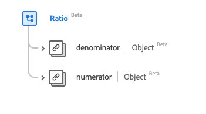

# [!UICONTROL 비율] 데이터 형식

[!UICONTROL Ratio]은(는) 표준 경험 데이터 모델(XDM) 데이터 형식이며, 분자 및 분모를 통해 두 [[!UICONTROL Quantity]](../healthcare/quantity.md) 값의 비율을 제공합니다. 이 데이터 유형은 HL7 FHIR 릴리스 5 사양에 따라 생성됩니다.

| 표시 이름 | 속성 | 데이터 유형 | 설명 |
| --- | --- | --- | --- |
| [!UICONTROL 분모] | `denominator` | [[!UICONTROL 단순 수량]](../healthcare/simple-quantity.md) | 분모의 값입니다. |
| [!UICONTROL 분자] | `numerator` | [[!UICONTROL 수량]](../healthcare/quantity.md) | 분자의 값입니다. |

>[!NOTE]
>
> HL7 FHIR 릴리스 5에 따라 만들어진 세부 항목으로 인해 `denominator`과(와) `numerator`의 데이터 형식이 다릅니다.

데이터 유형에 대한 자세한 내용은 공용 XDM 저장소를 참조하십시오.

* [채워진 예](https://github.com/adobe/xdm/blob/master/extensions/industry/healthcare/fhir/datatypes/ratio.example.1.json)
* [전체 스키마](https://github.com/adobe/xdm/blob/master/extensions/industry/healthcare/fhir/datatypes/ratio.schema.json)
