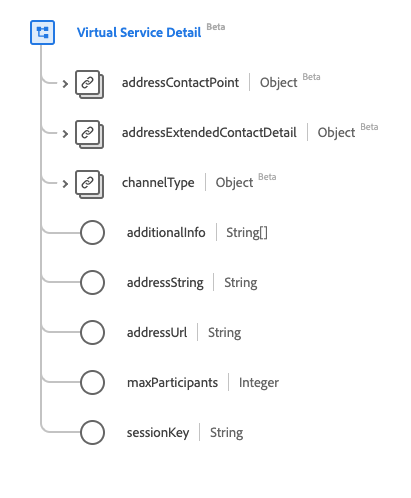

# [!UICONTROL 가상 서비스 세부 정보] 데이터 형식

[!UICONTROL 가상 서비스 세부 정보]은(는) 가상 서비스 연락처 세부 정보를 설명하는 표준 XDM(경험 데이터 모델) 데이터 형식입니다. 이 데이터 유형은 HL7 FHIR 릴리스 5 사양에 따라 생성됩니다.

| 표시 이름 | 속성 | 데이터 유형 | 설명 |
| --- | --- | --- | --- |
| [!UICONTROL 주소 연락처] | `addressContactPoint` | [[!UICONTROL 연락처]](../healthcare/contact-point.md) | 전화, 팩스 또는 전자 메일 등 기술 매개 연락처의 세부 정보. |
| [!UICONTROL 주소 확장 연락처 세부 정보] | `addressExtendedContactDetail` | [[!UICONTROL 확장된 연락처 세부 정보]](../healthcare/extended-contact-detail.md) | 확장된 연락처 정보. |
| [!UICONTROL 채널 유형] | `channelType` | [[!UICONTROL 코딩]](../healthcare/coding.md) | 연결할 가상 서비스 유형(예: Teams, Zoom 또는 WhatsApp). |
| [!UICONTROL 추가 정보] | `additionalInfo` | 문자열 배열 | URI로 표시되는 대체 연결 세부 정보를 볼 주소입니다. |
| [!UICONTROL 주소 문자열] | `addressString` | 문자열 | 가상 서비스에 연결하는 데 사용할 주소입니다. |
| [!UICONTROL 주소 Url] | `addressUrl` | 문자열 | 가상 서비스에 연결하는 데 사용할 URL로, URI로 표시됩니다. |
| [!UICONTROL 최대 참가자 수] | `maxParticipants` | 정수 | 지원되는 최대 참가자 수(최소값: `0`)입니다. |
| [!UICONTROL 세션 키] | `sessionKey` | 문자열 | 가상 서비스에 필요한 세션 키입니다. |

데이터 유형에 대한 자세한 내용은 공용 XDM 저장소를 참조하십시오.

* [채워진 예](https://github.com/adobe/xdm/blob/master/extensions/industry/healthcare/fhir/datatypes/simplequantity.example.1.json)
* [전체 스키마](https://github.com/adobe/xdm/blob/master/extensions/industry/healthcare/fhir/datatypes/simplequantity.schema.json)
