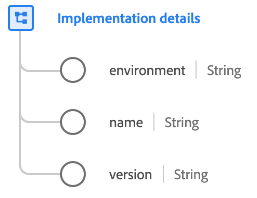

# [!UICONTROL 구현 세부 사항] 데이터 유형

[!UICONTROL 구현 세부 사항] 는 API 또는 SDK와 같은 기술 구현을 설명하는 표준 경험 데이터 모델(XDM) 데이터 유형입니다.

| 속성 | 데이터 유형 | 설명 |
| --- | --- | --- |
| `environment` | 문자열 | 구현 환경. |
| `name` | 문자열 | SDK 또는 엔드포인트에 대한 식별자. 모든 SDK 또는 끝점은 확장을 포함하여 URI를 통해 식별됩니다. |
| `version` | 문자열 | API 또는 SDK의 버전입니다. |

{style="table-layout:auto"}

데이터 유형에 대한 자세한 내용은 공용 XDM 저장소를 참조하십시오.

* [채워진 예](https://github.com/adobe/xdm/blob/master/components/datatypes/industry-verticals/implementationdetails.example.1.json)
* [전체 스키마](https://github.com/adobe/xdm/blob/master/components/datatypes/industry-verticals/implementationdetails.schema.json)
