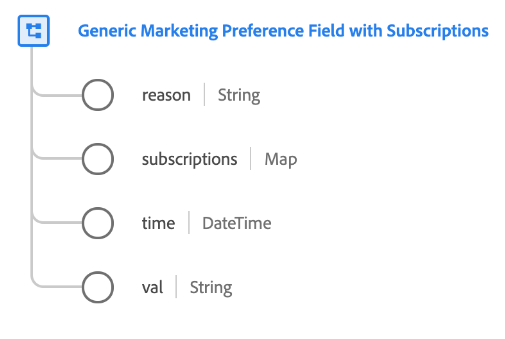

# [!UICONTROL 구독이 있는 일반 마케팅 기본 설정 필드] 데이터 유형

[!UICONTROL 구독이 있는 일반 마케팅 기본 설정 필드] 는 특정 마케팅 기본 설정에 대한 고객의 선택을 설명하는 표준 XDM 데이터 유형입니다.

>[!NOTE]
>
>이 데이터 유형은 다음을 사용하여 조직의 동의 스키마 구조를 사용자 지정하는 데 사용됩니다 [[!UICONTROL 동의 및 기본 설정] 필드 그룹](../field-groups/profile/consents.md) 을 기준으로 사용할 수 있습니다.
>
>필요하지 않은 경우 `subscriptions` 특정 마케팅 기본 설정 필드에 대해 매핑 시 [기본 마케팅 필드 데이터 유형](./marketing-field.md) 을 가리키도록 업데이트하는 것이 좋습니다.



| 속성 | 데이터 유형 | 설명 |
| --- | --- | --- |
| `reason` | 문자열 | 고객이 마케팅 사용 사례를 옵트아웃하면 이 문자열 필드는 고객이 옵트아웃한 이유를 나타냅니다. |
| `subscriptions` | 맵 | 특정 가입에 대한 고객 마케팅 환경 설정 맵입니다. 의 섹션을 참조하십시오. [구독](#subscriptions) 추가 정보. |
| `time` | DateTime | 마케팅 기본 설정이 변경된 경우 해당하는 ISO 8601 타임스탬프입니다. |
| `val` | 문자열 | 이 마케팅 사용 사례에 대해 고객이 제공한 환경 설정 선택입니다. 자세한 내용은 [다음 섹션](#val) 참조하십시오. |

{style=&quot;table-layout:auto&quot;}

## `val` {#val}

다음 표에서는 `val`:

| 값 | Title | 설명 |
| --- | --- | --- |
| `y` | 예(옵트인) | 고객이 기본 설정을 선택했습니다. 즉, **do** 해당 선호도에 의해 지시되는 대로 그들의 데이터의 사용에 동의. |
| `n` | 아니요(옵트아웃) | 고객이 선호하는 항목을 선택하지 않았습니다. 즉, **포함하지 않음** 해당 선호도에 의해 지시되는 대로 그들의 데이터의 사용에 동의. |
| `p` | 검증 보류 중 | 시스템에 최종 기본 설정 값이 아직 수신되지 않았습니다. 이는 2단계 검증이 필요한 동의의 일부로서 가장 많이 사용됩니다. 예를 들어 고객이 이메일 수신을 거부하는 경우 해당 동의는 `p` 이메일에서 링크를 선택하여 올바른 이메일 주소를 제공했는지 확인할 때까지 동의를 업데이트하여 `y`.<br><br>이 기본 설정에서 두 개의 확인 프로세스를 사용하지 않는 경우 `p` 대신 을(를) 선택하여 고객이 아직 동의 프롬프트에 응답하지 않았음을 나타낼 수 있습니다. 예를 들어 값을 자동으로 `p` 고객이 동의 프롬프트에 응답하기 전에 웹 사이트의 첫 페이지에서 명시적인 동의가 필요하지 않은 관할권에서 고객이 명시적으로 옵트아웃하지 않았음을 나타내기 위해 사용할 수도 있습니다(즉, 동의가 가정됨). |
| `u` | 알 수 없음 | 고객의 선호도 정보를 알 수 없습니다. |
| `dy` | 기본 예(옵트인) | 고객은 동의 값 자체를 제공하지 않았으며 기본적으로 옵트인(&quot;예&quot;)으로 처리됩니다. 즉, 고객은 달리 나타낼 때까지 동의를 가정합니다.<br><br>회사의 개인정보 처리방침에 대한 법률이나 변경이 일부 또는 모든 사용자의 기본값을 변경하는 경우 기본값이 포함된 모든 프로필을 수동으로 업데이트해야 합니다. |
| `dn` | 기본값은 아니요(옵트아웃)입니다. | 고객은 동의 값 자체를 제공하지 않았으며 기본적으로 옵트아웃(&quot;아니요&quot;)으로 처리됩니다. 즉, 고객이 달리 표시할 때까지 동의를 거부했다고 가정합니다.<br><br>회사의 개인정보 처리방침에 대한 법률이나 변경이 일부 또는 모든 사용자의 기본값을 변경하는 경우 기본값이 포함된 모든 프로필을 수동으로 업데이트해야 합니다. |
| `LI` | 합법적인 관심 | 지정된 용도로 이 데이터를 수집하고 처리하는 합법적인 비즈니스 이익은 개인에게 발생할 수 있는 잠재적인 피해를 가중시킵니다. |
| `CT` | 계약 | 지정된 목적으로 데이터를 수집하려면 개인과 계약 의무를 충족해야 합니다. |
| `CP` | 법적 의무 준수 | 지정된 목적으로 데이터를 수집하려면 비즈니스의 법적 의무를 충족해야 합니다. |
| `VI` | 개인의 중요한 관심 | 특정 목적을 위한 데이터 수집은 개인의 중요한 이익을 보호하기 위해 필요합니다. |
| `PI` | 공용 관심 | 특정 목적을 위한 자료의 수집은 공익상 또는 공권력의 행사에 따라 수행되어야 한다. |

{style=&quot;table-layout:auto&quot;}

## `subscriptions` {#subscriptions}

일부 기업에서는 고객이 특정 마케팅 채널과 연관된 서로 다른 가입을 선택할 수 있습니다. 예를 들어, 은행에서는 고객이 초과 인출된 계정에 대해 전화 경고를 가입하거나 충성도 프로그램 오퍼에 대한 판매 호출을 받을 수 있도록 할 수 있습니다.

다음 JSON은 다음을 포함하는 전화 통화 마케팅 채널에 대한 예제 마케팅 필드를 나타냅니다 `subscriptions` 맵 의 각 키 `subscriptions` 개체는 마케팅 채널에 대한 개별 가입을 나타냅니다. 그러면 각 구독에 옵트인 값( )이 포함됩니다`val`).

```json
"email-marketing-field": {
  "val": "y",
  "time": "2019-01-01T15:52:25+00:00",
  "subscriptions": {
    "loyalty-offers": {
      "val": "y",
      "type": "sales",
      "topics": ["discounts", "early-access"],
      "subscribers": {
        "jdoe@example.com": {
          "time": "2019-01-01T15:52:25+00:00",
          "source": "website"
        }
      }
    },
    "newsletters": {
      "val": "y",
      "type": "advertising",
      "topics": ["hardware"],
      "subscribers": {
        "jdoe@example.com": {
          "time": "2021-01-01T08:32:53+07:00",
          "source": "website"
        },
        "tparan@example.com": {
          "time": "2020-02-03T07:54:21+07:00",
          "source": "call center"
        }
      }
    }
  }
}
```

| 속성 | 설명 |
| --- | --- |
| `val` | 다음 [동의 값](#val) 구독. |
| `type` | 구독 유형입니다. 15자 이내인 경우 어떤 수사적 문자열일 수 있습니다. |
| `topics` | 고객이 구독한 관심 영역을 나타내는 문자열 배열이며 관련 콘텐츠를 보내는 데 사용할 수 있습니다. |
| `subscribers` | 특정 구독을 구독한 식별자 세트(예: 이메일 주소 또는 전화 번호)를 나타내는 선택적 맵 유형 필드입니다. 이 개체의 각 키는 해당 식별자를 나타내며 두 개의 하위 속성을 포함합니다. <ul><li>`time`: ID가 구독한 시간의 ISO 8601 타임스탬프입니다(해당하는 경우).</li><li>`source`: 구독자가 시작한 원본입니다. 15자 이내인 경우 어떤 수사적 문자열일 수 있습니다.</li></ul> |

{style=&quot;table-layout:auto&quot;}

## 추가 리소스

데이터 유형에 대한 자세한 내용은 공용 XDM 저장소를 참조하십시오.

* [채워진 예](https://github.com/adobe/xdm/blob/master/components/datatypes/consent/marketing-field-basic.example.1.json)
* [전체 스키마](https://github.com/adobe/xdm/blob/master/components/datatypes/consent/marketing-field-basic.schema.json)
