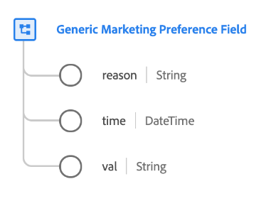

# [!UICONTROL 일반 마케팅 환경 설정 필드] 데이터 유형

[!UICONTROL 일반 마케팅 환경 설정 필드] 는 특정 마케팅 환경 설정에 대한 고객의 선택을 설명하는 표준 XDM 데이터 유형입니다.

>[!NOTE]
>
>이 데이터 유형은 다음을 사용하여 조직의 동의 스키마 구조를 사용자 지정하는 데 사용됩니다. [[!UICONTROL 동의 및 환경 설정] 필드 그룹](../field-groups/profile/consents.md) 를 기준으로 사용하십시오.
>
>필요한 경우 `subscriptions` 특정 마케팅 환경 설정 필드에 매핑하려면 [구독 데이터 유형이 있는 마케팅 필드](./marketing-field-subscriptions.md) 대신,

| 속성 | 데이터 유형 | 설명 |
| --- | --- | --- |
| `reason` | 문자열 | 고객이 마케팅 사용 사례를 옵트아웃하면 이 문자열 필드는 고객이 옵트아웃한 이유를 나타냅니다. |
| `time` | DateTime | 마케팅 환경 설정이 변경된 경우의 ISO 8601 타임스탬프(해당하는 경우). |
| `val` | 문자열 | 이 마케팅 사용 사례에 대해 고객이 제공한 환경 설정 선택. 허용되는 값 및 정의에 대해서는 아래 표를 참조하십시오. |

{style="table-layout:auto"}

다음 표에서 허용되는 값을 간략하게 설명합니다. `val`:

| 값 | 제목 | 설명 |
| --- | --- | --- |
| `y` | 예(옵트인) | 고객이 환경 설정을 선택했다. 즉, **할 일** 해당 환경 설정에 명시된 데이터 사용에 동의합니다. |
| `n` | 아니요(옵트아웃) | 고객이 선호에서 벗어났습니다. 즉, **금지** 해당 환경 설정에 명시된 데이터 사용에 동의합니다. |
| `p` | 확인 보류 중 | 시스템에서 아직 최종 환경 설정 값을 받지 못했습니다. 이는 2단계 인증이 필요한 동의의 일부로 가장 많이 사용됩니다. 예를 들어 고객이 이메일 수신을 선택하면 해당 동의가 로 설정됩니다. `p` 올바른 이메일 주소를 제공했는지 확인하기 위해 이메일에서 링크를 선택할 때까지 해당 동의를 다음으로 업데이트합니다. `y`.  이 기본 설정에서 두 개의 확인 프로세스를 사용하지 않는 경우 `p` 고객이 동의 프롬프트에 아직 응답하지 않았음을 나타내는 데 대신 선택을 사용할 수 있습니다. 예를 들어 값을 자동으로 로 설정할 수 있습니다 `p` 웹 사이트의 첫 페이지에서 고객이 동의 프롬프트에 응답하기 전에. 명시적인 동의가 필요하지 않은 관할 구역에서 고객이 명시적으로 옵트아웃하지 않았음을 나타내는 데 사용할 수도 있습니다(즉, 동의가 가정됨). |
| `u` | 알 수 없음 | 고객의 환경 설정 정보를 알 수 없습니다. |
| `dy` | 기본값 예(옵트인) | 고객이 동의 값 자체를 제공하지 않았으며 기본적으로 옵트인(&quot;예&quot;)으로 처리됩니다. 즉, 고객이 달리 표시할 때까지 동의가 가정됩니다.  법률 또는 회사 개인정보 처리방침 변경으로 인해 일부 또는 모든 사용자의 기본값이 변경되는 경우 기본값이 포함된 모든 프로필을 수동으로 업데이트해야 합니다. |
| `dn` | 기본값 No(옵트아웃) | 고객이 동의 값 자체를 제공하지 않았으며 기본적으로 옵트아웃(&quot;No&quot;)으로 처리됩니다. 즉 고객은 달리 표시할 때까지 동의를 거부한 것으로 간주됩니다.  법률 또는 회사 개인정보 처리방침 변경으로 인해 일부 또는 모든 사용자의 기본값이 변경되는 경우 기본값이 포함된 모든 프로필을 수동으로 업데이트해야 합니다. |
| `LI` | 정당한 이익 | 지정된 목적을 위하여 이 자료를 수집·처리할 정당한 영업상의 이익은 그것이 개인에게 끼칠 수 있는 잠재적인 해악을 능가한다. |
| `CT` | 약정 | 지정된 목적의 데이터 수집은 개인과의 계약상 의무를 충족하기 위해 요구된다. |
| `CP` | 법적 의무 준수 | 지정된 목적의 데이터 수집은 해당 사업의 법적 의무를 충족하기 위해 요구된다. |
| `VI` | 개인의 중대한 관심 | 특정된 목적을 위한 데이터의 수집은 개인의 중대한 이익을 보호하기 위해 필요하다. |
| `PI` | 공익 | 특정된 목적의 자료 수집은 공익 또는 공권 행사의 과제를 수행하기 위한 것이다. |

{style="table-layout:auto"}

데이터 유형에 대한 자세한 내용은 공용 XDM 저장소를 참조하십시오.

* [채워진 예](https://github.com/adobe/xdm/blob/master/components/datatypes/consent/marketing-field-basic.example.1.json)
* [전체 스키마](https://github.com/adobe/xdm/blob/master/components/datatypes/consent/marketing-field-basic.schema.json)
