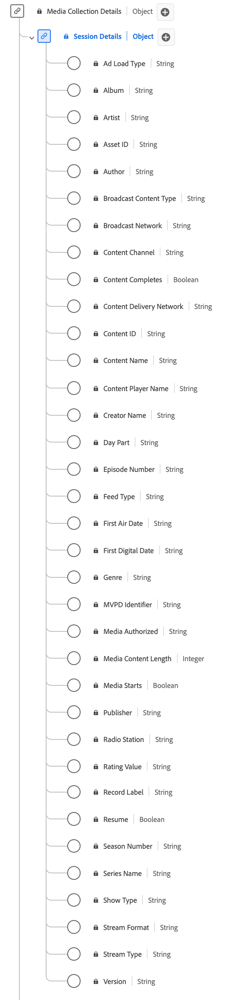

# [!UICONTROL 세션 세부 정보] 컬렉션 데이터 형식

[!UICONTROL 세션 세부 정보] 컬렉션은 미디어 재생 세션과 관련된 데이터를 추적하는 표준 XDM(Experience Data Model) 데이터 형식입니다. 미디어 컬렉션 필드는 추가 처리를 위해 다른 Adobe 서비스로 전송되는 데이터를 캡처하는 데 사용됩니다. 이 스키마는 사용자 동작 및 콘텐츠 소비 패턴에 대한 통찰력을 제공하는 데 사용할 수 있는 광범위한 속성을 포함합니다. [!UICONTROL 세션 세부 정보] 컬렉션 데이터 형식을 사용하여 재생 이벤트, 광고 상호 작용, 진행률 마커, 일시 중지 및 기타 지표를 로깅하여 사용자 참여를 캡처합니다.

+++세션 세부 정보 수집 데이터 유형의 다이어그램을 표시하려면 선택합니다.

+++

>[!NOTE]
>
>각 디스플레이 이름에는 해당 오디오 및 비디오 매개 변수에 대한 추가 정보를 볼 수 있는 링크가 포함되어 있습니다. 연결된 페이지에는 Adobe, 구현 값, 네트워크 매개 변수, 보고 및 중요 고려 사항으로 수집된 비디오 및 데이터에 대한 세부 사항이 포함되어 있습니다.

| 표시 이름 | 속성 | 데이터 유형 | 필수 여부 | 설명 |
|--------------------------------------------------------------------------------------------------------------------------------------------------------------------------|------------------|-----------|----------|---------------------------------------------------------------------------------------|
| [!UICONTROL 광고 로드 유형] | `adLoad` | 문자열 | 아니요 | 고객별 내부 표현으로 정의되는 로드된 광고 유형. |
| [[!UICONTROL 앨범]](https://experienceleague.adobe.com/docs/media-analytics/using/implementation/variables/audio-video-parameters.html#album) | `album` | 문자열 | 아니요 | 뮤직 레코딩 또는 비디오가 포함된 앨범 이름. |
| [[!UICONTROL 아티스트]](https://experienceleague.adobe.com/docs/media-analytics/using/implementation/variables/audio-video-parameters.html#artist) | `artist` | 문자열 | 아니요 | 뮤직 레코딩 또는 비디오의 앨범 아티스트나 단체의 이름. |
| [[!UICONTROL 자산 ID]](https://experienceleague.adobe.com/docs/media-analytics/using/implementation/variables/audio-video-parameters.html#asset-id) | `assetID` | 문자열 | 아니요 | [!UICONTROL 자산 ID]은(는) TV 시리즈 에피소드 식별자, 동영상 자산 식별자 또는 라이브 이벤트 식별자와 같은 미디어 자산 콘텐츠에 대한 고유 식별자입니다. 일반적으로 이러한 ID는 EIDR, TMS/Gracenote 또는 Rovi와 같은 메타데이터 권한에서 파생됩니다. 이러한 식별자는 다른 소유권 또는 사내 시스템에서도 사용할 수 있습니다. |
| [[!UICONTROL 작성자]](https://experienceleague.adobe.com/docs/media-analytics/using/implementation/variables/audio-video-parameters.html#author) | `author` | 문자열 | 아니요 | 미디어 작성자의 이름입니다. |
| [[!UICONTROL 브로드캐스트 콘텐츠 형식]](https://experienceleague.adobe.com/docs/media-analytics/using/implementation/variables/audio-video-parameters.html#content-type) | `contentType` | 문자열 | 예 | 스트림 배달의 [!UICONTROL 브로드캐스트 콘텐츠 형식]. [!UICONTROL 스트림 유형]당 사용 가능한 값은 다음과 같습니다. 오디오: &quot;song&quot;, &quot;podcast&quot;, &quot;audiobook&quot; 및 &quot;radio&quot;; 비디오: &quot;VoD&quot;, &quot;Live&quot;, &quot;Linear&quot;, &quot;UGC&quot; 및 &quot;DVoD&quot;. 고객은 이 매개 변수에 대한 사용자 지정 값을 제공할 수 있습니다. |
| [[!UICONTROL 브로드캐스트 네트워크]](https://experienceleague.adobe.com/docs/media-analytics/using/implementation/variables/audio-video-parameters.html#network) | `network` | 문자열 | 아니요 | 네트워크/채널 이름. |
| [[!UICONTROL 콘텐츠 채널]](https://experienceleague.adobe.com/docs/media-analytics/using/implementation/variables/audio-video-parameters.html#content-channel) | `channel` | 문자열 | 예 | [!UICONTROL 콘텐츠 채널]은(는) 콘텐츠가 재생된 배포 채널입니다. |
| [!UICONTROL 콘텐츠 배달 네트워크] | `cdn` | 문자열 | 아니요 | 재생된 콘텐츠의 [!UICONTROL 콘텐츠 배달 네트워크]. |
| [[!UICONTROL 콘텐츠 ID]](https://experienceleague.adobe.com/docs/media-analytics/using/implementation/variables/audio-video-parameters.html#content-id) | `name` | 문자열 | 예 | [!UICONTROL 콘텐츠 ID]은(는) 콘텐츠의 고유 식별자입니다. 다른 업계 또는 CMS ID에 다시 연결하는 데 사용할 수 있습니다. |
| [[!UICONTROL 콘텐츠 이름]](https://experienceleague.adobe.com/docs/media-analytics/using/implementation/variables/audio-video-parameters.html#content-name-(variable)) | `friendlyName` | 문자열 | 아니요 | [!UICONTROL 콘텐츠 이름]은(는) 콘텐츠의 &quot;친숙한&quot;(사람이 읽을 수 있음) 이름입니다. |
| [[!UICONTROL 콘텐츠 플레이어 이름]](https://experienceleague.adobe.com/docs/media-analytics/using/implementation/variables/audio-video-parameters.html#content-player-name) | `playerName` | 문자열 | 예 | 콘텐츠 플레이어의 이름입니다. |
| [[!UICONTROL 작성자 이름]](https://experienceleague.adobe.com/docs/media-analytics/using/implementation/variables/audio-video-parameters.html#originator) | `originator` | 문자열 | 아니요 | 콘텐츠 작성자의 이름입니다. |
| [[!UICONTROL 일 파트]](https://experienceleague.adobe.com/docs/media-analytics/using/implementation/variables/audio-video-parameters.html#day-part) | `dayPart` | 문자열 | 아니요 | 콘텐츠가 브로드캐스트 또는 재생되는 시간을 정의하는 속성입니다. 이는 고객이 필요에 따라 값을 설정할 수 있습니다 |
| [[!UICONTROL 에피소드 번호]](https://experienceleague.adobe.com/docs/media-analytics/using/implementation/variables/audio-video-parameters.html#episode) | `episode` | 문자열 | 아니요 | 에피소드의 번호입니다. |
| [[!UICONTROL 피드 유형]](https://experienceleague.adobe.com/docs/media-analytics/using/implementation/variables/audio-video-parameters.html#media-feed-type) | `feed` | 문자열 | 아니요 | EAST HD 또는 SD와 같은 실제 피드 관련 데이터나 URL과 같은 피드 소스를 나타낼 수 있는 피드 유형입니다. |
| [[!UICONTROL 첫 방송 날짜]](https://experienceleague.adobe.com/docs/media-analytics/using/implementation/variables/audio-video-parameters.html#first-air-date) | `firstAirDate` | 문자열 | 아니요 | 컨텐츠가 TV에 처음 방송된 날짜. 모든 날짜 형식이 허용되지만, Adobe은 YYYY-MM-DD 형식을 권장합니다. |
| [[!UICONTROL 첫 번째 디지털 날짜]](https://experienceleague.adobe.com/docs/media-analytics/using/implementation/variables/audio-video-parameters.html#first-digital-date) | `firstDigitalDate` | 문자열 | 아니요 | 콘텐츠가 디지털 채널 또는 플랫폼에서 처음으로 방송된 날짜. 모든 날짜 형식이 허용되지만, Adobe은 YYYY-MM-DD 형식을 권장합니다. |
| [[!UICONTROL 장르]](https://experienceleague.adobe.com/docs/media-analytics/using/implementation/variables/audio-video-parameters.html#genre) | `genre` | 문자열 | 아니요 | 콘텐츠 생성자가 정의한 콘텐츠 유형 또는 그룹입니다. 값은 변수 구현에서 쉼표로 구분해야 합니다. |
| [[!UICONTROL 승인된 미디어]](https://experienceleague.adobe.com/docs/media-analytics/using/implementation/variables/audio-video-parameters.html#authorized) | `authorized` | 문자열 | 아니요 | Adobe 인증을 통해 사용자에게 권한이 부여되었는지 확인합니다. |
| [[!UICONTROL 미디어 콘텐츠 길이]](https://experienceleague.adobe.com/docs/media-analytics/using/implementation/variables/audio-video-parameters.html#content-length-(variable)) | `length` | 정수 | 예 | [!UICONTROL 미디어 콘텐츠 길이]에 클립 길이/런타임이 포함되어 있습니다. 이는 사용되는 콘텐츠의 최대 길이(또는 기간)입니다(초). |
| [[!UICONTROL MVPD 식별자]](https://experienceleague.adobe.com/docs/media-analytics/using/implementation/variables/audio-video-parameters.html#mvpd) | `mvpd` | 문자열 | 아니요 | Adobe 인증을 통해 제공된 멀티채널 MVPD(비디오 프로그래밍 디스트리뷰터) 식별자. |
| [[!UICONTROL 게시자]](https://experienceleague.adobe.com/docs/media-analytics/using/implementation/variables/audio-video-parameters.html#publisher) | `publisher` | 문자열 | 아니요 | 오디오 콘텐츠 게시자의 이름입니다. |
| [[!UICONTROL 라디오 방송국]](https://experienceleague.adobe.com/docs/media-analytics/using/implementation/variables/audio-video-parameters.html#station) | `station` | 문자열 | 아니요 | 오디오가 재생되는 라디오 방송국 이름. |
| [[!UICONTROL 등급 값]](https://experienceleague.adobe.com/docs/media-analytics/using/implementation/variables/audio-video-parameters.html#content-rating) | `rating` | 문자열 | 아니요 | TV 유해 콘텐츠 가이드라인으로 정의된 등급. |
| [[!UICONTROL 레코드 레이블]](https://experienceleague.adobe.com/docs/media-analytics/using/implementation/variables/audio-video-parameters.html#label) | `label` | 문자열 | 아니요 | 레코드 레이블의 이름입니다. |
| [[!UICONTROL 다시 시작]](https://experienceleague.adobe.com/docs/media-analytics/using/implementation/variables/audio-video-parameters.html#content-resumes) | `hasResume` | 부울 | 아니요 | 버퍼, 일시 중단 또는 중단이 30분 이상 경과하고 다시 시작된 각 재생을 표시합니다. |
| [[!UICONTROL 시즌 번호]](https://experienceleague.adobe.com/docs/media-analytics/using/implementation/variables/audio-video-parameters.html#season) | `season` | 문자열 | 아니요 | 표시가 속한 [!UICONTROL 시즌 번호]입니다. 시즌 시리즈는 표시가 시리즈의 일부인 경우에만 필요합니다. |
| [[!UICONTROL 시리즈 이름]](https://experienceleague.adobe.com/docs/media-analytics/using/implementation/variables/audio-video-parameters.html#show) | `show` | 문자열 | 아니요 | 프로그램/시리즈 이름. 프로그램 이름은 표시가 시리즈의 일부인 경우에만 필요합니다. |
| [[!UICONTROL 유형 표시]](https://experienceleague.adobe.com/docs/media-analytics/using/implementation/variables/audio-video-parameters.html#show-type) | `showType` | 문자열 | 아니요 | 콘텐츠 유형. 예를 들어 예고편이나 전체 에피소드가 있습니다. 콘텐츠 유형은 0과 3 사이의 정수로 표시됩니다. 예를 들어, &quot;0&quot; = Full episode; &quot;1&quot; = Preview/trailer; &quot;2&quot; = Clip; &quot;3&quot; = Other. |
| [[!UICONTROL 스트림 형식]](https://experienceleague.adobe.com/docs/media-analytics/using/implementation/variables/audio-video-parameters.html#stream-format) | `streamFormat` | 문자열 | 아니요 | 스트림 형식(HD, SD)입니다. |
| [[!UICONTROL 스트림 형식]](https://experienceleague.adobe.com/docs/media-analytics/using/implementation/variables/audio-video-parameters.html#stream-type) | `streamType` | 문자열 | 아니요 | 미디어 스트림의 유형입니다. |
| [[!UICONTROL 버전]](https://experienceleague.adobe.com/docs/media-analytics/using/implementation/variables/audio-video-parameters.html#sdk-version) | `appVersion` | 문자열 | 아니요 | 플레이어에서 사용하는 SDK 버전입니다. 플레이어에 적합한 사용자 정의 값을 가질 수 있습니다. |

{style="table-layout:auto"}
