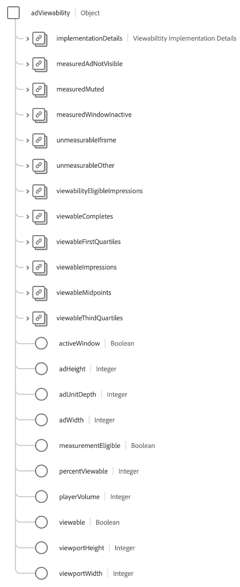

# [!UICONTROL 광고 세부 사항] 스키마 필드 그룹

[!UICONTROL 광고 세부 사항] 는 의 표준 스키마 필드 그룹입니다. [[!DNL XDM ExperienceEvent] 클래스](../../classes/experienceevent.md). 필드 그룹은 단일 `advertising` 광고 노출 횟수, 클릭스루 및 기여도 분석과 관련된 정보를 캡처하는 스키마에 대한 개체입니다.

| 속성 | 데이터 유형 | 설명 |
| --- | --- | --- |
| `adAssetReference` | 개체 | 광고에 대한 자산 정보를 캡처합니다. 자세한 내용은 [하위 섹션](#adAssetReference) 개체의 구조에 대한 자세한 내용을 보려면 |
| `adAssetViewDetails` | 개체 | 광고 재생에 대한 보기 세부 사항을 캡처합니다. 자세한 내용은 [하위 섹션](#adAssetViewDetails) 개체의 구조에 대한 자세한 내용을 보려면 |
| `adViewability` | 개체 | 플레이어 볼륨, 라이브러리 버전, 창 상태 및 광고 뷰포트 차원과 같이 최종 사용자가 보는 노출 횟수를 캡처합니다. 자세한 내용은 [하위 섹션](#adViewability) 개체의 구조에 대한 자세한 내용을 보려면 |
| `clicks` | [[!UICONTROL 측정]](../../data-types/measure.md) | 광고에 대한 클릭 동작 수입니다. |
| `completes` | [[!UICONTROL 측정]](../../data-types/measure.md) | 시간 미디어 자산을 관찰하여 완료된 횟수입니다. 이는 최종 사용자가 건너뛸 수 있을 때 반드시 전체 비디오를 시청했음을 의미하지는 않습니다. |
| `conversions` | [[!UICONTROL 측정]](../../data-types/measure.md) | 사전 정의된 작업(또는 작업)이 성능 평가를 위해 이벤트를 트리거한 횟수입니다. |
| `federated` | [[!UICONTROL 측정]](../../data-types/measure.md) | 고객 간의 데이터 공유와 같은 데이터 페더레이션을 통해 경험 이벤트가 생성되었는지 여부를 나타냅니다. |
| `firstQuartiles` | [[!UICONTROL 측정]](../../data-types/measure.md) | 일반 속도로 재생 시간의 25%를 거친 디지털 비디오 광고 횟수입니다. |
| `impressions` | [[!UICONTROL 측정]](../../data-types/measure.md) | 볼 수 있는 가능성이 있는 최종 사용자에게 전송된 광고 노출 수입니다. |
| `midpoints` | [[!UICONTROL 측정]](../../data-types/measure.md) | 일반 속도로 재생 시간의 50%를 거친 디지털 비디오 광고 횟수입니다. |
| `starts` | [[!UICONTROL 측정]](../../data-types/measure.md) | 디지털 비디오 광고 재생이 시작된 횟수입니다. |
| `thirdQuartiles` | [[!UICONTROL 측정]](../../data-types/measure.md) | 일반 속도로 재생 기간의 75%를 거친 디지털 비디오 광고 횟수입니다. |
| `timePlayed` | [[!UICONTROL 측정]](../../data-types/measure.md) | 최종 사용자가 특정 시간 미디어 자산에서 보낸 시간입니다. |
| `downloadedPlayback` | 부울 | 로 설정된 경우 `true`: 다운로드한 광고 세션 재생으로 인해 히트가 생성되었음을 나타냅니다. |

{style=&quot;table-layout:auto&quot;}

## `adAssetReference` {#adAssetReference}

다음 `adAssetReference` 개체가 광고에 대한 자산 정보를 캡처합니다.

| 속성 | 데이터 유형 | 설명 |
| --- | --- | --- |
| `_dc.title` | 문자열 | 친숙한 및 사람이 읽을 수 있는 광고 자산 이름. |
| `_xmpDM.duration` | 정수 | 자산의 길이 또는 기간(초)입니다. |
| `_id` | 문자열 | 광고 자산 다음의 고유 식별자입니다. [Ad-ID 표준](https://datatracker.ietf.org/doc/html/rfc8107). |
| `advertiser` | 문자열 | 광고에서 다루고 있는 제품의 회사 또는 브랜드입니다. |
| `campaign` | 문자열 | 광고 캠페인의 ID. |
| `creativeID` | 문자열 | 광고 문안 ID. |
| `creativeURL` | 문자열 | 광고 문안 URL. |
| `placementID` | 문자열 | 광고 배치 ID. |
| `siteID` | 문자열 | 광고 사이트의 ID. |

{style=&quot;table-layout:auto&quot;}

## `adAssetViewDetails` {#adAssetViewDetails}

다음 `adAssetViewDetails` 개체는 광고 재생에 대한 보기 세부 사항을 캡처합니다.

| 속성 | 데이터 유형 | 설명 |
| --- | --- | --- |
| `adBreak` | [[!UICONTROL 광고 브레이크]](../../data-types/ad-break.md) | 시간 제한 광고가 시간 미디어에 삽입되는 방법을 설명합니다. |
| `index` | 정수 | 상위 광고 브레이크 내에 있는 광고의 인덱스입니다. 예를 들어 첫 번째 광고에는 색인이 있습니다 `0` 두 번째 광고에는 색인이 있습니다 `1`. |
| `playerName` | 문자열 | 광고를 렌더링하는 플레이어의 이름. |

{style=&quot;table-layout:auto&quot;}

## `adViewability` {#adViewability}

다음 `adViewability` 개체는 플레이어 볼륨, 라이브러리 버전, 창 상태 및 광고 뷰포트 차원과 같이 최종 사용자가 보는 노출 횟수를 캡처합니다.

| 속성 | 데이터 유형 | 설명 |
| --- | --- | --- |
| `implementationDetails` | [[!UICONTROL 구현 세부 사항]](../../data-types/implementation-details.md) | 뷰가능 지표를 측정하기 위해 구현된 라이브러리의 이름 및 버전입니다. |
| `measuredAdNotVisible` | [[!UICONTROL 측정]](../../data-types/measure.md) | 노출 시 뷰가능 라이브러리에서 측정된 대로 광고가 표시되지 않음을 나타냅니다. |
| `measuredMuted` | [[!UICONTROL 측정]](../../data-types/measure.md) | 노출 시 뷰가능 라이브러리에서 측정된 대로 광고가 음소거되었음을 나타냅니다. |
| `unmeasurableIframe` | [[!UICONTROL 측정]](../../data-types/measure.md) | 노출 시 뷰가능 라이브러리에서 측정된 대로 비활성 창에 광고가 표시됨을 나타냅니다. |
| `unmeasurableOther` | [[!UICONTROL 측정]](../../data-types/measure.md) | 광고가 iframe 내에 표시되어 있어 보기 가능 라이브러리가 측정을 제대로 실행할 수 없음을 나타냅니다. |
| `viewabilityEligibleImpressions` | [[!UICONTROL 측정]](../../data-types/measure.md) | 뷰가능 라이브러리가 구현된 최종 사용자에게 광고에 대한 노출 수입니다. |
| `viewabilityCompletes` | [[!UICONTROL 측정]](../../data-types/measure.md) | 뷰가능 라이브러리에서 완료 시 볼 수 있다고 판단되는 최종 사용자에게 광고를 완료하십시오. |
| `viewableFirstQuartiles` | [[!UICONTROL 측정]](../../data-types/measure.md) | 뷰가능 라이브러리에서 재생의 첫 번째 사분기에서 볼 수 있다고 판단되는 최종 사용자에게 표시되는 광고의 첫 사분기입니다. |
| `viewableImpressions` | [[!UICONTROL 측정]](../../data-types/measure.md) | 뷰가능 라이브러리에서 2초 동안 재생한 후 볼 수 있다고 판단되는 최종 사용자에게 표시되는 광고의 노출 수입니다. |
| `viewableMidpoints` | [[!UICONTROL 측정]](../../data-types/measure.md) | 뷰가능 라이브러리에서 재생 중 시점에 볼 수 있다고 간주되는 최종 사용자에게 표시되는 광고의 중간 지점입니다. |
| `viewableThirdQuartiles` | [[!UICONTROL 측정]](../../data-types/measure.md) | 뷰가능 라이브러리에서 재생 중 3사분기에서 볼 수 있다고 판단되는 최종 사용자에게 광고를 3사분기로 표시합니다. |
| `activeWindow` | 부울 | 사용자 장치의 활성 창에 광고가 표시되었는지 여부를 나타냅니다. |
| `adHeight` | 정수 | 런타임 시 측정된 플레이어의 세로 픽셀 수입니다. 플레이어에 추가 컨트롤이나 축소판이 있는 경우 광고 크기보다 클 수 있습니다. |
| `adUnitDepth` | 정수 | 게시자는 페이지의 코드에만 대한 광고 액세스를 제한하려면 컨테이너(iFrames) 내에 광고 단위를 포함할 수 있습니다. 이 값은 광고 단위가 내부에 표시되는 컨테이너 수를 설명합니다. |
| `adWidth` | 정수 | 런타임 시 측정된 플레이어의 가로 픽셀 수입니다. 플레이어에 추가 컨트롤이나 축소판이 있는 경우 광고 크기보다 클 수 있습니다. |
| `measurementEligible` | 부울 | 광고가 뷰가능 측정에 적합한지 여부를 나타냅니다. 장치에 지원되는 광고 형식 및 태그 유형이 있는 경우 광고가 가능합니다. |
| `percentViewable` | 정수 | 광고에서 측정 시 볼 수 있는 것으로 간주되는 픽셀 비율. |
| `playerVolume` | 정수 | 런타임 시 측정된 플레이어 볼륨 백분율입니다. 여기서 `0` 는 음소거되어 있고 `100` 최대 볼륨입니다. |
| `viewable` | 부울 | 광고가 런타임 시 볼 수 있는지 여부를 나타냅니다. 최소 1초 동안 광고의 50%가 표시될 때 디스플레이 광고가 볼 수 있는 것으로 간주됩니다. 비디오 광고가 최소 2초 동안 연속해서 재생되는 동안 50% 이상이 광고에 표시될 때 비디오 광고를 볼 수 있는 것으로 간주됩니다. |
| `viewportHeight` | 정수 | 런타임에 측정된 창 내부에 경험이 표시된 창의 세로 크기(픽셀 단위)입니다. 웹 보기 이벤트의 경우 이 값은 브라우저 뷰포트 높이를 나타냅니다. |
| `viewportWidth` | 정수 | 런타임 시 경험이 측정된 창 내부의 수평 크기(픽셀 단위)입니다. 웹 보기 이벤트의 경우 이 값은 브라우저 뷰포트 너비를 나타냅니다. |

{style=&quot;table-layout:auto&quot;}

필드 그룹에 대한 자세한 내용은 [공용 XDM 저장소](https://github.com/adobe/xdm/blob/master/components/fieldgroups/experience-event/experienceevent-advertising.schema.json).
