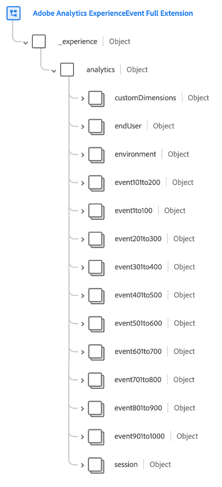
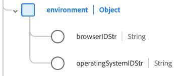

# [!UICONTROL Adobe Analytics ExperienceEvent 전체 확장] 스키마 필드 그룹

[!UICONTROL Adobe Analytics ExperienceEvent 전체 확장 기능]은(는) [[!DNL XDM ExperienceEvent] 클래스](../../classes/experienceevent.md)에 대한 표준 스키마 필드 그룹으로, Adobe Analytics에서 수집하는 일반적인 지표를 캡처합니다.

이 문서에서는 Analytics 확장 필드 그룹의 구조 및 사용 사례에 대해 설명합니다.

>[!NOTE]
>
>이 필드 그룹의 반복되는 요소 크기와 수로 인해 이 안내서에 표시되는 많은 필드가 축소되어 공간을 절약할 수 있습니다. 이 필드 그룹의 전체 구조를 살펴보려면 [Experience Platform UI에서 조회](../../ui/explore.md)하거나 [공개 XDM 저장소](https://github.com/adobe/xdm/blob/master/extensions/adobe/experience/analytics/experienceevent-all.schema.json)에서 전체 스키마를 볼 수 있습니다.

## 필드 그룹 구조

필드 그룹은 스키마에 단일 `_experience` 개체를 제공하며, 이 개체 자체에는 단일 `analytics` 개체가 있습니다.

| 속성 | 데이터 유형 | 설명 |
| --- | --- | --- |
| `customDimensions` | 오브젝트 | Analytics에서 추적하는 사용자 지정 차원을 캡처합니다. 이 개체의 내용에 대한 자세한 내용은 아래 [하위 섹션](#custom-dimensions)을 참조하세요. |
| `endUser` | 오브젝트 | 이벤트를 트리거한 최종 사용자에 대한 웹 인터랙션 세부 정보를 캡처합니다. 이 개체의 내용에 대한 자세한 내용은 아래 [하위 섹션](#end-user)을 참조하세요. |
| `environment` | 오브젝트 | 이벤트를 트리거한 브라우저 및 운영 체제에 대한 정보를 캡처합니다. 이 개체의 내용에 대한 자세한 내용은 아래 [하위 섹션](#environment)을 참조하세요. |
| `event1to100`  `event101to200`  `event201to300`  `event301to400`  `event401to500`  `event501to100`  `event601to700`  `event701to800`  `event801to900`  `event901to1000` | 오브젝트 | 필드 그룹은 최대 1000개의 사용자 지정 이벤트를 캡처할 수 있는 개체 필드를 제공합니다. 이러한 필드에 대한 자세한 내용은 아래 [하위 섹션](#events)을 참조하세요. |
| `session` | 오브젝트 | 이벤트를 트리거한 세션에 대한 정보를 캡처합니다. 이 개체의 내용에 대한 자세한 내용은 아래 [하위 섹션](#session)을 참조하세요. |

{style="table-layout:auto"}

## `customDimensions` {#custom-dimensions}

`customDimensions`은(는) Analytics에서 추적하는 사용자 지정 [차원](https://experienceleague.adobe.com/docs/analytics/components/dimensions/overview.html?lang=ko)을(를) 캡처합니다.

| 속성 | 데이터 유형 | 설명 |
| --- | --- | --- |
| `eVars` | 오브젝트 | 최대 250개의 전환 변수([eVars](https://experienceleague.adobe.com/docs/analytics/components/dimensions/evar.html?lang=ko-KR))를 캡처하는 개체입니다. 이 개체의 속성은 `eVar1`에서 `eVar250`(으)로 처리되며 해당 데이터 형식에 대한 문자열만 허용합니다. |
| `hierarchies` | 오브젝트 | 최대 5개의 사용자 지정 계층 변수([계층](https://experienceleague.adobe.com/docs/analytics/implementation/vars/page-vars/hier.html?lang=ko))를 캡처하는 개체입니다. 이 개체의 속성은 `hier1`에서 `hier5`(으)로 처리됩니다. 이 개체는 다음 하위 속성을 가진 개체 자체입니다.<ul><li>`delimiter`: `values` 아래에 제공된 목록을 생성하는 데 사용되는 원래 구분 기호입니다.</li><li>`values`: 문자열로 표시되는 계층 수준 이름의 구분된 목록입니다.</li></ul> |
| `listProps` | 오브젝트 | 최대 75개의 [목록 prop](https://experienceleague.adobe.com/docs/analytics/implementation/vars/page-vars/prop.html?lang=ko#list-props)을 캡처하는 개체입니다. 이 개체의 속성은 `prop1`에서 `prop75`(으)로 처리됩니다. 이 개체는 다음 하위 속성을 가진 개체 자체입니다.<ul><li>`delimiter`: `values` 아래에 제공된 목록을 생성하는 데 사용되는 원래 구분 기호입니다.</li><li>`values`: 문자열로 표시되는 prop의 구분된 값 목록입니다.</li></ul> |
| `lists` | 오브젝트 | 최대 3개의 [목록](https://experienceleague.adobe.com/docs/analytics/implementation/vars/page-vars/list.html?lang=ko)을 캡처하는 개체입니다. 이 개체의 속성은 `list1`에서 `list3`(으)로 처리됩니다. 이러한 각 속성에는 [[!UICONTROL 키 값 쌍]](../../data-types/key-value-pair.md) 데이터 형식의 단일 `list` 배열이 포함되어 있습니다. |
| `props` | 오브젝트 | 최대 75개의 [props](https://experienceleague.adobe.com/docs/analytics/implementation/vars/page-vars/prop.html?lang=ko)을(를) 캡처하는 개체입니다. 이 개체의 속성은 `prop1`에서 `prop75`(으)로 처리되며 해당 데이터 형식에 대한 문자열만 허용합니다. |
| `postalCode` | 문자열 | 클라이언트가 제공한 우편 번호. |
| `stateProvince` | 문자열 | 클라이언트가 제공한 주 또는 시/도 위치. |

{style="table-layout:auto"}

## `endUser` {#end-user}

`endUser`은(는) 이벤트를 트리거한 최종 사용자에 대한 웹 인터랙션 세부 정보를 캡처합니다.

| 속성 | 데이터 유형 | 설명 |
| --- | --- | --- |
| `firstWeb` | [[!UICONTROL 웹 정보]](../../data-types/web-information.md) | 이 최종 사용자에 대한 첫 번째 경험 이벤트의 웹 페이지, 링크 및 레퍼러 관련 정보입니다. |
| `firstTimestamp` | 정수 | 이 최종 사용자의 첫 번째 ExperienceEvent에 대한 Unix 타임스탬프입니다. |

## `environment` {#environment}

`environment`에서 이벤트를 트리거한 브라우저 및 운영 체제에 대한 정보를 캡처합니다.

| 속성 | 데이터 유형 | 설명 |
| --- | --- | --- |
| `browserIDStr` | 문자열 | 사용된 브라우저([브라우저 유형 차원](https://experienceleague.adobe.com/docs/analytics/components/dimensions/browser-type.html?lang=ko))의 Adobe Analytics 식별자입니다. |
| `operatingSystemIDStr` | 문자열 | 사용된 운영 체제의 Adobe Analytics 식별자(다른 경우에는 [운영 체제 유형 차원](https://experienceleague.adobe.com/docs/analytics/components/dimensions/operating-system-types.html?lang=ko))입니다. |

## 사용자 정의 이벤트 필드 {#events}

Analytics 확장 필드 그룹은 필드 그룹에 대해 최대 100개의 [사용자 지정 이벤트 지표](https://experienceleague.adobe.com/docs/analytics/components/metrics/custom-events.html?lang=ko)를 캡처하는 10개의 개체 필드를 제공합니다(총 1000개).

각 최상위 이벤트 객체에는 해당 범위의 개별 이벤트 객체가 포함되어 있습니다. 예를 들어 `event101to200`에는 `event101`에서 `event200`(으)로 처리된 이벤트가 포함되어 있습니다.

각 짝수 개체는 [[!UICONTROL 측정]](../../data-types/measure.md) 데이터 형식을 사용하여 고유 식별자 및 수량 가능한 값을 제공합니다.

## `session` {#session}

`session`에서 이벤트를 트리거한 세션에 대한 정보를 캡처합니다.

| 속성 | 데이터 유형 | 설명 |
| --- | --- | --- |
| `search` | [[!UICONTROL 검색]](../../data-types/search.md) | 세션 항목에 대한 웹 또는 모바일 검색 관련 정보를 캡처합니다. |
| `web` | [[!UICONTROL 웹 정보]](../../data-types/web-information.md) | 세션 항목에 대한 링크 클릭 수, 웹 페이지 세부 정보, 레퍼러 정보 및 브라우저 세부 정보를 캡처합니다. |
| `depth` | 정수 | 최종 사용자의 현재 세션 깊이(예: 페이지 번호)입니다. |
| `num` | 정수 | 최종 사용자의 현재 세션 번호입니다. |
| `timestamp` | 정수 | 세션 항목에 대한 Unix 타임스탬프입니다. |

## 다음 단계

이 문서에서는 Analytics 확장 필드 그룹의 구조 및 사용 사례에 대해 다룹니다. 필드 그룹 자체에 대한 자세한 내용은 [공개 XDM 저장소](https://github.com/adobe/xdm/blob/master/extensions/adobe/experience/analytics/experienceevent-all.schema.json)를 참조하세요.

이 필드 그룹을 사용하여 Adobe Experience Platform Web SDK을 사용하여 Analytics 데이터를 수집하는 경우 서버측에서 데이터를 XDM에 매핑하는 방법에 대해 알아보려면 [데이터 스트림 구성](../../../datastreams/overview.md)에 대한 안내서를 참조하십시오.
