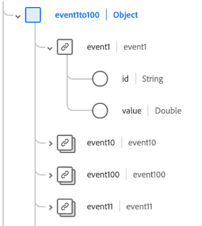

# [!UICONTROL Adobe Analytics Experience Event Full Extension] 스키마 필드 그룹

[!UICONTROL Adobe Analytics Experience Event Full Extension] 는 의 표준 스키마 필드 그룹입니다. [[!DNL XDM ExperienceEvent] 클래스](../../classes/experienceevent.md): Adobe Analytics에서 수집하는 일반적인 지표를 캡처합니다.

이 문서에서는 Analytics 확장 필드 그룹의 구조 및 사용 사례를 설명합니다.

>[!NOTE]
>
>이 필드 그룹에서 반복되는 요소의 크기 및 수로 인해 이 안내서에 표시된 많은 필드가 공간을 절약하기 위해 축소되었습니다. 이 필드 그룹의 전체 구조를 탐색하려면 다음을 수행할 수 있습니다 [플랫폼 UI에서 검색 ](../../ui/explore.md) 또는 [공용 XDM 저장소](https://github.com/adobe/xdm/blob/master/extensions/adobe/experience/analytics/experienceevent-all.schema.json).

## 필드 그룹 구조

필드 그룹은 단일 `_experience` 스키마에 대한 객체(자체가 단일 포함) `analytics` 개체.

| 속성 | 데이터 유형 | 설명 |
| --- | --- | --- |
| `customDimensions` | 개체 | Analytics에서 추적하는 사용자 지정 차원을 캡처합니다. 자세한 내용은 [하위 섹션](#custom-dimensions) 을 참조하십시오. |
| `endUser` | 개체 | 이벤트를 트리거한 최종 사용자에 대한 웹 상호 작용 세부 사항을 캡처합니다. 자세한 내용은 [하위 섹션](#end-user) 을 참조하십시오. |
| `environment` | 개체 | 이벤트를 트리거한 브라우저 및 운영 체제에 대한 정보를 캡처합니다. 자세한 내용은 [하위 섹션](#environment) 을 참조하십시오. |
| `event1to100`  `event101to200`  `event201to300`  `event301to400`  `event401to500`  `event501to100`  `event601to700`  `event701to800`  `event801to900`  `event901to1000` | 개체 | 필드 그룹은 최대 1,000개의 사용자 지정 이벤트를 캡처할 개체 필드를 제공합니다. 자세한 내용은 [하위 섹션](#events) 를 참조하십시오. |
| `session` | 개체 | 이벤트를 트리거한 세션에 대한 정보를 캡처합니다. 자세한 내용은 [하위 섹션](#session) 을 참조하십시오. |

{style=&quot;table-layout:auto&quot;}

## `customDimensions` {#custom-dimensions}

`customDimensions` 사용자 지정 캡처 [차원](https://experienceleague.adobe.com/docs/analytics/components/dimensions/overview.html?lang=ko-KR) 추적됩니다.

| 속성 | 데이터 유형 | 설명 |
| --- | --- | --- |
| `eVars` | 개체 | 최대 250개의 전환 변수를 캡처하는 개체([eVar](https://experienceleague.adobe.com/docs/analytics/components/dimensions/evar.html?lang=ko-KR)). 이 개체의 속성은 키 대조되어 있습니다 `eVar1` to `eVar250` 및 는 해당 데이터 유형에 대한 문자열만 허용합니다. |
| `hierarchies` | 개체 | 최대 5개의 사용자 지정 계층 변수([히어](https://experienceleague.adobe.com/docs/analytics/implementation/vars/page-vars/hier.html)). 이 개체의 속성은 키 대조되어 있습니다 `hier1` to `hier5`: 다음 하위 속성을 사용하는 객체 자체입니다.<ul><li>`delimiter`: 아래에 제공된 목록을 생성하는 데 사용되는 원래 구분 기호입니다. `values`.</li><li>`values`: 문자열로 표시되는 구분된 계층 수준 이름 목록입니다.</li></ul> |
| `listProps` | 개체 | 최대 75개의 객체를 캡처합니다. [list props](https://experienceleague.adobe.com/docs/analytics/implementation/vars/page-vars/prop.html#list-props). 이 개체의 속성은 키 대조되어 있습니다 `prop1` to `prop75`: 다음 하위 속성을 사용하는 객체 자체입니다.<ul><li>`delimiter`: 아래에 제공된 목록을 생성하는 데 사용되는 원래 구분 기호입니다. `values`.</li><li>`values`: 문자열로 표시되는 prop에 대한 구분된 값 목록입니다.</li></ul> |
| `lists` | 개체 | 최대 3개의 객체를 캡처합니다 [목록](https://experienceleague.adobe.com/docs/analytics/implementation/vars/page-vars/list.html). 이 개체의 속성은 키 대조되어 있습니다 `list1` to `list3`. 이러한 각 속성에는 하나의 `list` 배열 [[!UICONTROL 키 값 쌍]](../../data-types/key-value-pair.md) 데이터 유형. |
| `props` | 개체 | 최대 75개의 객체를 캡처합니다. [prop](https://experienceleague.adobe.com/docs/analytics/implementation/vars/page-vars/prop.html). 이 개체의 속성은 키 대조되어 있습니다 `prop1` to `prop75` 및 는 해당 데이터 유형에 대한 문자열만 허용합니다. |
| `postalCode` | 문자열 | 클라이언트가 제공한 우편 번호입니다. |
| `stateProvince` | 문자열 | 클라이언트가 제공한 주 또는 도 위치입니다. |

{style=&quot;table-layout:auto&quot;}

## `endUser` {#end-user}

`endUser` 은(는) 이벤트를 트리거한 최종 사용자에 대한 웹 상호 작용 세부 사항을 캡처합니다.

| 속성 | 데이터 유형 | 설명 |
| --- | --- | --- |
| `firstWeb` | [[!UICONTROL 웹 정보]](../../data-types/web-information.md) | 이 최종 사용자에 대한 첫 번째 경험 이벤트의 웹 페이지, 링크 및 레퍼러와 관련된 정보입니다. |
| `firstTimestamp` | 정수 | 이 최종 사용자에 대한 첫 번째 ExperienceEvent에 대한 Unix 타임스탬프입니다. |

## `environment` {#environment}

`environment` 은(는) 이벤트를 트리거한 브라우저 및 운영 체제에 대한 정보를 캡처합니다.

| 속성 | 데이터 유형 | 설명 |
| --- | --- | --- |
| `browserIDStr` | 문자열 | 사용된 브라우저의 Adobe Analytics 식별자(다른 방법으로는 [브라우저 유형 차원](https://experienceleague.adobe.com/docs/analytics/components/dimensions/browser-type.html)). |
| `operatingSystemIDStr` | 문자열 | 사용된 운영 체제에 대한 Adobe Analytics 식별자(그렇지 않으면 [운영 체제 유형 차원](https://experienceleague.adobe.com/docs/analytics/components/dimensions/operating-system-types.html)). |

## 사용자 지정 이벤트 필드 {#events}

Analytics 확장 필드 그룹은 최대 100개를 캡처하는 10개의 개체 필드를 제공합니다 [사용자 지정 이벤트 지표](https://experienceleague.adobe.com/docs/analytics/components/metrics/custom-events.html) 각각, 필드 그룹에 대해 총 1000개씩.

각 최상위 이벤트 객체에는 해당 범위에 대한 개별 이벤트 객체가 포함되어 있습니다. 예, `event101to200` 에서 처리된 이벤트 포함 `event101` to `event200`.

각 짝수 개체는 [[!UICONTROL 측정]](../../data-types/measure.md) 데이터 유형. 고유 식별자와 수량 가능한 값을 제공합니다.

## `session` {#session}

`session` 은(는) 이벤트를 트리거한 세션에 대한 정보를 캡처합니다.

| 속성 | 데이터 유형 | 설명 |
| --- | --- | --- |
| `search` | [[!UICONTROL 검색]](../../data-types/search.md) | 세션 항목의 웹 또는 모바일 검색과 관련된 정보를 캡처합니다. |
| `web` | [[!UICONTROL 웹 정보]](../../data-types/web-information.md) | 세션 항목에 대한 링크 클릭 수, 웹 페이지 세부 사항, 레퍼러 정보 및 브라우저 세부 사항에 대한 정보를 캡처합니다. |
| `depth` | 정수 | 최종 사용자의 현재 세션 깊이(예: 페이지 번호)입니다. |
| `num` | 정수 | 최종 사용자의 현재 세션 번호입니다. |
| `timestamp` | 정수 | 세션 항목의 Unix 타임스탬프입니다. |

## 다음 단계

이 문서에서는 Analytics 확장 필드 그룹에 대한 구조 및 사용 사례를 다룹니다. 필드 그룹 자체에 대한 자세한 내용은 [공용 XDM 저장소](https://github.com/adobe/xdm/blob/master/extensions/adobe/experience/analytics/experienceevent-all.schema.json).

이 필드 그룹을 사용하여 Adobe Experience Platform Web SDK를 사용하여 Analytics 데이터를 수집하는 경우 안내서의 를 참조하십시오 [데이터 스트림 구성](../../../edge/fundamentals/datastreams.md) 를 눌러 데이터를 서버 쪽의 XDM에 매핑하는 방법을 알아봅니다.
