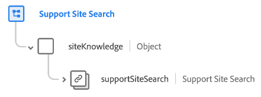

# [!UICONTROL 지원 사이트 검색] 스키마 필드 그룹

[!UICONTROL 지원 사이트 검색] 는 의 표준 스키마 필드 그룹입니다. [[!DNL XDM ExperienceEvent] 클래스](../../classes/experienceevent.md). 단일 `siteKnowledge.supportSiteSearch` 지원 사이트 검색에 대한 정보를 캡처하는 스키마에 대한 객체입니다.

| 속성 | 데이터 유형 | 설명 |
| --- | --- | --- |
| `supportSiteSearch` | [[!UICONTROL 내부 사이트 검색]](../../data-types/internal-site-search.md) | 검색 이벤트에 대한 세부 정보를 캡처합니다. |

{style="table-layout:auto"}

필드 그룹에 대한 자세한 내용은 [공개 XDM 저장소](https://github.com/adobe/xdm/blob/master/docs/reference/fieldgroups/experience-event/experienceevent-support-site-search.schema.json).
