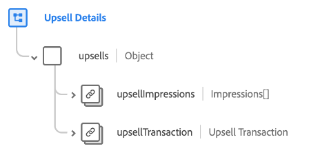

# [!UICONTROL 업셀 세부 정보] 스키마 필드 그룹

[!UICONTROL 업셀 세부 정보] 는 의 표준 스키마 필드 그룹입니다. [[!DNL XDM ExperienceEvent] 클래스](../../classes/experienceevent.md) 거래에 대한 세부 정보 및 오퍼가 고객에게 표시되는 다양한 방법을 포함하여 업셀 마케팅 이벤트에 대한 정보를 캡처하는 데 사용됩니다.

필드 그룹은 단일 개체 유형 필드를 제공합니다. `upsells`. 이 개체에 포함된 속성은 아래에 설명되어 있습니다.

| 속성 | 데이터 유형 | 설명 |
| --- | --- | --- |
| `upsellImpressions` | 배열 [노출 횟수](../../data-types/impressions.md) | 고객에 대해 기록된 노출 횟수(디지털 보기 또는 상향 판매 오퍼와의 계약)를 나열하는 배열입니다. |
| `upsellTransaction` | [거래](../../data-types/transaction.md) | 상향 판매에 대한 통화 트랜잭션을 설명합니다. |

{style="table-layout:auto"}

필드 그룹에 대한 자세한 내용은 공개 XDM 저장소를 참조하십시오.

* [채워진 예](https://github.com/adobe/xdm/blob/master/components/fieldgroups/experience-event/industry-verticals/experienceevent-upsell-details.example.1.json)
* [전체 스키마](https://github.com/adobe/xdm/blob/master/components/fieldgroups/experience-event/industry-verticals/experienceevent-upsell-details.schema.json)
