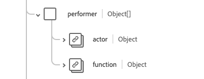

# [!UICONTROL 의약품 분배] 스키마 필드 그룹

[!UICONTROL 약물 분배]은(는) [[!DNL Medication] 클래스](../../classes/location.md), [[!DNL XDM Individual Profile] 클래스](../../classes/individual-profile.md) 및 [[!DNL Provider class]](../../classes/provider.md)에 대한 표준 스키마 필드 그룹입니다. 지정된 사람/환자에게 제공되거나 제공된 약물에 대한 정보를 캡처하는 단일 개체 유형 필드 `healthcareMedicationDispense`을(를) 제공합니다.

| 표시 이름 | 속성 | 데이터 유형 | 설명 |
| --- | --- | --- | --- |
| [!UICONTROL 처방전 인증] | `authorizingPrescription` | [[!UICONTROL 참조]](../../data-types/healthcare/reference.md) 배열 | 처방전 조제 허용 명령서. |
| [!UICONTROL 기준] | `basedOn` | [[!UICONTROL 참조]](../../data-types/healthcare/reference.md) 배열 | 그 약의 조제 계획은 기초를 두고 있다. |
| [!UICONTROL 범주] | `category` | [[!UICONTROL 코드 가능한 개념 배열]](../../data-types/healthcare/codeable-concept.md) | 교부 중인 의약품의 범주는 의약품의 법적 범주 또는 의약품 분류 등 해당 범주에 속한다. |
| [!UICONTROL 일 공급] | `daysSupply` | [[!UICONTROL 단순 수량]](../../data-types/healthcare/simple-quantity.md) | 약물이 환자에게 공급할 일수입니다. |
| [!UICONTROL 대상] | `destination` | [[!UICONTROL 참조]](../../data-types/healthcare/reference.md) | 분배 이벤트의 일부로 의약품이 배송되었거나 배송될 시설 또는 위치. |
| [!UICONTROL 복용량 지침] | `dosageInstruction` | [[!UICONTROL 투약]](../../data-types/healthcare/dosage.md) 배열 | 환자가 약물을 사용하는 방법을 설명합니다. |
| [!UICONTROL Encounter] | `encounter` | [[!UICONTROL 참조]](../../data-types/healthcare/reference.md) | 이 이벤트의 컨텍스트를 설정하는 발생 횟수. |
| [!UICONTROL 이벤트 기록] | `eventHistory` | [[!UICONTROL 참조]](../../data-types/healthcare/reference.md) 배열 | 디스펜싱 주변에서 발생한 이벤트에 대한 요약. |
| [!UICONTROL 식별자] | `identifier` | [[!UICONTROL 식별자]](../../data-types/healthcare/identifier.md) 배열 | 디스펜싱과 연계된 식별자. 식별자는 비즈니스 프로세스에서 정의해야 하며, 직접 URL 참조가 적절하지 않을 때 참조하는 데 사용해야 합니다. |
| [!UICONTROL 위치] | `location` | [[!UICONTROL 참조]](../../data-types/healthcare/reference.md) | 약물이 조제된 주요 물리적 위치. |
| [!UICONTROL 약물] | `medication` | [[!UICONTROL 코드 사용 가능한 참조]](../../data-types/healthcare/codeable-reference.md) | 요청 중인 의약품을 식별합니다. 이는 약물의 세부 사항을 나타내는 리소스에 대한 링크이거나 약물을 식별하는 코드여야 합니다. |
| [!UICONTROL 수행되지 않은 이유] | `notPerformedReason` | [[!UICONTROL 코드 사용 가능한 참조]](../../data-types/healthcare/codeable-reference.md) | 약물이 조제되지 않은 이유. |
| [!UICONTROL 메모] | `note` | [[!UICONTROL 주석]](../../data-types/healthcare/annotation.md) 배열 | 디스펜싱에 대한 추가 정보. |
| [!UICONTROL 일부] | `partOf` | [[!UICONTROL 참조]](../../data-types/healthcare/reference.md) 배열 | 조제를 트리거한 절차 또는 약물 요청. |
| [!UICONTROL 수행자] | `performer` | 오브젝트 배열 | 분배 이벤트를 수행한 사람 또는 내용을 나타냅니다. 자세한 내용은 아래 [섹션](#performer)을 참조하세요. |
| [!UICONTROL 수량] | `quantity` | [[!UICONTROL 단순 수량]](../../data-types/healthcare/simple-quantity.md) | 측정 단위를 포함하여 조제된 약물의 양. |
| [!UICONTROL 받는 사람] | `receiver` | [[!UICONTROL 참조]](../../data-types/healthcare/reference.md) 배열 | 의약품을 수령한 사람 또는 의약품이 배달된 위치를 식별합니다. |
| [!UICONTROL 제목] | `subject` | [[!UICONTROL 참조]](../../data-types/healthcare/reference.md) | 의약품을 받을 사용자 또는 그룹을 나타내는 리소스에 대한 링크입니다. |
| [!UICONTROL 대체] | `substitution` | 오브젝트 | 분배의 일부로 대체되었는지 여부를 나타냅니다. 다음 네 가지 속성을 포함합니다. <li>`wasSubstituted`: 디스펜서가 대체를 요청한 경우 true인 부울 값입니다.</li> <li>`type`: 대체 여부를 나타내는 코드를 제공하는 [[!UICONTROL Codeable Concept]](../../data-types/healthcare/codeable-concept.md) 값입니다.</li> <li>`reason`: 대체 이유를 포함하는 [[!UICONTROL 코드 가능한 개념]](../../data-types/healthcare/codeable-concept.md) 값의 배열입니다.</li> <li>`responsibleParty`: 대체를 담당하는 사람 또는 파티를 제공하는 [[!UICONTROL 참조]](../../data-types/healthcare/reference.md) 값입니다. </li> |
| [!UICONTROL 지원 정보] | `supportingInformation` | [[!UICONTROL 참조]](../../data-types/healthcare/reference.md) 배열 | 조제 중인 의약품을 지원하는 추가 정보. |
| [!UICONTROL 유형] | `type` | [[!UICONTROL 코드 가능한 개념]](../../data-types/healthcare/codeable-concept.md) | 긴급 채우기 또는 부분 채우기와 같이 수행되는 분배 이벤트 유형을 설명합니다. |
| [!UICONTROL 기록됨] | `recorded` | 날짜/시간 | `whenPrepared` 또는 `whenHandedOver`이(가) 채워지지 않은 경우 분배 활동이 시작된 날짜와 시간입니다. |
| [!UICONTROL 렌더링된 투약 지침] | `renderedDosageInstruction` | 문자열 | 모든 복용 지침에 포함된 복용 용량의 전체 표시. 용량 증가 또는 테이퍼링과 같은 복합 투여를 나타내기 위해 다중 투여량 지시사항이 포함될 때 사용됩니다. |
| [!UICONTROL 상태] | `status` | 문자열 | 분배 상태. 이 속성의 값은 다음 알려진 열거형 값 중 하나와 같아야 합니다. <li> `preperation` </li> <li> `in-progress` </li> <li> `cancelled` </li> <li> `on-hold` </li> <li> `completed` </li> <li> `entered-in-error` </li> <li> `stopped` </li> <li> `declined` </li> <li> `unknown` </li> |
| [!UICONTROL 상태 변경됨] | `statusChanged` | 날짜/시간 | 분배 레코드의 상태가 변경된 날짜 및 시간입니다. |
| [!UICONTROL 인계될 때] | `whenHandedOver` | 날짜/시간 | 교제한 약제가 환자에게 제공된 날짜와 시간. |
| [!UICONTROL 준비되면] | `whenPrepared` | 날짜/시간 | 조제된 의약품을 포장하여 검토한 날짜와 시간. |

필드 그룹에 대한 자세한 내용은 공개 XDM 저장소를 참조하십시오.

* [채워진 예](https://github.com/adobe/xdm/blob/master/extensions/industry/healthcare/fhir/fieldgroups/medicationdispense.example.1.json)
* [전체 스키마](https://github.com/adobe/xdm/blob/master/extensions/industry/healthcare/fhir/fieldgroups/medicationdispense.schema.json)

## `performer` {#performer}

`performer`은(는) 개체 배열로 제공됩니다. 각 객체의 구조는 아래에 설명되어 있습니다.

| 표시 이름 | 속성 | 데이터 유형 | 설명 |
| --- | --- | --- | --- |
| [!UICONTROL 작업자] | `actor` | [[!UICONTROL 참조]](../../data-types/healthcare/reference.md) | 작업을 수행한 실무자(또는 유사)입니다. 행위자가 그 약제의 디스펜서임을 전제로 하여야 할 것이다. |
| [!UICONTROL 함수] | `function` | [[!UICONTROL 코드 가능한 개념]](../../data-types/healthcare/codeable-concept.md) | 날짜 입력기, 패키지 작성기 또는 최종 검사기 등 디스펜싱의 수행자 유형. |
