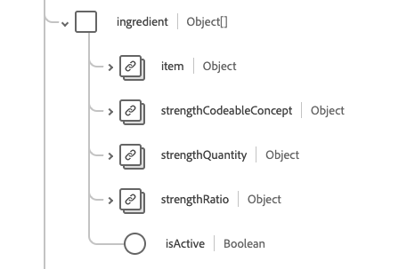

# [!UICONTROL 약물] 스키마 필드 그룹

[!UICONTROL 약물]은(는) [[!DNL Medication] 클래스](../../classes/medication.md)에 대한 표준 스키마 필드 그룹입니다. 약물 정보를 캡처하는 단일 개체 유형 필드 `healthcareMedication`을(를) 제공합니다.

| 표시 이름 | 속성 | 데이터 유형 | 설명 |
| ---|  --- | --- | --- |
| [!UICONTROL 일괄 처리] | `batch` | 오브젝트 | 패키지된 약물에 대한 세부 정보. 다음 두 가지 속성을 포함합니다. <li>`lotNumber`: 일괄 처리에 할당된 식별자의 문자열 값입니다.</li> <li>`expirationDate`: 일괄 처리가 만료되는 날짜의 DateTime 값입니다.</li> |
| [!UICONTROL 코드] | `code` | [[!UICONTROL 코드 가능한 개념]](../../data-types/healthcare/codeable-concept.md) | 이 의약품을 식별하는 코드입니다. |
| [!UICONTROL 정의] | `definition` | [[!UICONTROL 참조]](../../data-types/healthcare/reference.md) | 약물의 정의. |
| [!UICONTROL 선량 양식] | `doseForm` | [[!UICONTROL 코드 가능한 개념]](../../data-types/healthcare/codeable-concept.md) | 정제 또는 캡슐과 같은 약물의 용량 형태를 설명합니다. |
| [!UICONTROL 식별자] | `identifier` | [[!UICONTROL 식별자]](../../data-types/healthcare/identifier.md) 배열 | 약물에 대한 식별자. |
| [!UICONTROL 재료] | `ingredient` | 오브젝트 배열 | 약물에 대한 성분 정보를 설명합니다. 자세한 내용은 아래 [섹션](#ingredient)을 참조하세요. |
| [!UICONTROL 마케팅 권한 부여 소유자] | `marketingAuthorizationHolder` | [[!UICONTROL 참조]](../../data-types/healthcare/reference.md) | 의약품을 판매할 수 있는 권한이 있는 조직입니다. |
| [!UICONTROL 총 볼륨] | `totalVolume` | [[!UICONTROL 수량]](../../data-types/healthcare/quantity.md) | 제품 코드가 패키지 크기를 유추하지 않는 경우 의약품에서 제공하는 제품의 양. |
| [!UICONTROL 상태] | `status` | 문자열 | 약물 상태. 이 속성의 값은 다음 알려진 열거형 값 중 하나와 같아야 합니다. <li> `active` </li> <li> `inactive` </li> <li> `entered-in-error` </li> |

필드 그룹에 대한 자세한 내용은 공개 XDM 저장소를 참조하십시오.

* [채워진 예](https://github.com/adobe/xdm/blob/master/extensions/industry/healthcare/fhir/fieldgroups/medication.example.1.json)
* [전체 스키마](https://github.com/adobe/xdm/blob/master/extensions/industry/healthcare/fhir/fieldgroups/medication.schema.json)

## `ingredient` {#ingredient}

`ingredient`은(는) 개체 배열로 제공됩니다. 각 객체의 구조는 아래에 설명되어 있습니다.

| 표시 이름 | 속성 | 데이터 유형 | 설명 |
| --- | --- | --- | --- |
| [!UICONTROL 항목] | `item` | [[!UICONTROL 코드 사용 가능한 참조]](../../data-types/healthcare/codeable-reference.md) | 설명 중인 성분입니다. |
| [!UICONTROL 강도 코드 가능 개념] | `strengthCodeableConcept` | [[!UICONTROL 코드 가능한 개념]](../../data-types/healthcare/codeable-concept.md) | 시스템 정의 용어로 표시되는 재료의 수량입니다. |
| [!UICONTROL 강도 수량] | `strengthQuantity` | [[!UICONTROL 수량]](../../data-types/healthcare/quantity.md) | 존재하는 재료의 수량입니다. |
| [!UICONTROL 강도 비율] | `strengthRatio` | [[!UICONTROL 비율]](../../data-types/healthcare/ratio.md) | 존재하는 성분의 비율입니다. |
| [!UICONTROL 활성 상태임] | `isActive` | 부울 | 재료가 활성 상태인지 여부를 나타냅니다. |
