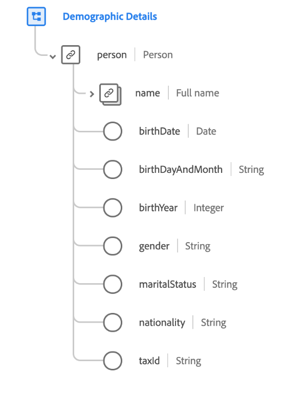

# [!UICONTROL 인구 통계 세부 정보] 스키마 필드 그룹

>[!NOTE]
>
>여러 스키마 필드 그룹의 이름이 변경되었습니다. 다음에 대한 문서 보기: [필드 그룹 이름 업데이트](../name-updates.md) 추가 정보.

[!UICONTROL 인구 통계 세부 정보] 는 의 표준 스키마 필드 그룹입니다. [[!DNL XDM Individual Profile] 클래스](../../classes/individual-profile.md). 필드 그룹은 루트 수준을 제공합니다. `person` 개체. 이 개체의 하위 필드는 개별 사용자에 대한 정보를 설명합니다.

| 속성 | 데이터 유형 | 설명 |
| --- | --- | --- |
| `person.name` | [개인 이름](../../data-types/person-name.md) | 하위 필드에 사용자 이름의 여러 요소가 설명되어 있는 객체입니다. |
| `person.birthDate` | 날짜 | ISO 8601 타임스탬프 형식으로 개인이 태어난 전체 날짜입니다. |
| `person.birthDayAndMonth` | 문자열 | MM-DD 형식으로 사람이 태어난 날짜와 시간. 이 필드는 출생월일이 알려진 경우 사용해야 하지만 연도가 아닌 경우 사용해야 합니다. |
| `person.birthYear` | 정수 | 세기가 포함된 태어난 연도(1989년 등). 이 필드는 전체 생년월일이 아니라 연령만 알려진 경우에 사용해야 합니다. |
| `person.gender` | 문자열 | 개인의 성 정체성. |
| `person.martialStatus` | 문자열 | 다른 중요 인물과의 관계를 설명합니다. |
| `person.nationality` | 문자열 | ISO 3166-1 Alpha-2 코드를 사용하여 표시된 사용자와 해당 주 간의 법적 관계. |
| `person.taxId` | 문자열 | 개인의 세금/회계 ID(예: 미국의 TIN 또는 스페인의 CIF/NIF). |

{style="table-layout:auto"}

필드 그룹에 대한 자세한 내용은 공개 XDM 저장소를 참조하십시오.

* [채워진 예](https://github.com/adobe/xdm/blob/master/components/fieldgroups/profile/profile-person-details.example.1.json)
* [전체 스키마](https://github.com/adobe/xdm/blob/master/components/fieldgroups/profile/profile-person-details.schema.json)