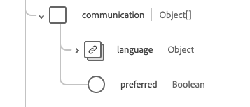

# [!UICONTROL 환자] 스키마 필드 그룹

[!UICONTROL 환자]은(는) [[!DNL XDM Individual Profile] 클래스](../../classes/individual-profile.md)의 표준 스키마 필드 그룹입니다. 개인 또는 동물 관리 또는 기타 건강 관련 서비스에 대한 인구 통계와 기타 관리 세부 정보를 캡처하는 단일 개체 유형 필드 `healthcarePatient`을(를) 제공합니다.

| 표시 이름 | 속성 | 데이터 유형 | 설명 |
| --- | --- | --- | --- |
| [!UICONTROL 주소] | `address` | [[!UICONTROL 주소]](../../data-types/healthcare/address.md) 배열 | 환자의 주소 정보. |
| [!UICONTROL 통신] | `communication` | 오브젝트 배열 | 환자의 건강에 대해 환자와 의사소통하는 데 사용할 수 있는 언어. 자세한 내용은 아래 [섹션](#communication)을 참조하세요. |
| [!UICONTROL 환자 연락처] | `contact` | 오브젝트 배열 | 보호자, 파트너 또는 친구 등 환자의 연락처 파티. 자세한 내용은 아래 [섹션](#contact)을 참조하세요. |
| [!UICONTROL 일반 전문가] | `generalPractioner` | [[!UICONTROL 참조]](../../data-types/healthcare/reference.md) 배열 | 환자의 1차 진료 제공업체. |
| [!UICONTROL 식별자] | `identifier` | [[!UICONTROL 식별자]](../../data-types/healthcare/identifier.md) 배열 | 환자용 식별자. |
| [!UICONTROL 환자 링크 세부 정보] | `link` | 오브젝트 배열 | 동일한 개인과 관련된 환자 또는 관련 개인의 리소스에 대한 링크입니다. 자세한 내용은 아래 [섹션](#link)을 참조하세요. |
| [!UICONTROL 조직 관리] | `managingOrganization` | [[!UICONTROL 참조]](../../data-types/healthcare/reference.md) | 환자 기록의 보관 조직. |
| [!UICONTROL 결혼 상태] | `maritalStatus` | [[!UICONTROL 코드 가능한 개념]](../../data-types/healthcare/codeable-concept.md) | 환자의 결혼 상태. |
| [!UICONTROL 이름] | `name` | [[!UICONTROL 사람 이름]](../../data-types/healthcare/human-name.md) 배열 | 환자와 연계된 이름. |
| [!UICONTROL 연락처 정보] | `telecom` | [[!UICONTROL 연락처]](../../data-types/healthcare/contact-point.md) 배열 | 전화 번호나 이메일 주소 등 환자와 연락할 수 있는 연락처 세부 정보. |
| [!UICONTROL 활성 상태임] | `active` | 부울 | 환자의 기록이 활성 상태인지 여부를 나타냅니다. |
| [!UICONTROL 생년월일] | `birthDate` | 날짜 | 환자의 생년월일. |
| [!UICONTROL 삭제된 표시기] | `deceasedBoolean` | 부울 | 환자가 사망했는지 여부를 나타냅니다. |
| [!UICONTROL 중단된 날짜 시간] | `deceasedDateTime` | 날짜/시간 | 환자가 사망한 날짜와 시간. |
| [!UICONTROL 성별] | `gender` | 문자열 | 개인의 성 정체성. 이 속성의 값은 다음 알려진 열거형 값 중 하나와 같아야 합니다. <li> `female` </li> <li> `male` </li> <li> `other` </li> <li> `unknown`</li> |
| [!UICONTROL 다태아 출생 중 일부임] | `multipleBirthBoolean` | 부울 | 환자가 다태아 출산의 일부인지 보여 줍니다. |
| [!UICONTROL 출생번호] | `multipleBirthInteger` | 정수 | 시퀀스 내 생년월일. |

필드 그룹에 대한 자세한 내용은 공개 XDM 저장소를 참조하십시오.

* [채워진 예](https://github.com/adobe/xdm/blob/master/extensions/industry/healthcare/fhir/fieldgroups/patient.example.1.json)
* [전체 스키마](https://github.com/adobe/xdm/blob/master/extensions/industry/healthcare/fhir/fieldgroups/patient.schema.json)

## `communication` {#communication}

`communication`은(는) 개체 배열로 제공됩니다. 각 객체의 구조는 아래에 설명되어 있습니다.

| 표시 이름 | 속성 | 데이터 유형 | 설명 |
| --- | --- | --- | --- |
| [!UICONTROL 언어] | `language` | [[!UICONTROL 코드 가능한 개념]](../../data-types/healthcare/codeable-concept.md) | 건강과 관련된 사람들과 의사소통하는 데 사용할 수 있는 언어입니다. |
| [!UICONTROL 기본 언어임] | `preferred` | 부울 | 언어가 기본 언어인지 여부를 나타냅니다. |

## `contact` {#contact}

`contact`은(는) 개체 배열로 제공됩니다. 각 객체의 구조는 아래에 설명되어 있습니다.

| 표시 이름 | 속성 | 데이터 유형 | 설명 |
| --- | --- | --- | --- |
| [!UICONTROL 연락처 주소] | `address` | [[!UICONTROL 주소]](../../data-types/healthcare/address.md) | 담당자 주소. |
| [!UICONTROL 연락처 이름] | `name` | [[!UICONTROL 사람 이름]](../../data-types/healthcare/human-name.md) | 연락처의 이름입니다. |
| [!UICONTROL 조직에 문의] | `organization` | [[!UICONTROL 참조]](../../data-types/healthcare/reference.md) | 연락처와 연관된 조직입니다. |
| [!UICONTROL 연락 기간] | `period` | [[!UICONTROL 기간]](../../data-types/healthcare/period.md) | 연락처가 사용되었거나 사용 중인 기간입니다. |
| [!UICONTROL 관계] | `relationship` | [[!UICONTROL 코드 가능한 개념]](../../data-types/healthcare/codeable-concept.md) | 환자와 접촉자 간의 관계. |
| [!UICONTROL 연락처 정보] | `telecom` | 오브젝트 배열 | 연락처에 대한 연락처 세부 정보. 자세한 내용은 아래 [섹션](#telecom)을 참조하세요. |
| [!UICONTROL 성별] | `gender` | 문자열 | 개인의 성 정체성. 이 속성의 값은 다음 알려진 열거형 값 중 하나와 같아야 합니다. <li> `female` </li> <li> `male` </li> <li> `other` </li> <li> `unknown`</li> |

### `telecom` {#telecom}

`telecom`은(는) 개체 배열로 제공됩니다. 각 객체의 구조는 아래에 설명되어 있습니다.

| 표시 이름 | 속성 | 데이터 유형 | 설명 |
| --- | --- | --- | --- |
| [!UICONTROL 연락처] | `contactPoint` | [[!UICONTROL 연락처]](../../data-types/healthcare/contact-point.md) | 개인용 연락처 세부 정보. |

## `link` {#link}

`link`은(는) 개체 배열로 제공됩니다. 각 객체의 구조는 아래에 설명되어 있습니다.

| 표시 이름 | 속성 | 데이터 유형 | 설명 |
| --- | --- | --- | --- |
| [!UICONTROL 기타] | `other` | [[!UICONTROL 참조]](../../data-types/healthcare/reference.md) | 동일한 개인과 관련된 환자 또는 관련 개인의 리소스에 대한 링크입니다. |
| [!UICONTROL 유형] | `type` | 문자열 | 두 환자 리소스 간의 연결 유형입니다. |
