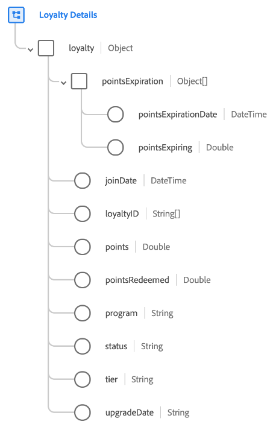

# [!UICONTROL 고객 충성도 세부 정보] 스키마 필드 그룹

>[!NOTE]
>
>여러 스키마 필드 그룹의 이름이 변경되었습니다. 다음에 대한 문서 보기: [필드 그룹 이름 업데이트](../name-updates.md) 추가 정보.

[!UICONTROL 고객 충성도 세부 정보] 는 의 표준 스키마 필드 그룹입니다. [[!DNL XDM Individual Profile] 클래스](../../classes/individual-profile.md). 필드 그룹은 단일 개체 유형 필드를 제공합니다. `loyalty`고객 충성도 프로그램에서 개인 멤버십과 관련된 정보를 캡처합니다.

| 속성 | 데이터 유형 | 설명 |
| --- | --- | --- |
| `pointsExpiration` | 오브젝트 배열 | 만료될 모든 충성도 포인트(또는 충성도 포인트 그룹)와 만료될 날짜를 나열합니다. 각 배열 항목은 다음 두 가지 속성을 포함하는 객체여야 합니다. <ul><li>`pointsExpirationDate`: 포인트가 만료되는 날짜의 ISO 8601 날짜/시간입니다.</li><li>`pointsExpiring`: 관련 만료일 현재 만료되는 포인트 잔액입니다.</li></ul> |
| `joinDate` | DateTime | 사용자가 고객 충성도 프로그램에 가입한 ISO 8601 날짜/시간입니다. |
| `loyaltyID` | 문자열 배열 | 충성도 프로그램 회원과 연결된 충성도 프로그램 ID를 나타냅니다. |
| `points` | 이중 | 충성도 멤버의 현재 충성도 포인트 또는 포상 잔고. |
| `pointsRedeemed` | 이중 | 충성도 멤버가 구매에 지원하거나 다른 방식으로 상환한 포인트 금액. |
| `program` | 문자열 | 개인이 등록된 고객 충성도 프로그램의 이름. |
| `status` | 문자열 | 사용자 충성도 멤버십의 현재 상태(예: ) `active`, `disabled`, 또는 `suspended`. |
| `tier` | 문자열 | 개인이 등록된 고객 충성도 프로그램 계층을 캡처합니다. |
| `upgradeDate` | 문자열 | 충성도 멤버가 가장 최근 계층 수준으로 업그레이드된 날짜입니다. |

{style="table-layout:auto"}

필드 그룹에 대한 자세한 내용은 공개 XDM 저장소를 참조하십시오.

* [채워진 예](https://github.com/adobe/xdm/blob/master/components/fieldgroups/profile/profile-loyalty-details.example.1.json)
* [전체 스키마](https://github.com/adobe/xdm/blob/master/components/fieldgroups/profile/profile-loyalty-details.schema.json)
