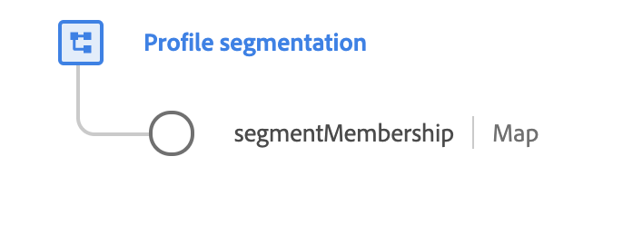

# [!UICONTROL 세그먼트 멤버십 세부 정보] 스키마 필드 그룹

>[!NOTE]
>
>여러 스키마 필드 그룹의 이름이 변경되었습니다. 다음 문서를 참조하십시오. [필드 그룹 이름 업데이트](../name-updates.md) 추가 정보.

[!UICONTROL 세그먼트 멤버십 세부 정보] 는 의 표준 스키마 필드 그룹입니다. [[!DNL XDM Individual Profile] 클래스](../../classes/individual-profile.md). 필드 그룹은 개인이 속한 세그먼트, 마지막 자격 시간, 멤버십이 유효한 시기 등 세그먼트 멤버십에 대한 정보를 캡처하는 단일 맵 필드를 제공합니다.

>[!WARNING]
>
>반면에 `segmentMembership` 이 필드 그룹을 사용하여 프로필 스키마에 필드를 수동으로 추가해야 합니다. 이 필드를 수동으로 채우거나 업데이트해서는 안 됩니다. 시스템이 자동으로 `segmentMembership` 세그먼테이션 작업으로 각 프로필에 매핑합니다.

<br />

| 속성 | 데이터 유형 | 설명 |
| --- | --- | --- |
| `segmentMembership` | 맵 | 개인의 세그먼트 멤버십을 설명하는 맵 개체입니다. 이 객체의 구조는 아래에 자세히 설명되어 있습니다. |

{style=&quot;table-layout:auto&quot;}

다음은 한 예입니다 `segmentMembership` 시스템이 특정 프로필에 대해 채워졌는지 매핑합니다. 세그먼트 멤버십은 개체의 루트 수준 키로 표시된 대로 네임스페이스별로 정렬됩니다. 따라서 각 네임스페이스 아래의 개별 키는 프로필이 속하는 세그먼트의 ID를 나타냅니다. 각 세그먼트 객체에는 멤버십에 대한 세부 정보를 제공하는 여러 하위 필드가 포함되어 있습니다.

```json
{
  "xdm:segmentMembership": {
    "AAM": {
      "04a81716-43d6-4e7a-a49c-f1d8b3129ba9": {
        "xdm:version": "15",
        "xdm:lastQualificationTime": "2018-04-26T15:52:25+00:00",
        "xdm:validUntil": "2019-04-26T15:52:25+00:00",
        "xdm:status": "existing",
        "xdm:payload": {
          "xdm:payloadBooleanValue": true,
          "xdm:payloadType": "boolean"
        }
      },
      "53cba6b2-a23b-454a-8069-fc41308f1c0f": {
        "xdm:version": "3",
        "xdm:lastQualificationTime": "2018-04-26T15:52:25+00:00",
        "xdm:validUntil": "2018-04-27T15:52:25+00:00",
        "xdm:status": "realized",
        "xdm:payload": {
          "xdm:payloadPropensityValue": 0.5,
          "xdm:payloadType": "propensity"
        }
      }
    },
    "Email": {
      "abcd@adobe.com": {
        "xdm:version": "1",
        "xdm:lastQualificationTime": "2017-09-26T15:52:25+00:00",
        "xdm:validUntil": "2017-12-26T15:52:25+00:00",
        "xdm:status": "exited"
      }
    }
  }
}
```

| 속성 | 설명 |
| --- | --- |
| `xdm:version` | 이 프로필에서 자격이 있는 세그먼트의 버전입니다. |
| `xdm:lastQualificationTime` | 이 프로필이 세그먼트에 대해 자격이 있는 마지막 시간의 타임스탬프입니다. |
| `xdm:validUntil` | 세그먼트 멤버십이 더 이상 유효하다고 가정하지 않아야 하는 시간의 타임스탬프입니다. |
| `xdm:status` | 세그먼트 멤버십이 현재 요청의 일부로 실현되었는지 여부를 나타내는 문자열 필드입니다. 다음 값이 허용됩니다. <ul><li>`existing`: 프로필은 요청 전에 이미 세그먼트의 일부였으며 계속해서 멤버십을 유지합니다.</li><li>`realized`: 프로필이 현재 요청의 일부로 세그먼트를 입력하고 있습니다.</li><li>`exited`: 프로필이 현재 요청의 일부로 세그먼트를 종료하고 있습니다.</li></ul> |
| `xdm:payload` | 일부 세그먼트 멤버십에는 멤버십과 직접 관련된 추가 값을 설명하는 페이로드가 포함됩니다. 각 멤버십에 대해 주어진 유형의 페이로드를 하나만 제공할 수 있습니다. `xdm:payloadType` 페이로드 유형(`boolean`, `number`, `propensity`, 또는 `string`)이고, 동위 속성은 페이로드 유형에 대한 값을 제공합니다. |

{style=&quot;table-layout:auto&quot;}

필드 그룹에 대한 자세한 내용은 공용 XDM 저장소를 참조하십시오.

* [채워진 예](https://github.com/adobe/xdm/blob/master/components/fieldgroups/profile/profile-personal-details.example.1.json)
* [전체 스키마](https://github.com/adobe/xdm/blob/master/components/fieldgroups/profile/profile-personal-details.schema.json)
