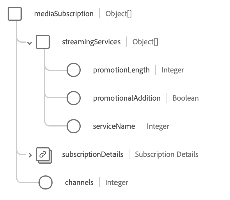

# [!UICONTROL 통신 ] 가입 스키마 필드 그룹

>[!NOTE]
>
>여러 스키마 필드 그룹의 이름이 변경되었습니다. 자세한 내용은 [필드 그룹 이름 업데이트](../name-updates.md)에 있는 문서를 참조하십시오.

[!UICONTROL 통신 ] 가입은 가격, 패키지 및 개별 제품 구독을 포함하여 고객의  [[!DNL XDM Individual Profile] ](../../classes/individual-profile.md) 통신 구독 계획을 설명하는 클래스에 대한 표준 스키마 필드 그룹입니다.

필드 그룹은 아래에 설명되어 있는 단일 객체 유형 필드 `telecomSubscription`를 제공합니다.

| 속성 | 데이터 유형 | 설명 |
| --- | --- | --- |
| `internetSubscription` | 개체 배열 | 데이터 상한, 연결 유형 및 속도 세부 정보와 같은 인터넷 구독 플랜 세부 사항을 설명합니다. 자세한 내용은 ](#internetSubscription) 아래의 [섹션을 참조하십시오. |
| `landlineSubscription` | 개체 배열 | 선택한 기능, 분 및 전화 걸기 계획을 포함하여 일반 라인 구독 계획 세부 사항에 대해 설명합니다. 자세한 내용은 ](#landlineSubscription) 아래의 [섹션을 참조하십시오. |
| `mediaSubscription` | 개체 배열 | 채널 수 및 포함된 스트리밍 서비스를 포함한 미디어 구독 플랜 세부 사항을 설명합니다. 자세한 내용은 ](#mediaSubscription) 아래의 [섹션을 참조하십시오. |
| `mobileSubscription` | 개체 배열 | 라인 수, 데이터 비율, 비용 등을 포함하여 모바일 구독 계획 세부 사항을 설명합니다. 자세한 내용은 ](#mobileSubscription) 아래의 [섹션을 참조하십시오. |
| `primarySubscriber` | [[!UICONTROL 사람]](../../data-types/person.md) | 구독 소유자를 설명합니다. |
| `bundleName` | 문자열 | 고객이 등록된 모든 유형의 구독 번들(예: `Internet + Media`)의 이름을 캡처합니다. |
| `primaryPartyID` | 문자열 | 일반적으로 장치 전화 번호일 수 있는 구독을 담당하는 기본 개인의 식별자입니다. |

{style=&quot;table-layout:auto&quot;}

필드 그룹에 대한 자세한 내용은 공용 XDM 저장소를 참조하십시오.

* [채워진 예](https://github.com/adobe/xdm/blob/master/components/fieldgroups/profile/profile-personal-details.example.1.json)
* [전체 스키마](https://github.com/adobe/xdm/blob/master/components/fieldgroups/profile/profile-personal-details.schema.json)

## `internetSubscription` {#internetSubscription}

`internetSubscription` 는 개체 배열을 제공합니다. 각 객체의 구조는 아래에 설명되어 있습니다.

| 속성 | 데이터 유형 | 설명 |
| --- | --- | --- |
| `subscriptionDetails` | [[!UICONTROL 통신 구독]](../../data-types/telecom-subscription.md) | 구독 길이, 요금, 상태 등을 포함하여 구독에 대한 일반 세부 사항을 설명합니다. 구독 길이, 요금, 상태 등을 포함하여 구독에 대한 일반 세부 사항을 설명합니다. |
| `connectionType` | 문자열 | 구독에 대한 연결 유형입니다. |
| `dataCap` | 정수 | 계정의 데이터 상한 제한(MB)입니다. |
| `downloadSpeed` | 정수 | 구독에 사용할 수 있는 최대 다운로드 속도(MB)입니다. |
| `selfSetup` | 부울 | 엔지니어의 방문 없이 고객이 인터넷 설정을 받을 수 있는지 여부를 나타냅니다. |
| `uploadSpeed` | 정수 | 구독에 사용할 수 있는 최대 업로드 속도(MB)입니다. |

{style=&quot;table-layout:auto&quot;}

## `landlineSubscription` {#landlineSubscription}

`landlineSubscription` 는 개체 배열을 제공합니다. 각 객체의 구조는 아래에 설명되어 있습니다.

| 속성 | 데이터 유형 | 설명 |
| --- | --- | --- |
| `phoneNumber` | [[!UICONTROL 전화 번호]](../../data-types/telecom-subscription.md) | 이 구독에 할당된 전화 번호입니다. |
| `subscriptionDetails` | [[!UICONTROL 통신 구독]](../../data-types/telecom-subscription.md) | 구독 길이, 요금, 상태 등을 포함하여 구독에 대한 일반 세부 사항을 설명합니다. |
| `callBlocking` | 부울 | 일반 라인 구독 기능에 호출 차단이 포함되어 있는지 여부를 나타냅니다. |
| `callForwarding` | 부울 | 일반 라인 구독 기능에 호출 전달이 포함되는지 여부를 나타냅니다. |
| `callWaiting` | 부울 | 일반 라인 구독 기능에 호출 대기 중 포함 여부를 나타냅니다. |
| `callerID` | 부울 | 일반 라인 구독 기능에 호출자 ID가 포함되어 있는지 여부를 나타냅니다. |
| `internationalCalling` | 부울 | 일반 라인 구독 기능에 국제 전화가 포함되어 있는지 여부를 나타냅니다. |
| `minutes` | 정수 | 구독 내에서 사용할 수 있는 월별 분 수입니다. |
| `threeWayCalling` | 부울 | 일반 라인 구독 기능에 3방향 호출이 포함되어 있는지 여부를 나타냅니다. |
| `unlimitedDomesticLongDistance` | 부울 | 일반 라인 구독 기능에 무제한 국내 장거리 통화가 포함되는지 여부를 나타냅니다. |
| `unlimitedLocalCalling` | 부울 | 일반 라인 구독 기능에 무제한 로컬 호출이 포함되어 있는지 여부를 나타냅니다. |
| `voicemail` | 부울 | 일반 라인 구독 기능에 음성 메일이 포함되는지 여부를 나타냅니다. |

{style=&quot;table-layout:auto&quot;}

## `mediaSubscription` {#mediaSubscription}

`mediaSubscription` 는 개체 배열을 제공합니다. 각 객체의 구조는 아래에 설명되어 있습니다.

| 속성 | 데이터 유형 | 설명 |
| --- | --- | --- |
| `streamingServices` | 개체 배열 | 구독에 포함된 모든 스트리밍 서비스 목록입니다. 각 배열 항목에는 다음 속성이 포함됩니다. <ul><li>`promotionLength`: 스트리밍 서비스를 프로모션의 일부로 추가한 경우 프로모션의 길이(개월)입니다.</li><li>`promotionalAddition`: 스트리밍 서비스가 프로모션의 일부로 추가되었는지 여부를 나타냅니다.</li><li>`serviceName`: 스트리밍 서비스의 이름입니다.</li></ul> |
| `subscriptionDetails` | [[!UICONTROL 통신 구독]](../../data-types/telecom-subscription.md) | 구독 길이, 요금, 상태 등을 포함하여 구독에 대한 일반 세부 사항을 설명합니다. |
| `channels` | 정수 | 미디어 구독에 포함된 채널 수입니다. |

{style=&quot;table-layout:auto&quot;}

## `mobileSubscription` {#mobileSubscription}

`mobileSubscription` 는 개체 배열을 제공합니다. 각 객체의 구조는 아래에 설명되어 있습니다.

| 속성 | 데이터 유형 | 설명 |
| --- | --- | --- |
| `phoneNumber` | [[!UICONTROL 전화 번호]](../../data-types/telecom-subscription.md) | 이 구독에 할당된 전화 번호입니다. |
| `subscriptionDetails` | [[!UICONTROL 통신 구독]](../../data-types/telecom-subscription.md) | 구독 길이, 요금, 상태 등을 포함하여 구독에 대한 일반 세부 사항을 설명합니다. |
| `earlyUpgradeEnrollment` | 부울 | 고객이 조기 업그레이드를 선택하는지 여부를 나타냅니다. |
| `planLevel` | 문자열 | 이 구독에 할당된 모바일 계획의 이름입니다. |
| `portedNumber` | 부울 | 고객이 다른 반송파에서 해당 번호를 포트하는지 여부를 나타냅니다. |

{style=&quot;table-layout:auto&quot;}

