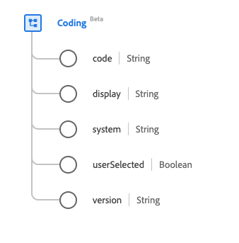

# [!UICONTROL 코딩] 데이터 형식

[!UICONTROL 코딩]은(는) 용어 시스템에서 정의한 코드에 대한 참조를 설명하는 표준 경험 데이터 모델(XDM) 데이터 형식입니다. 이 데이터 유형은 HL7 FHIR 릴리스 5 사양에 따라 생성됩니다.

| 표시 이름 | 속성 | 데이터 유형 | 설명 |
| --- | --- | --- | --- |
| [!UICONTROL 코드] | `code` | 문자열 | 시스템에서 정의한 구문의 기호입니다. |
| [!UICONTROL 디스플레이] | `display` | 문자열 | 시스템에서 정의한 표현입니다. |
| [!UICONTROL 시스템] | `system` | 문자열 | URI로 표시된 식별자 값에 대한 네임스페이스입니다. |
| [!UICONTROL 사용자가 선택했습니다] | `userSelected` | 부울 | 사용자가 이 코딩을 선택했는지 여부를 보여 주는 표시기. 기본값은 false입니다. |
| [!UICONTROL 버전] | `version` | 문자열 | 시스템의 버전입니다. |

데이터 유형에 대한 자세한 내용은 공용 XDM 저장소를 참조하십시오.

* [채워진 예](https://github.com/adobe/xdm/blob/master/extensions/industry/healthcare/fhir/datatypes/coding.example.1.json)
* [전체 스키마](https://github.com/adobe/xdm/blob/master/extensions/industry/healthcare/fhir/datatypes/coding.schema.json)
