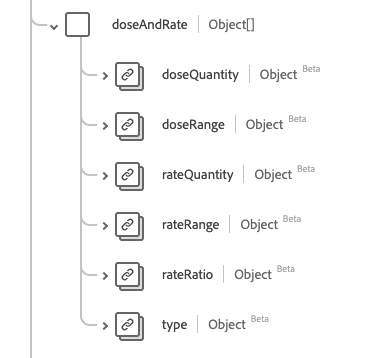

# [!UICONTROL 용량] 데이터 형식

[!UICONTROL Dosage]은(는) 약물 복용 또는 복용 방법을 설명하는 표준 경험 데이터 모델(XDM) 데이터 형식입니다. 이 데이터 유형은 HL7 FHIR 릴리스 5 사양에 따라 생성됩니다.

| 표시 이름 | 속성 | 데이터 유형 | 설명 |
| --- | --- | --- | --- |
| [!UICONTROL 추가 지침] | `additionalInstruction` | [[!UICONTROL 코드 가능한 개념 배열]](../data-types/codeable-concept.md) | 환자에 대한 보충 지시 또는 경고. |
| [!UICONTROL 필요한 경우] | `asNeededFor` | [[!UICONTROL 코드 가능한 개념 배열]](../data-types/codeable-concept.md) | 필요한 경우 약물을 사용해야 하는 문제를 설명합니다. |
| [!UICONTROL 용량 및 속도] | `doseAndRate` | 오브젝트 배열 | 투여되는 약물의 양, 투여되는 약물의 양, 또는 투여되는 일반적인 양. 자세한 내용은 아래 [섹션](#dose-and-rate)을 참조하세요. |
| [!UICONTROL 투여당 최대 용량] | `maxDosePerAdministration` | [[!UICONTROL 단순 수량]](../data-types/simple-quantity.md) | 투약당 투약의 상한입니다. |
| [!UICONTROL 수명당 최대 선량] | `maxDosePerLifetime` | [[!UICONTROL 단순 수량]](../data-types/simple-quantity.md) | 환자의 생애당 투약 상한입니다. |
| [!UICONTROL 기간당 최대 선량] | `maxDosePerPeriod` | [[!UICONTROL 비율]](../data-types/ratio.md) 배열 | 시간 단위당 투약의 상한. |
| [!UICONTROL 방법] | `method` | [[!UICONTROL 코드 가능한 개념]](../data-types/codeable-concept.md) | 약물 관리를 위한 기술. |
| [!UICONTROL 경로] | `route` | [[!UICONTROL 코드 가능한 개념]](../data-types/codeable-concept.md) | 약물이 신체에 침투하는 방법. |
| [!UICONTROL 본문 사이트] | `site` | [[!UICONTROL 코드 가능한 개념]](../data-types/codeable-concept.md) | 약물을 투여할 신체 부위입니다. |
| [!UICONTROL 시간] | `timing` | [[!UICONTROL 시간]](../data-types/timing.md) | 언제 약을 투여해야 합니까? |
| [!UICONTROL 필요한 경우] | `asNeeded` | 부울 | 필요에 따라 약물을 복용해야 하는지 여부를 나타내는 지표. |
| [!UICONTROL 환자 지침] | `patientInstruction` | 문자열 | 환자 또는 소비자가 이해해야 하는 용어의 지침. |
| [!UICONTROL 시퀀스] | `Integer` | [[!UICONTROL 코드 가능한 개념]](../data-types/codeable-concept.md) | 복용 지침의 순서. |
| [!UICONTROL 텍스트] | `text` | 문자열 | 텍스트 복용 지침을 계획합니다. |

데이터 유형에 대한 자세한 내용은 공용 XDM 저장소를 참조하십시오.

* [채워진 예](https://github.com/adobe/xdm/blob/master/extensions/industry/healthcare/fhir/datatypes/dosage.example.1.json)
* [전체 스키마](https://github.com/adobe/xdm/blob/master/extensions/industry/healthcare/fhir/datatypes/dosage.schema.json)

## `doseAndRate` {#dose-and-rate}

`doseAndRate`은(는) 개체 배열로 제공됩니다. 각 객체의 구조는 아래에 설명되어 있습니다.

| 표시 이름 | 속성 | 데이터 유형 | 설명 |
| --- | --- | --- | --- |
| [!UICONTROL 용량 양] | `doseQuantity` | [[!UICONTROL 단순 수량]](../data-types/simple-quantity.md) | 용량 당 약물 양. |
| [!UICONTROL 용량 범위] | `doseRange` | [[!UICONTROL Range]](../data-types/range.md) | 용량 당 약물 양. |
| [!UICONTROL 비율 수량] | `rateQuantity` | [[!UICONTROL 단순 수량]](../data-types/simple-quantity.md) | 시간 단위당 약물의 양. |
| [!UICONTROL 속도 범위] | `rateRange` | [[!UICONTROL Range]](../data-types/range.md) | 시간 단위당 약물의 양. |
| [!UICONTROL 비율] | `rateRatio` | [[!UICONTROL 비율]](../data-types/ratio.md) | 시간 단위당 약물의 양. |
| [!UICONTROL 유형] | `type` | [[!UICONTROL 코드 가능한 개념]](../data-types/codeable-concept.md) | 지정된 용량 또는 속도 종류. |
