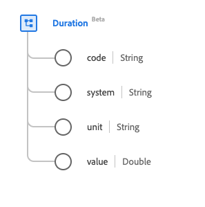

# [!UICONTROL 기간] 데이터 형식

[!UICONTROL Duration]은(는) 시간을 설명하는 표준 경험 데이터 모델(XDM) 데이터 형식입니다. 이 데이터 유형은 HL7 FHIR 릴리스 5 사양에 따라 생성됩니다.

| 표시 이름 | 속성 | 데이터 유형 | 설명 |
| --- | --- | --- | --- |
| [!UICONTROL 코드] | `code` | 문자열 | 시간 단위의 코딩된 형식입니다. |
| [!UICONTROL 시스템] | `system` | 문자열 | URI로 표시되는 코딩된 단위를 설명하는 시스템입니다. |
| [!UICONTROL 단위] | `unit` | 문자열 | 밀리초, 초, 분, 시간, 일, 주, 월 또는 년 단위로 표시되는 시간 단위입니다. 이 속성의 값은 다음 알려진 열거형 값 중 하나 이상과 같아야 합니다. <li> `ms`(밀리초) </li> <li> `s`(초) </li> <li> `min`(분) </li> <li> `h`(시간) </li>  <li> `d`(일) </li> <li> `wk`(주) </li> <li> `mo`(개월) </li> <li> `a`(년) </li> |
| [!UICONTROL 값] | `value` | 더블 | 시간 단위에 대한 숫자 값입니다. |

데이터 유형에 대한 자세한 내용은 공용 XDM 저장소를 참조하십시오.

* [채워진 예](https://github.com/adobe/xdm/blob/master/extensions/industry/healthcare/fhir/datatypes/duration.example.1.json)
* [전체 스키마](https://github.com/adobe/xdm/blob/master/extensions/industry/healthcare/fhir/datatypes/duration.schema.json)
