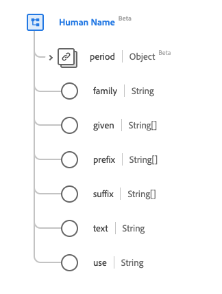

# [!UICONTROL 사람 이름] 데이터 형식

[!UICONTROL 사람 이름]은(는) 사람 또는 다른 살아있는 엔터티의 이름에 대한 정보를 제공하는 표준 경험 데이터 모델(XDM) 데이터 형식입니다. 이 데이터 유형은 HL7 FHIR 릴리스 5 사양에 따라 생성됩니다.

| 표시 이름 | 속성 | 데이터 유형 | 설명 |
| --- | --- | --- | --- |
| [!UICONTROL 기간] | `period` | [[!UICONTROL 기간]](../data-types/period.md) | 이름이 사용 중이거나 사용된 기간. |
| [!UICONTROL 가족] | `family` | 문자열 | 가족 또는 성입니다. |
| [!UICONTROL 지정] | `given` | 문자열 배열 | 중간 이름을 포함하여 지정된 이름입니다. |
| [!UICONTROL 접두사] | `prefix` | 문자열 배열 | 이름 또는 이름 앞 이름의 모든 부분. |
| [!UICONTROL 접미사] | `suffix` | 문자열 배열 | 가족 또는 성 이름을 딴 모든 부분. |
| [!UICONTROL 텍스트] | `text` | 문자열 | 전체 이름의 일반 텍스트 표현입니다. |
| [!UICONTROL 사용] | `use` | 문자열 | 이름의 사용입니다. 이 속성의 값은 다음 알려진 열거형 값 중 하나 이상과 같아야 합니다. <li> `usual` </li> <li> `offical` </li> <li> `temp` </li> <li> `nickname` </li> <li> `anonymous` </li> <li> `old` </li> <li> `maiden` </li> |

데이터 유형에 대한 자세한 내용은 공용 XDM 저장소를 참조하십시오.

* [채워진 예](https://github.com/adobe/xdm/blob/master/extensions/industry/healthcare/fhir/datatypes/humanname.example.1.json)
* [전체 스키마](https://github.com/adobe/xdm/blob/master/extensions/industry/healthcare/fhir/datatypes/humanname.schema.json)
