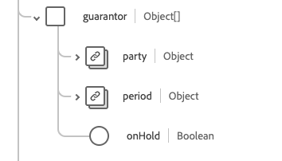

# [!UICONTROL 계정] 스키마 필드 그룹

[!UICONTROL 계정]은(는) [[!DNL XDM Individual Profile] 클래스](../../../classes/individual-profile.md) 및 [[!DNL Provider class]](../../../classes/provider.md)에 대한 표준 스키마 필드 그룹입니다. 환자나 개인 그룹에 제공되는 의료 서비스와 관련된 거래, 서비스 및 기타 재무 정보(예: 보험 또는 청구 목적)를 기록하는 데 사용되는 단일 개체 유형 필드 `healthcareAccount`을(를) 제공합니다.

| 표시 이름 | 속성 | 데이터 유형 | 설명 |
| --- | --- | --- | --- |
| [!UICONTROL 균형] | `balance` | 오브젝트 배열 | 재무 시스템에서 계산 및 처리되는 계정 잔고. 자세한 내용은 [아래 섹션](#balances)을 참조하세요. |
| [!UICONTROL 청구 상태] | `billingStatus` | [[!UICONTROL 코드 가능한 개념]](../data-types/codeable-concept.md) | 과금 프로세스를 통해 계정의 라이프사이클을 추적합니다. 계정에 할당되었을 때 트랜잭션이 처리되는 방식을 나타냅니다. |
| [!UICONTROL 적용 범위] | `coverage` | 오브젝트 배열 | 이 계정의 비용을 부담할 책임이 있는 당사자 및 해당 비용을 어떤 순서로 적용해야 합니까? 자세한 내용은 아래 [섹션](#coverage)을 참조하세요. |
| [!UICONTROL 통화] | `currency` | [[!UICONTROL 코드 가능한 개념]](../data-types/codeable-concept.md) | 계정의 기본 통화입니다. |
| [!UICONTROL 진단] | `diagnosis` | 오브젝트 배열 | 청구서와 관련된 일련의 진단은 여기에 청구서 제출을 위해 처리 전에 적절하게 순서를 지정할 수 있는 계정에 저장됩니다. 자세한 내용은 아래 [섹션](#diagnosis)을 참조하세요. |
| [!UICONTROL 보증인] | `guarantor` | 오브젝트 배열 | 다른 결제 방법이 부족할 경우 계정 잔액조정을 담당하는 당사자. 자세한 내용은 아래 [섹션](#guarantor)을 참조하세요. |
| [!UICONTROL 식별자] | `identifier` | [[!UICONTROL 식별자]](../data-types/identifier.md) 배열 | 계정 참조에 사용되는 고유 식별자. 사람이 사용하기 위한 것일 수도 있고 그렇지 않을 수도 있습니다(예: 신용카드 번호). |
| [!UICONTROL 소유자] | `owner` | [[!UICONTROL 참조]](../data-types/reference.md) | 서비스 지역, 병원, 부서 등을 나타냅니다. 계정 관리에 대한 책임 있음. |
| [!UICONTROL 프로시저] | `procedure` | 오브젝트 배열 | 청구서와 관련된 일련의 절차들은 여기에 청구서 제출을 위한 처리 전에 적절하게 순서를 지정할 수 있는 계정에 저장됩니다. 자세한 내용은 아래 [섹션](#procedure)을 참조하세요. |
| [!UICONTROL 관련 계정] | `relatedAccount` | 오브젝트 배열 | 이 계정과 관련된 기타 관련 계정. 자세한 내용은 아래 [섹션](#related-account)을 참조하세요. |
| [!UICONTROL 서비스 기간] | `servicePeriod` | [[!UICONTROL 기간]](../data-types/period.md) | 이 계정과 연결된 서비스의 날짜 범위입니다. |
| [!UICONTROL 제목] | `subject` | [[!UICONTROL 참조]](../data-types/reference.md) 배열 | 비용을 발생시키는 엔티티를 식별합니다. 용역이나 재화의 직계 수령자는 해당 주체와 관련된 주체일 수 있지만, 경비는 궁극적으로 해당 계정의 주체에 의해 발생하였다. |
| [!UICONTROL 유형] | `type` | [[!UICONTROL 코드 가능한 개념]](../data-types/codeable-concept.md) | 보고 및 검색을 위해 계정을 분류합니다. |
| [!UICONTROL 계산된 시간] | `calculatedAt` | 날짜/시간 | 잔액이 계산된 시간입니다. |
| [!UICONTROL 설명] | `description` | 문자열 | 계정이 추적하는 항목과 계정 사용 방법에 대한 추가 정보를 제공합니다. |
| [!UICONTROL 이름] | `name` | 문자열 | 계정 이름. |
| [!UICONTROL 상태] | `status` | 문자열 | 계정의 상태입니다. 이 속성의 값은 다음 알려진 열거형 값 중 하나와 같아야 합니다. <li> `active` </li> <li> `inactive` </li> <li> `entered-in-error` </li> <li> `on-hold` </li> <li> `unknown`</li> |

필드 그룹에 대한 자세한 내용은 공개 XDM 저장소를 참조하십시오.

* [채워진 예](https://github.com/adobe/xdm/blob/master/extensions/industry/healthcare/fhir/fieldgroups/account.example.1.json)
* [전체 스키마](https://github.com/adobe/xdm/blob/master/extensions/industry/healthcare/fhir/fieldgroups/account.schema.json)

## `balances` {#balances}

`balances`은(는) 개체 배열로 제공됩니다. 각 객체의 구조는 아래에 설명되어 있습니다.

| 표시 이름 | 속성 | 데이터 유형 | 설명 |
| --- | --- | --- | --- |
| [!UICONTROL 집계] | `aggregate` | [[!UICONTROL 코드 가능한 개념]](../data-types/codeable-concept.md) | 누가 이 부분의 잔금을 지불할 것으로 예상되는가. |
| [!UICONTROL 금액] | `amount` | [[!UICONTROL 돈]](../data-types/money.md) | 기간 속성에 정의된 연령을 기준으로 계산된 실제 잔액입니다. |
| [!UICONTROL 용어] | `term` | [[!UICONTROL 코드 가능한 개념]](../data-types/codeable-concept.md) | 계정 기간. |
| [!UICONTROL 예상] | `estimate` | 부울 | 금액이 예상 값인 경우. |

## `coverage` {#coverage}

`coverage`은(는) 개체 배열로 제공됩니다. 각 객체의 구조는 아래에 설명되어 있습니다.

| 표시 이름 | 속성 | 데이터 유형 | 설명 |
| --- | --- | --- | --- |
| [!UICONTROL 적용 범위] | `coverage` | [[!UICONTROL 참조]](../data-types/reference.md) | 이 계정의 비용을 부담할 책임이 있는 당사자 및 해당 비용을 어떤 순서로 적용해야 합니까? |
| [!UICONTROL 우선 순위] | `priority` | 정수 | 최소값이 `0`인 이 계정의 컨텍스트에서 적용 범위의 우선 순위입니다. |

## `diagnosis` {#diagnosis}

`diagnosis`은(는) 개체 배열로 제공됩니다. 각 객체의 구조는 아래에 설명되어 있습니다.

| 표시 이름 | 속성 | 데이터 유형 | 설명 |
| --- | --- | --- | --- |
| [!UICONTROL 조건] | `condition` | [[!UICONTROL 코드 사용 가능한 참조]](../data-types/codeable-reference.md) | 계정과 관련된 진단. |
| [!UICONTROL 패키지 코드] | `packageCode` | [[!UICONTROL 코드 가능한 개념 배열]](../data-types/codeable-concept.md) | 패키지 코드는 단일 제품(예: DRG)으로 가격이 책정되거나 전달될 수 있는 진단을 그룹화하는 데 사용할 수 있습니다. |
| [!UICONTROL 유형] | `type` | [[!UICONTROL 코드 가능한 개념 배열]](../data-types/codeable-concept.md) | 이 진단이 계정과 관련된 항목을 입력합니다(예: 입원, 청구, 퇴원 등). |
| [!UICONTROL 진단 날짜] | `dateOfDiagnosis` | 날짜/시간 | 진단 날짜(코드화된 진단 시). |
| [!UICONTROL 승인 중] | `onAdmission` | 부울 | 입원 시 진단이 있었는지 여부. |
| [!UICONTROL 대기] | `sequence` | 정수 | 최소값이 `0`인 진단 순위(각 유형에 대해). |

## `guarantor` {#guarantor}

`guarantor`은(는) 개체 배열로 제공됩니다. 각 객체의 구조는 아래에 설명되어 있습니다.

| 표시 이름 | 속성 | 데이터 유형 | 설명 |
| --- | --- | --- | --- |
| [!UICONTROL 파티] | `party` | [[!UICONTROL 참조]](../data-types/reference.md) | 책임 있는 엔티티. |
| [!UICONTROL 기간] | `period` | [[!UICONTROL 기간]](../data-types/period.md) | 보증인이 계정에 대한 책임을 수락하는 기간. |
| [!UICONTROL 보류 중] | `onHold` | 부울 | 보증인은 신용을 일시 정지하거나 그 밖의 방법으로 그 역할을 일시 정지시킬 수 있다. |

## `procedure` {#procedure}

`procedure`은(는) 개체 배열로 제공됩니다. 각 객체의 구조는 아래에 설명되어 있습니다.

| 표시 이름 | 속성 | 데이터 유형 | 설명 |
| --- | --- | --- | --- |
| [!UICONTROL 코드] | `code` | [[!UICONTROL 코드 사용 가능한 참조]](../data-types/codeable-reference.md) | 계정과 관련된 절차. |
| [!UICONTROL 장치] | `device` | [[!UICONTROL 참조]](../data-types/reference.md) 배열 | 계정과 관련된 절차와 연관된 모든 디바이스. |
| [!UICONTROL 유형] | `type` | [[!UICONTROL 코드 가능한 개념 배열]](../data-types/codeable-concept.md) | 계정 과금에 프로시저 값을 사용해야 하는 방법입니다. |
| [!UICONTROL 패키지 코드] | `packageCode` | [[!UICONTROL 코드 가능한 개념 배열]](../data-types/codeable-concept.md) | 패키지 코드는 단일 제품(예: DRG)으로 가격 책정되거나 전달될 수 있는 절차를 그룹화하는 데 사용할 수 있습니다. |
| [!UICONTROL 서비스 날짜] | `dateOfService` | 날짜/시간 | 코드화된 절차를 사용할 때의 날짜입니다. 프로시저에 대한 참조를 사용하는 경우 프로시저 날짜를 사용해야 합니다. |
| [!UICONTROL 시퀀스] | `sequence` | 정수 | 최소값이 `0`인 프로시저(각 유형에 대해) 순위. |

## `relatedAccount` {#related-account}

`relatedAccount`은(는) 개체 배열로 제공됩니다. 각 객체의 구조는 아래에 설명되어 있습니다.

| 표시 이름 | 속성 | 데이터 유형 | 설명 |
| --- | --- | --- | --- |
| [!UICONTROL 계정] | `account` | [[!UICONTROL 참조]](../data-types/reference.md) | 관련 계정에 대한 참조. |
| [!UICONTROL 관계] | `relationship` | [[!UICONTROL 코드 가능한 개념]](../data-types/codeable-concept.md) | 연결된 계정의 관계입니다. |
