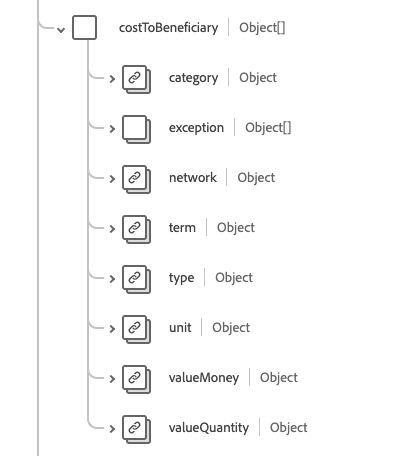

# [!UICONTROL 검사] 스키마 필드 그룹

[!UICONTROL 적용 범위]는 [[!DNL Plan] 클래스](../../../classes/plan.md)에 대한 표준 스키마 필드 그룹입니다. 보험 플랜의 높은 수준의 식별자 및 설명자(일반적으로 보험 카드에 표시되는 정보)를 제공하기 위한 단일 개체 유형 필드 `healthcareCoverage`을(를) 제공합니다. 이 정보는 의료 서비스 제품 및 서비스 제공을 위해 일부 또는 전체를 지불하는 데 사용할 수 있습니다.

| 표시 이름 | 속성 | 데이터 유형 | 설명 |
| --- | --- | --- | --- |
| [!UICONTROL 플랜 수혜자] | `beneficiary` | [[!UICONTROL 참조]](../data-types/reference.md) | 보험 가입으로 이익을 얻는 당사자와 상품 또는 서비스 제공 시 환자. |
| [!UICONTROL 클래스] | `class` | 오브젝트 배열 | 인수자별 분류자 세트입니다. 자세한 내용은 아래 [섹션](#class)을 참조하세요. |
| [!UICONTROL 연락처] | `contract` | [[!UICONTROL 참조]](../data-types/reference.md) 배열 | 이 보험 적용을 구성하는 보험 증권. |
| [!UICONTROL 수익자 비용] | `costToBeneficiary` | 오브젝트 배열 | 정책에 자세히 설명되어 있으며 상태 카드에 포함되어 있을 수 있는 비용 범주 및 관련 금액을 나타내는 코드 세트입니다. 자세한 내용은 아래 [섹션](#cost-to-beneficiary)을 참조하세요. |
| [!UICONTROL 예외] | `exception` | 오브젝트 배열 | 환자 비용 및 해당 유효 기간의 예외 또는 감소를 나타내는 코드 세트입니다. 자세한 내용은 아래 [섹션](#exception)을 참조하세요. |
| [!UICONTROL 식별자] | `identifier` | [[!UICONTROL 식별자]](../data-types/identifier.md) 배열 | 보험사가 발행한 보장 범위에 대한 식별자. |
| [!UICONTROL 보험 증서] | `insurancePlan` | [[!UICONTROL 참조]](../data-types/reference.md) | 보험 제도는 이 보험 적용을 구성하는 세부 사항, 혜택 및 비용을 명시합니다. |
| [!UICONTROL 보험자] | `insurer` | [[!UICONTROL 참조]](../data-types/reference.md) | 프로그램 또는 플랜 인수, 지불 또는 보험 회사. |
| [!UICONTROL 결제자] | `paymentBy` | 오브젝트 배열 | 지급 당사자에 대한 링크 및 선택적으로 지급할 책임이 있습니다. 자세한 내용은 아래 [섹션](#payment-by)을 참조하세요. |
| [!UICONTROL 적용 시작 및 종료 날짜] | `period` | [[!UICONTROL 기간]](../data-types/period.md) | 보장이 활성화되는 기간입니다. 시작 일자가 누락되면 시작 일자를 알 수 없으며, 종료 일자가 누락되면 적용 범위가 진행 중임을 의미합니다. |
| [!UICONTROL 정책 보유자] | `policyHolder` | [[!UICONTROL 참조]](../data-types/reference.md) | 보험 증서를 보유하고 있는 당사자. |
| [!UICONTROL 수취인 관계] | `relationship` | [[!UICONTROL 코드 가능한 개념]](../data-types/codeable-concept.md) | 구독자에 대한 수익자 관계. |
| [!UICONTROL 구독자] | `subscriber` | [[!UICONTROL 참조]](../data-types/reference.md) | 정책에 대한 계약 관계를 가지는 당사자. |
| [!UICONTROL 구독자 식별자] | `subscriberId` | [[!UICONTROL 식별자]](../data-types/identifier.md) 배열 | 보험사가 가입자의 ID를 지정했습니다. |
| [!UICONTROL 유형] | `type` | [[!UICONTROL 코드 가능한 개념]](../data-types/codeable-concept.md) | 적용 범위 유형. |
| [!UICONTROL 종속 번호] | `dependent` | 문자열 | 적용 범위 아래의 종속 대상 지정자입니다. |
| [!UICONTROL 종류] | `kind` | 문자열 | 그런 종류의 보도. 이 속성의 값은 다음 알려진 열거형 값 중 하나와 같아야 합니다. <li> `insurance` </li> <li> `self-pay` </li> <li> `other` </li> |
| [!UICONTROL 보험 회사 네트워크] | `network` | 문자열 | 수혜자가 네트워크 내 요율로 보장되는 치료를 요청할 수 있는 제공자 네트워크, 그렇지 않으면 네트워크 외 약관이 적용됩니다. |
| [!UICONTROL 적용 범위 순서] | `order` | 정수 | 최소 값이 `0`인 범위의 상대적 순서입니다. |
| [!UICONTROL 상태] | `status` | 문자열 | 적용 범위의 상태입니다. 이 속성의 값은 다음 알려진 열거형 값 중 하나와 같아야 합니다. <li> `active` </li> <li> `cancelled` </li> <li> `draft` </li> <li> `entered-in-error` </li> |
| [!UICONTROL 대위] | `subrogation` | 부울 | `true`일 때 이 보험 인스턴스는 심판을 위한 것이 아니라 보험사에게 비용 회수를 위한 세부 사항을 제공하기 위해 포함되었습니다. |

필드 그룹에 대한 자세한 내용은 공개 XDM 저장소를 참조하십시오.

* [채워진 예](https://github.com/adobe/xdm/blob/master/extensions/industry/healthcare/fhir/fieldgroups/coverage.example.1.json)
* [전체 스키마](https://github.com/adobe/xdm/blob/master/extensions/industry/healthcare/fhir/fieldgroups/coverage.schema.json)

## `class` {#class}

`class`은(는) 개체 배열로 제공됩니다. 각 객체의 구조는 아래에 설명되어 있습니다.

| 표시 이름 | 속성 | 데이터 유형 | 설명 |
| --- | --- | --- | --- |
| [!UICONTROL 유형] | `type` | [[!UICONTROL 코드 가능한 개념 배열]](../data-types/codeable-concept.md) | 보험사별 분류 레이블 또는 번호와 선택적 이름이 제공되는 분류 유형입니다. 예를 들어, 유형은 적용 범위, 고용주 그룹, 정책 또는 제도의 분류를 식별하는 데 사용될 수 있습니다. |
| [!UICONTROL 값] | `value` | [[!UICONTROL 식별자]](../data-types/identifier.md) | 보험사가 발행한 레이블과 연결된 영숫자 식별자입니다. |
| [!UICONTROL 이름] | `name` | 문자열 | 클래스에 대한 간단한 설명입니다. |

## `costToBeneficiary` {#cost-to-beneficiary}

`costToBeneficiary`은(는) 개체 배열로 제공됩니다. 각 객체의 구조는 아래에 설명되어 있습니다.

| 표시 이름 | 속성 | 데이터 유형 | 설명 |
| --- | --- | --- | --- |
| [!UICONTROL 범주] | `category` | [[!UICONTROL 코드 가능한 개념]](../data-types/codeable-concept.md) | 제품 및 서비스가 제공되는 일반적인 혜택 유형을 식별하는 코드. |
| [!UICONTROL 네트워크] | `network` | [[!UICONTROL 코드 가능한 개념]](../data-types/codeable-concept.md) | 혜택이 네트워크 내 또는 네트워크 외 공급자를 참조하는지 여부를 나타내는 코드입니다. |
| [!UICONTROL 용어] | `term` | [[!UICONTROL 코드 가능한 개념]](../data-types/codeable-concept.md) | 최대 라이프타임 혜택 등 값의 용어. |
| [!UICONTROL 유형] | `type` | [[!UICONTROL 코드 가능한 개념]](../data-types/codeable-concept.md) | 치료와 관련된 환자 중심 비용의 범주. |
| [!UICONTROL 단위] | `unit` | [[!UICONTROL 코드 가능한 개념]](../data-types/codeable-concept.md) | 혜택이 개인에게 적용되는지 또는 가족에게 적용되는지를 나타냅니다. |

## `exception` {#exception}

`exception`은(는) 개체 배열로 제공됩니다. 각 객체의 구조는 아래에 설명되어 있습니다.

| 표시 이름 | 속성 | 데이터 유형 | 설명 |
| --- | --- | --- | --- |
| [!UICONTROL 유형] | `type` | [[!UICONTROL 코드 가능한 개념]](../data-types/codeable-concept.md) | 특정 예외에 대한 코드입니다. |
| [!UICONTROL 기간] | `period` | [[!UICONTROL 기간]](../data-types/period.md) | 예외가 활성화된 일정. |

## `paymentBy` {#payment-by}

`paymentBy`은(는) 개체 배열로 제공됩니다. 각 객체의 구조는 아래에 설명되어 있습니다.

| 표시 이름 | 속성 | 데이터 유형 | 설명 |
| --- | --- | --- | --- |
| [!UICONTROL 파티] | `party` | [[!UICONTROL 참조]](../data-types/reference.md) | 치료 비용에 대한 비보험 지급을 제공하는 당사자 목록입니다. |
| [!UICONTROL 권한] | `responsibility` | 문자열 | 재무 책임에 대한 설명입니다. |
