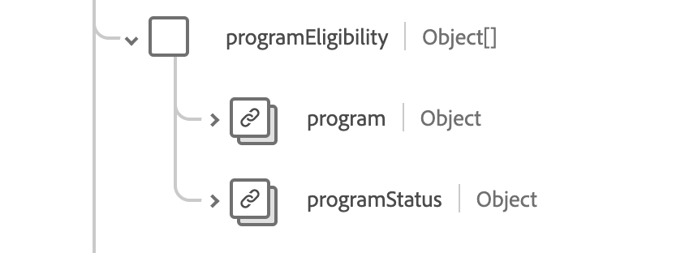

# [!UICONTROL 예방 접종] 스키마 필드 그룹

[!UICONTROL 면역]은(는) [[!DNL XDM Experience Event] 클래스](../../../classes/experienceevent.md)에 대한 표준 스키마 필드 그룹입니다. 면역 이벤트 정보를 캡처하는 단일 개체 유형 필드 `healthcareImmunization`을(를) 제공합니다.

| 표시 이름 | 속성 | 데이터 유형 | 설명 |
| --- | --- | --- | --- |
| [!UICONTROL 관리 제품] | `administeredProduct` | [[!UICONTROL 코드 사용 가능한 참조]](../data-types/codeable-reference.md) | 투여된 제품. |
| [!UICONTROL 기준] | `basedOn` | [[!UICONTROL 참조]](../data-types/reference.md) 배열 | 예방 접종 이벤트의 기반이 되는 권한. |
| [!UICONTROL 용량 양] | `doseQuantity` | [[!UICONTROL 단순 수량]](../data-types/simple-quantity.md) | 백신의 양. |
| [!UICONTROL Encounter] | `encounter` | [[!UICONTROL 참조]](../data-types/reference.md) | 예방접종이 한 부분입니다. |
| [!UICONTROL Source 펀딩] | `fundingSource` | [[!UICONTROL 코드 가능한 개념]](../data-types/codeable-concept.md) | 백신에 대한 자금 출처. |
| [!UICONTROL 식별자] | `identifier` | [[!UICONTROL 식별자]](../data-types/identifier.md) 배열 | 비즈니스 식별자. |
| [!UICONTROL 정보 Source] | `informationSource` | [[!UICONTROL 코드 사용 가능한 참조]](../data-types/codeable-reference.md) | 보고된 레코드의 소스를 나타냅니다. |
| [!UICONTROL 위치] | `location` | [[!UICONTROL 참조]](../data-types/reference.md) | 예방접종이 발생한 위치입니다. |
| [!UICONTROL 제조업체] | `manufacturer` | [[!UICONTROL 코드 사용 가능한 참조]](../data-types/codeable-reference.md) | 백신 제조업체. |
| [!UICONTROL 메모] | `note` | [[!UICONTROL 주석]](../data-types/annotation.md) 배열 | 추가 예방 접종 참고 사항. |
| [!UICONTROL 환자] | `patient` | [[!UICONTROL 참조]](../data-types/reference.md) | 누가 면역을 받았죠? |
| [!UICONTROL 일괄 처리] | `performer` | 오브젝트 배열 | 누가 예방 접종 이벤트를 수행했는지. 자세한 내용은 아래 [섹션](#performer)을 참조하세요. |
| [!UICONTROL 프로그램 자격 요건] | `programEligibility` | 오브젝트 배열 | 특정 예방 접종 프로그램에 대한 환자의 자격 요건. 자세한 내용은 아래 [섹션](#program-eligibility)을 참조하세요. |
| [!UICONTROL 적용된 프로토콜] | `protocolApplied` | 오브젝트 배열 | 공급자가 제공한 프로토콜입니다. 자세한 내용은 아래 [섹션](#protocol-applied)을 참조하세요. |
| [!UICONTROL 반응] | `reaction` | 오브젝트 배열 | 예방 접종 후 반응의 세부 정보. 자세한 내용은 아래 [섹션](#reaction)을 참조하세요. |
| [!UICONTROL 이유] | `reason` | [[!UICONTROL 코드 가능한 참조]](../data-types/codeable-reference.md) 배열 | 예방 접종을 하는 이유입니다. |
| [!UICONTROL 경로] | `route` | [[!UICONTROL 코드 가능한 개념]](../data-types/codeable-concept.md) | 백신이 어떻게 몸에 들어갔는지. |
| [!UICONTROL 사이트] | `site` | [[!UICONTROL 코드 가능한 개념]](../data-types/codeable-concept.md) | 백신이 투여된 신체 부위 |
| [!UICONTROL 상태 이유] | `statusReason` | [[!UICONTROL 코드 가능한 개념]](../data-types/codeable-concept.md) | 현재 상태에 대한 설명입니다. |
| [!UICONTROL 잠재 이유] | `subpotentReason` | [[!UICONTROL 코드 가능한 개념 배열]](../data-types/codeable-concept.md) | 백신이 잠재력을 가진 이유. |
| [!UICONTROL 지원 정보] | `supportingInformation` | [[!UICONTROL 참조]](../data-types/reference.md) 배열 | 예방 접종을 지원하는 추가 정보입니다. |
| [!UICONTROL 백신 코드] | `vaccineCode` | [[!UICONTROL 코드 가능한 개념]](../data-types/codeable-concept.md) | 백신을 투여하는 코드. |
| [!UICONTROL 만료 날짜] | `expirationDate` | 날짜 | 백신 만료일. |
| [!UICONTROL Is Subpotent] | `isSubpotent` | 부울 | 백신이 잠재력이 있는지 여부를 나타내는 지표. |
| [!UICONTROL 로트 번호] | `lotNumber` | 문자열 | 백신의 많은 수. |
| [!UICONTROL 발생 날짜 시간] | `occurenceDateTime` | 날짜/시간 | 백신 투여일. |
| [!UICONTROL 발생 문자열] | `occurenceString` | 문자열 | 백신 투여일. |
| [!UICONTROL 기본 Source] | `primarySource` | 부울 | 데이터가 기본 소스에서 캡처되었는지 여부를 나타냅니다. |
| [!UICONTROL 상태] | `status` | 문자열 | 예방접종 상태. 이 속성의 값은 다음 알려진 열거형 값 중 하나와 같아야 합니다. <li> `completed` </li> <li> `entered-in-error` </li> <li> `not-done` </li> |

필드 그룹에 대한 자세한 내용은 공개 XDM 저장소를 참조하십시오.

* [채워진 예](https://github.com/adobe/xdm/blob/master/extensions/industry/healthcare/fhir/fieldgroups/immunization.example.1.json)
* [전체 스키마](https://github.com/adobe/xdm/blob/master/extensions/industry/healthcare/fhir/fieldgroups/immunization.schema.json)

## `performer` {#performer}

`performer`은(는) 개체 배열로 제공됩니다. 각 객체의 구조는 아래에 설명되어 있습니다.

| 표시 이름 | 속성 | 데이터 유형 | 설명 |
| --- | --- | --- | --- |
| [!UICONTROL 작업자] | `actor` | [[!UICONTROL 참조]](../data-types/reference.md) | 수행 중인 개인 또는 조직. |
| [!UICONTROL 함수] | `function` | [[!UICONTROL 코드 가능한 개념]](../data-types/codeable-concept.md) | 어떤 유형의 공연이 수행되었습니까? |

## `programEligibility` {#program-eligibility}

`programEligibility`은(는) 개체 배열로 제공됩니다. 각 객체의 구조는 아래에 설명되어 있습니다.

| 표시 이름 | 속성 | 데이터 유형 | 설명 |
| --- | --- | --- | --- |
| [!UICONTROL 프로그램] | `program` | [[!UICONTROL 코드 가능한 개념]](../data-types/codeable-concept.md) | 자격 요건이 선언되는 프로그램입니다. |
| [!UICONTROL 프로그램 상태] | `programStatus` | [[!UICONTROL 코드 가능한 개념]](../data-types/codeable-concept.md) | 프로그램에 대한 환자의 자격 상태. |

## `protocolApplied` {#protocol-applied}

`protocolApplied`은(는) 개체 배열로 제공됩니다. 각 객체의 구조는 아래에 설명되어 있습니다.

| 표시 이름 | 속성 | 데이터 유형 | 설명 |
| --- | --- | --- | --- |
| [!UICONTROL 권한] | `authority` | [[!UICONTROL 참조]](../data-types/reference.md) | 권장 사항 게시의 책임자는 누구입니까? |
| [!UICONTROL 대상 질환] | `targetDisease` | [[!UICONTROL 코드 가능한 개념 배열]](../data-types/codeable-concept.md) | 백신이 목표로 삼고 있는 예방 가능한 질병. |
| [!UICONTROL 용량 수] | `doseNumber` | 문자열 | 시리즈 내 용량 수. |
| [!UICONTROL 계열] | `series` | 문자열 | 백신 시리즈의 이름. |
| [!UICONTROL 시리즈 선량] | `seriesDoses` | 문자열 | 면역을 위한 권장 용량. |

## `reaction` {#reaction}

`reaction`은(는) 개체 배열로 제공됩니다. 각 객체의 구조는 아래에 설명되어 있습니다.

| 표시 이름 | 속성 | 데이터 유형 | 설명 |
| --- | --- | --- | --- |
| [!UICONTROL 표시] | `manifestation` | [[!UICONTROL 코드 사용 가능한 참조]](../data-types/codeable-concept.md) | 반응에 대한 추가 정보. |
| [!UICONTROL 날짜] | `date` | 날짜/시간 | 반응이 시작된 시기. |
| [!UICONTROL 보고됨] | `reported` | 문자열 | 반응이 자가 보고되었는지 여부를 나타냅니다. |
