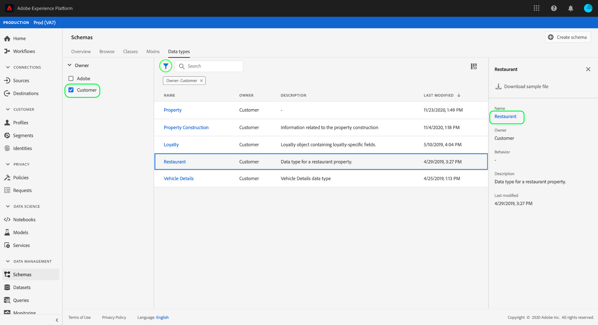
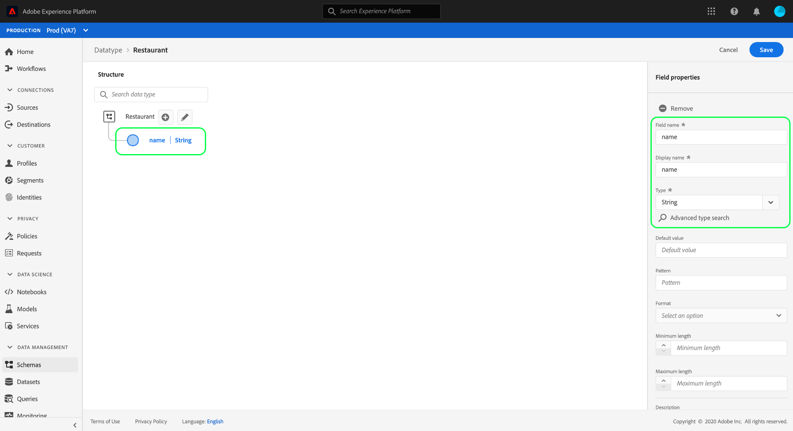
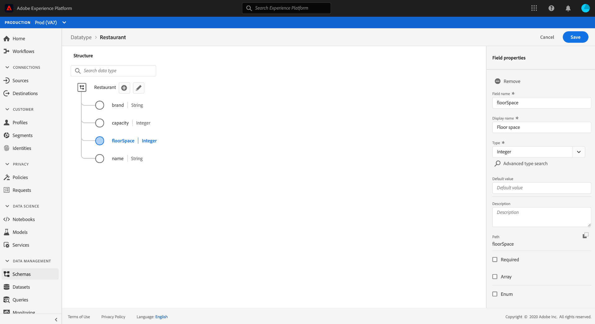

# Experience Platform UI를 사용하여 데이터 유형 만들기 및 편집

XDM(Experience Data Model)에서 데이터 유형은 기본 리터럴 필드와 같은 방식으로 클래스 또는 믹싱에서 참조 유형 필드로 사용되며, 데이터 유형이 여러 하위 필드를 정의할 수 있다는 점에서 중요한 차이가 있습니다. 다중 필드 구조를 일관되게 사용할 수 있다는 점에서 혼합과 유사하지만, 데이터 유형은 스키마 구조의 어느 위치에나 포함될 수 있는 반면 혼합은 루트 수준에서만 추가할 수 있으므로 보다 유연합니다.

Adobe Experience Platform은 다양한 일반적인 경험 관리 사용 사례를 처리하는 데 사용할 수 있는 다양한 표준 데이터 유형을 제공합니다. 그러나 고유한 비즈니스 요구 사항을 충족하기 위해 고유한 사용자 지정 데이터 유형을 정의할 수도 있습니다.

이 자습서에서는 플랫폼 사용자 인터페이스에서 사용자 지정 데이터 유형을 만들고 편집하는 단계를 설명합니다.

## 전제 조건

이 자습서에서는 XDM 시스템에 대해 제대로 이해하고 있어야 합니다. Experience Platform 에코시스템 내 XDM의 역할 소개 [와 데이터 유형이 XDM 스키마에 기여하는 방법에 대한 스키마 구성](../home.md)  기본 사항에 대해서는 XDM 개요를 참조하십시오.

이 자습서에서는 필요하지 않지만 UI에서 스키마 [구성에 대한 자습서를 따라 UI의](./-schema-ui.md) 다양한 기능에 익숙해지도록 하는 것이 좋습니다 [!DNL Schema Editor].

## 데이터 유형 [!DNL Schema Editor] 에 대해

플랫폼 UI에서 왼쪽 탐색 **[!UICONTROL 에서]** 스키마를 선택하여 [!UICONTROL 스키마] 작업 영역을 연 다음 **[!UICONTROL 데이터 유형]** 탭을 선택합니다. Adobe에서 정의한 데이터 및 조직에서 만든 데이터 유형을 비롯하여 사용 가능한 데이터 유형 목록이 표시됩니다.

여기서 두 가지 옵션이 있습니다.

* [새 데이터 유형 만들기](#create)
* [편집할 기존 데이터 유형 선택](#edit)

### 새 데이터 유형 만들기 {#create}

데이터 **[!UICONTROL 유형]** 탭에서 **[!UICONTROL 데이터 유형 만들기를 선택합니다]**.

캔버스에 새 데이터 유형의 현재 구조를 보여주는 [!DNL Schema Editor] 화면이 나타납니다. 편집기의 오른쪽에는 데이터 유형에 대한 표시 이름과 선택적 설명을 제공할 수 있습니다. 스키마에 추가할 때 식별되는 데이터 유형에 대해 고유하고 간결한 이름을 제공해야 합니다.

이 자습서에서는 레스토랑 속성을 설명하는 데이터 유형을 생성하므로 데이터 유형에는 &quot;Restaurant&quot;이라는 표시 이름이 지정됩니다.

데이터 유형에 필드 추가를 시작하려면 [다음 섹션으로](#add-fields) 건너뜁니다.

### 기존 데이터 유형 편집

조직에서 정의한 사용자 지정 데이터 유형만 편집할 수 있습니다. 표시된 목록의 범위를 좁히려면 필터 아이콘()을 선택하여 [!UICONTROL 소유자]기반 필터링 컨트롤을 표시합니다. 조직에서 소유한 **[!UICONTROL 사용자]** 지정 데이터 유형만 표시하려면 고객을 선택합니다.

목록에서 편집할 데이터 유형을 선택하여 오른쪽 레일을 열고 데이터 유형의 세부 사항을 표시합니다. 오른쪽 레일에 있는 데이터 유형의 이름을 선택하여 해당 구조를 에서 엽니다 [!DNL Schema Editor].

## 데이터 유형에 필드 추가 {#add-fields}

데이터 유형에 필드 추가를 시작하려면 캔버스의 루트 수준 필드 옆에 있는 **더하기(+)** 아이콘을 선택합니다. 새 필드가 아래에 표시되고 오른쪽 레일이 업데이트되어 새 필드에 대한 컨트롤이 표시됩니다.

오른쪽 레일 컨트롤을 사용하여 필드에 **[!UICONTROL 필드 이름]**, **[!UICONTROL 표시 이름]**&#x200B;및 **[!UICONTROL 유형]** 을제공합니다. 필드의 유형은 기본 스칼라 유형(예: 문자열, 정수 또는 부울)이거나 Adobe 또는 조직에서 정의한 다른 다중 필드 데이터 유형을 나타낼 수 있습니다.

레스토랑 데이터 유형에는 레스토랑 이름을 나타내는 문자열 필드가 필요합니다. 따라서 [!UICONTROL 필드 이름은] &quot;이름&quot;으로 설정되고 [!UICONTROL 유형] 이 [!UICONTROL 문자열로]설정됩니다. 적용 **[!UICONTROL 을]** 선택하여 필드에 변경 사항을 적용합니다.

루트 수준 필드 옆에 있는 **더하기(+)** 아이콘을 선택하고 오른쪽 레일에 구성 세부 정보를 제공하여 추가 필드를 추가하는 동일한 프로세스를 계속 진행합니다.

레스토랑 데이터 유형에는 브랜드, 좌석 용량 및 바닥 공간을 위한 추가 필드가 있습니다.

기본 필드 외에도 사용자 지정 데이터 유형 내에 추가 데이터 유형을 중첩할 수도 있습니다. 예를 들어, 레스토랑 데이터 유형에는 속성의 실제 주소를 나타내는 필드가 필요합니다. 이 시나리오에서는 표준 데이터 유형 &quot;[!UICONTROL 우편 주소&quot;가 할당된 새 &quot;주소&quot; 필드를 추가할 수 있습니다].

이는 데이터를 설명하는 관점에서 유연한 데이터 유형을 어떻게 활용하는지 보여줍니다.데이터 유형은 추가 데이터 유형을 포함할 수 있는 데이터 유형인 필드를 사용할 수 있습니다. 이를 통해 XDM 스키마 전체에서 일반적인 데이터 패턴을 추상화하고 재사용할 수 있으므로 복잡한 데이터 구조를 쉽게 나타낼 수 있습니다.

데이터 유형에 필드 추가가 완료되면 **[!UICONTROL 저장을 선택하여]** 변경 사항을 저장하고 데이터 유형을 데이터에 [!DNL Schema Library]추가합니다.

## 혼합에 데이터 유형 추가

데이터 유형을 생성한 후에는 스키마에서 사용할 수 있습니다. XDM 스키마는 클래스와 0개 이상의 혼합으로 구성되므로 데이터 형식으로 제공된 필드는 스키마에 직접 추가할 수 없습니다. 대신, 그것들은 수업이나 혼합물에 포함되어야 한다.

>[!NOTE]
>
>이 섹션에서는 사용자 지정 데이터 유형에 가장 일반적인 패턴이므로 데이터 유형을 혼합에 추가하는 것에 중점을 둡니다. 그러나 동일한 단계를 적용하여 대신 클래스에 데이터 유형을 추가할 수도 있습니다.

기존 혼합에 데이터 유형을 추가하거나 완전히 새 믹스를 만들 수 있습니다. 두 경우 모두 [!DNL Schema Editor] 의 경우, [찾아보기] 탭에서 기존 스키마를 선택하거나 **[!UICONTROL 새 스키마를 완전히 만들어 새 데이터 유형을 추가할 스키마에]** 대해 열어야 합니다.

스키마가 열려 있으면 왼쪽 레일에 [!DNL Schema Editor]에 데이터 유형을 추가할 혼합을 선택합니다. 스키마에 적절한 믹싱이 없는 경우, 단계에 따라 새 믹싱을 [만들어 스키마에](./create-schema-ui.md#define-mixin) 대신 추가하고 왼쪽 레일에서 혼합을 선택해야 합니다.

선택한 믹스에 새 필드를 추가하려면 **스키마 이름 옆에 있는 더하기(+)** 아이콘을 선택합니다. 필드의 **[!UICONTROL 유형]** 속성을 선택하면 이제 드롭다운 목록에서 이전에 만든 데이터 유형의 이름을 사용할 수 있습니다. 데이터 유형의 이름을 입력하기 시작하면 쉽게 찾을 수 있습니다.

목록에서 데이터 유형을 선택한 다음 적용을 **[!UICONTROL 선택합니다]**. 스키마 필드가 캔버스에서 업데이트되어 데이터 유형이 제공하는 구조화된 하위 필드를 보여줍니다. 저장을 선택하여 스키마 **[!UICONTROL 를]**&#x200B;저장하는 경우 혼합도 저장되므로 동일한 클래스에 속하는 추가 스키마에서 혼합을 재사용할 수 있습니다.

>[!NOTE]
>
>믹스인은 단지 한 학급과 호환된다. 다른 클래스를 기반으로 하는 추가 스키마에 데이터 유형을 사용하려면 위 단계에 따라 해당 클래스를 확장하기 위한 추가 혼합에 데이터 유형을 추가해야 합니다.

## 다음 단계

이 자습서에서는 데이터 유형을 만들고 편집하는 방법 및 데이터를 사용하여 혼합에 추가하는 방법에 대해 설명합니다 [!DNL Schema Editor]. 다중 필드 개체를 데이터 유형으로 변환하는 방법을 포함하여 UI에서 데이터 형식을 사용하는 작업에 대한 자세한 내용은 [스키마 만들기 자습서를 참조하십시오](./create-schema-ui.md#datatype).

스키마 레지스트리 API를 사용하여 데이터 형식을 만드는 방법에 대해 알아보려면 [데이터 유형 끝점 안내서를 참조하십시오](../api/data-types.md#create).